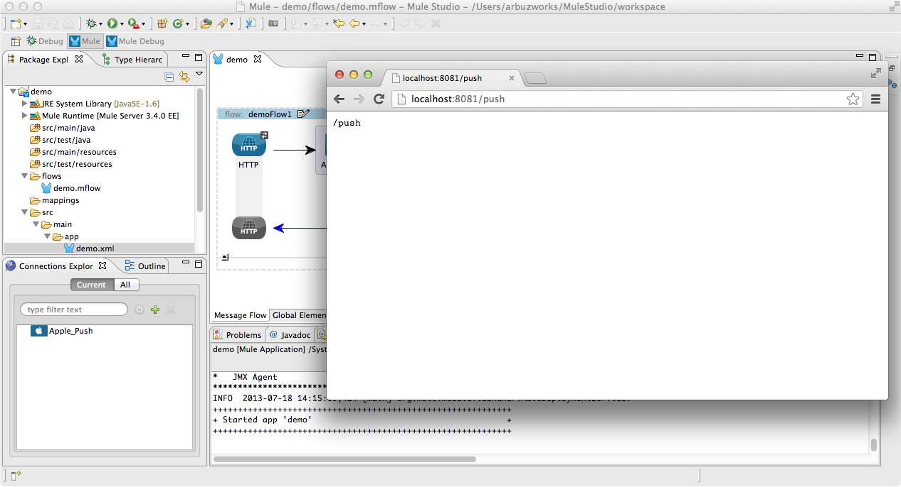

# Apple Push Connector

This document provides detailed instructions on how to install MuleSoft's Apple Push connector and demonstrates how to build and run a simple demo application that uses this connector.

### Contents
[Prerequisites](#prerequisites)  
[Step 1: Prepare iOS Push Services Certificate](#step1)  
[Step 2: Install Mule Apple Push Connector from Update Site](#step2)  
[Step 3: Create Demo Project](#step3)  
[Step 4: Add Global Element](#step4)  
[Step 5: Create Push Flow](#step5)  
[Step 6: Test Push Flow](#step6)  
[Flow XML](#flow)  
[Other Resources](#resources)  

### Prerequisites

In order to build and run this project, you'll need:

- A valid Apple Development iOS Push Services certificate  
- [MuleStudio](http://www.mulesoft.org/download-mule-esb-community-edition) 
- Web browser 

### Step 1: Prepare iOS Push Services Certificate

If you don't have a valid certificate, please refer to [Mac Developer Library](http://developer.apple.com/library/mac/#documentation/NetworkingInternet/Conceptual/RemoteNotificationsPG/Chapters/ProvisioningDevelopment.html#//apple_ref/doc/uid/TP40008194-CH104-SW4) 
on creating the SSL certificate and Keys.

- Download a valid Apple Development iOS Push Services certificate from [http://developer.apple.com](http://developer.apple.com) and add it to Keychain.

- Right click the certificate in Keychain Access and select **Export...** 

- Export it in **Personal Information Exchange (.p12)** format. Note the file name and its location.    

### Step 2: Install Mule Apple Push Connector from Update Site

- In Mule Studio select **Help** \> **Install New Software...**.
- Select **MuleStudio Cloud Connectors Update Site** in the **Work With** dropdown.
- Find **Mule Apple Push Connector Mule Studio Extension** under the the **Standard** folder. Check it and click **Next**.
- Follow the installation steps.

### Step 3: Create Demo Project

- Run Mule Studio and select **File \> New \> Mule Project** menu item.  
- Type **Demo** in the Project Name field and click **Next**.  

Accept default values in the next screen of the project creation wizard and click **Finish**.

### Step 4: Add Global Element   

- Double click **src/main/app/demo.xml** to open it, select the **Global Elements** tab in the view.
- Click **Create** button and add **Apple Push** to the configuration.   

- Global Element Properties dialog will be automatically opened. You need to specify the following properties for this global element:
    - **Host**: `gateway.sandbox.push.apple.com`    
    - **Port**:  `2195` 
    - **Keystore**: `<path to your Apple Development iOS Push Services certificate exported in Step 1>` 
    - **Keystore Password**: `<password for the above certificate>` 

- Click OK.

### Step 5: Create Push Flow

- In the Mule Studio flow editor, switch to the **Message Flow** tab.
- Drag **HTTP Endpoint** from the palette and drop it onto the canvas. A new flow will be created and HTTP will be its Inbound Endpoint.    
- Double click HTTP Building block to show its properties and set **push** as a **Path** value.

- Drag **Apple Push** cloud connector from the palette to the flow. Double click it to show its properties. At the very minimum, the following values must be specified:
    - **Config Reference**: select the Global element we created on Step 4.
    - **Alert**: alert text to be pushed to your iOS device.
    - **Device Token**: device token of your iOS device.

- Click OK and save the project.

### Step 6: Test Push Flow

- Right Click **flows/demo.mflow \> Run As/Mule Application**.

- Check the console to see when the application starts.  

You should see a log message on the console:  
 
    ++++++++++++++++++++++++++++++++++++++++++++++++++++++++++++    
    + Started app 'demo'                                       +
    ++++++++++++++++++++++++++++++++++++++++++++++++++++++++++++

- Open your favorite browser and point it to [http://localhost:8081/push](http://localhost:8081/push).

- Make sure there are no errors in the console.
- Look at your iPhone.

### Flow XML

The final XML flow should look like that:  

	<?xml version="1.0" encoding="UTF-8"?>

	<mule xmlns:apple-push="http://www.mulesoft.org/schema/mule/apple-push" xmlns:http="http://www.mulesoft.org/schema/mule/http" xmlns="http://www.mulesoft.org/schema/mule/core" xmlns:doc="http://www.mulesoft.org/schema/mule/documentation" xmlns:spring="http://www.springframework.org/schema/beans" version="EE-3.4.0" xmlns:xsi="http://www.w3.org/2001/XMLSchema-instance" xsi:schemaLocation="http://www.springframework.org/schema/beans http://www.springframework.org/schema/beans/spring-beans-current.xsd
	http://www.mulesoft.org/schema/mule/core http://www.mulesoft.org/schema/mule/core/current/mule.xsd
	http://www.mulesoft.org/schema/mule/http http://www.mulesoft.org/schema/mule/http/current/mule-http.xsd
	http://www.mulesoft.org/schema/mule/apple-push http://www.mulesoft.org/schema/mule/apple-push/3.3/mule-apple-push.xsd">
	    <apple-push:config name="Apple_Push" host="gateway.sandbox.push.apple.com" port="2195" keystore="/Users/arbuzworks/Documents/ArbuzWorks.p12" keystorePassword="secret" doc:name="Apple Push"/>
	    <flow name="demoFlow1" doc:name="demoFlow1">
	        <http:inbound-endpoint exchange-pattern="request-response" host="localhost" port="8081" path="push" doc:name="HTTP"/>
	        <apple-push:send config-ref="Apple_Push" alert="test alert" deviceToken="1eb443c6a8d49f25bf456b782b961e02bc1faa86ff6463357ea7cd23abd1b674" doc:name="Apple Push"/>
	    </flow>
	</mule>

### Other Resources

For more information on:

- Apple Push connector, please visit [http://mulesoft.github.io/apple-push-connector](http://mulesoft.github.io/apple-push-connector);
- Mule AnyPoint® connectors, please visit [http://www.mulesoft.org/extensions](http://www.mulesoft.org/extensions);
- Mule platform and how to build Mule apps, please visit [http://www.mulesoft.org/documentation/display/current/Home](http://www.mulesoft.org/documentation/display/current/Home).

