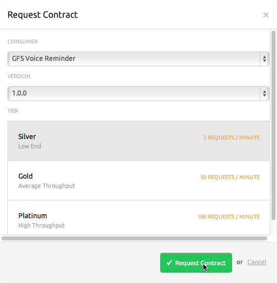

# Anypoint Service Registry

Anypoint™ Service Registry is a service registry and SOA governance tool. Delivered as a multi-tenant service
in the cloud, you can integrate it with Mule ESB on-premise or CloudHub platforms.    

### Contents 

[Prerequisites](#prerequisites)    
[Step 1: Anypoint Service Registry Installation Guide](#step-1-anypoint-service-registry-installation-guide)    
[Step 2: Anypoint Service Registry Walkthrough](#step-2-anypoint-service-registry-walkthrough) 	
[Other Resources](#other-resources)   

### Prerequisites

In order to build and run this project you'll need to download and install:

*   [Mule ESB 3.3.2 Enterprise Edition or later.](http://www.mulesoft.com/mule-esb-enterprise)  
       

### Step 1: Anypoint Service Registry Installation Guide

##### Obtaining an Account

To begin, contact MuleSoft to set up an account for your organization. We will support your organization and
provide you with your Anypoint license file. If you already have a MuleSoft community account, we simply need
your username to give you access privileges to Anypoint. If you do not have a MuleSoft community
account, we'll create one for you. If it is required, we can pre-populate your account with sample data to include
working examples of registered services and applications described in the walkthrough. 

##### Downloading and Installing Files

  (1)   Install the Anypoint Service Registry license that you have been given by your MuleSoft representative.
In the command line, execute the following:

```
cd $MULE_HOME/bin 
mule -installLicense ~/license.lic
``` 
  
  (2)  Download corresponding sample application files in order to manipulate the examples described in the walkthrough.   

  *   Download sample applications here: [Sample applications](https://www.dropbox.com/sh/qtb3j39taki782c/7Z3zEdPg9M/Software/Mule%20Applications)  

  *   Navigate to your **Downloads** folder and copy the files to your ```$MULE_HOME/apps folder```. 

##### Running Anypoint Registry with Mule

(1) Go to [http://registry.mulesoft.com](http://registry.mulesoft.com) and enter your MuleSoft community login credentials.      
(2) Click **Agent Tokens** on the top navigation bar.  
(3) Click the blue **Download** button in the upper right corner of the screen.   
(4) Copy the file to your ```$MULE_HOME/lib/shared/default``` folder.  
(5) Return to the **Agents Tokens** screen in Anypoint, then click **New Token**.   
(6) Copy the token that appears.  
(7) Start Mule from the command line using the following syntax:   

* For Mac/Linux/Unix:

```$MULE_HOME/bin/mule -M-Dhabitat.agent.token=<PasteYourUniqueTokenHere>```

* For Windows:

```
%MULE_HOME%\bin\mule.bat
-M-Dhabitat.agent.token=<PasteYourUniqueTokenHere>
```

### Step 2: Anypoint Service Registry Walkthrough

##### Scenario 1: runtime policy management for a freight tracking service  

######***Use Case***

GFS (Global Freight Service) has developed a tracking system that allows internal applications to query
information about packages it delivers. No contract is required between service owner and consumer to
access the service and there is no service level agreement in place. However, as this  service is
intended only for internal use, it requires consumers to authenticate by passing user credentials
along with their service calls. 

######***How Anypoint Works***

Take the service for a test drive before applying a policy:

(1) Click the **Services** icon on the top navigation bar to open your service catalog.   
(2) Click **GFS Freight Tracking Service** to open its Service Details screen.

  

(3) Copy the URL of the service's endpoint to your clipboard: [http://localhost:8089/services/tracking/1.0/GFSTrack](http://localhost:8089/services/tracking/1.0/GFSTrack)  
(4) Open a web browser and paste the URL into the browser's address bar. You should see a message: "You have successfully accessed the GFS Freight Tracking Service", which indicates that your service call is successful.  

Next, create a policy using the HTTP Basic Authentication template:   

(1) Click the **Policies** icon on the top navigation bar.  
(2) Click the **Add Policy** button in the upper right corner.  
(3) Select **HTTP Basic Authentication** from the list of templates in the left column.   
(4) Once this template is selected, configure the authentication credentials in the right column with a username and password of your choice – for example, **gfs** and **gfs1234**.  
(5) In the **Name** field, enter a brief specific name for your policy. In this example, we use **GFS Basic Authentication**.  
(6) In the **Notes** field, enter a short description that will help other Anypoint users in your organization understand what your policy will do. For example, **This policy protects a service using basic authentication**. 

  

(7) Save your policy.   

Now that you've created a policy, apply it to the GFS Freight Tracking Service: 

(1) Click the **Services** icon on the top navigation bar and navigate back to the **Service Details** screen of the GFS Freight Tracking Service.  
(2) Click three horizontal lines in the upper right corner of the screen to open the version menu, then select **Manage policies**.   
(3) Next to **GFS Basic Authentication**, click **Apply**.  
(4) Close the window. 

  

The HTTP Basic Authentication policy takes effect as soon as the cache is refreshed (usually within 60 seconds) and any new service calls will now require authentication. The authentication credentials can either be passed to the service in the syntax of the service call or entered manually by the end user via a browser.   

Now that the policy has been applied, add a note to the Release Notes of the service to inform end users that this service version now has an authentication policy applied to it:  

(1) Click **Release Notes** to open the Release Notes tab.  
(2) Click the **pencil** icon to open the text editor.  
(3) Type: **Version 1.0.0 is protected by HTTP basic authentication. To access the service, obtain credentials from the service owner**.  

 

(4) Click **checkbox** to save your note. Now this note is visible to all users  viewing this Service Details screen.  

Try accessing the service again:

(1) Return to the browser window where you previously tested the endpoint URL and refresh the window. You should now be presented with a pop-up authentication dialog requesting a username and password. (You may need to wait from a few seconds and up to a few minutes to allow the cache to be refreshed before this pop-up appears.)  
(2) First, check what happens when you enter false credentials. Enter a random text in both fields, then click **Ok**. You should see an error message indicating that your credentials are not valid.   
(3) Refresh your browser again, and enter the valid login credentials (we suggested **gfs** and **gfs1234**) that you specified when you created the policy. Now you should see the same message you saw previously when you tested the service before you applied the authentication policy.  

The name and description of this policy can be reviewed via the same **Manage policies** pop-up, accessible via three horizontal lines in the upper right corner of the screen, where you can unapply the policy if needed. Only the service owner or an administrator can see the policy details or unapply the policy from the service.

All Anypoint users – other than the service owner – do not have access to the details of the policies that have been applied to this service. However, all users can access any information in the **Release Notes** tab or any documentation that you link to in the service description for further details. 

##### Scenario 2: Dynamic Endpoint Lookup for a Regional Vendor Assignment Service

######***Use Case***

GFS signs short-term contracts with other shipping vendors to deliver packages to rural areas that are cost-prohibitive for GFS to service via standard delivery channels. At any given time, each region has an active contract with a vendor, but these vendors are frequently changed based on which vendors offer the most cost-effective options. For example, in January, all subcontracted delivery in the South American region may be handled by Vendor 1. In February, Vendor 1 may have its contract renewed, or Vendor 2 may have
underbid and won the contract for that month. GFS must ensure that all its shipping applications and services always work with the appropriate subcontractor assigned for their region without having to manually look up current vendor assignments. Therefore, GFS has developed a service which, when queried, returns the information about which subcontractor shipping vendor is currently assigned to deliver packages in a particular region. The service owner of this service needs to be able to update the vendors for each region at runtime without bringing the service offline. 

######***How Anypoint Works***  

Navigate to this service in Anypoint and examine the details of the endpoints.  

(1) Click the **Services** icon on the top navigation bar to open your service catalog.   
(2) Click **Regional Vendor Assignment Service** to open its Service Details screen.   


(3) View the details of each endpoint by clicking the **Edit** icon. Note each endpoint is tagged with custom metadata that tags it to a specific region.    

 

As the service owner (or an administrator), you can add, change, or delete metadata for these endpoints, add additional endpoints with additional metadata or delete endpoints. You can perform all of these actions at runtime with no need to take any applications offline to alter and redeploy.  

Any consumers that send service calls must include the correctly-formatted regional metadata in their service calls. Anypoint compares this metadata against all the endpoints in the registry and dynamically resolves the request based on the endpoint tags at the time that the service call occurs. For example, a service call which includes key="region" value="NorthAmerica” invokes the endpoint for Vendor 1, because that one is currently tagged with the "NorthAmerica" region in the registry. 

Now, simulate a service call from this consumer using your browser.   

(1) Open a browser window and navigate to [http://localhost:8090/](http://localhost:8090/)    
(2) You should see a message reading "You have reached Vendor 1." Confirm this is the correct vendor for the North American region by returning to Anypoint and checking the metadata assigned to the first endpoint.

Next, assume that you are the service owner or administrator of the vendor assignment service, and that you have just received updated information that Vendor 1 and Vendor 2 have swapped contracts: now Vendor 2 is the vendor assigned to North America and Vendor 1 is assigned to South America. Update the metadata for the endpoints in the registry to reflect this change:   

(1) Next to the first endpoint listed, [http://localhost:8091/services/Vendor1/PriceTrack](http://localhost:8091/services/Vendor1/PriceTrack), click the **Edit** icon.    
(2) Delete the existing metadata by clicking the trash can icon.   
(3) Add new metadata:   

*    In the **Key** field, type **region**. 
*    In the **Value** field, type **SouthAmerica**.   
*    Click the **Append Metadata** button to save the metadata.    

   

(4) Click **Update Endpoint** to save your changes.   
(5) Repeat these steps for the second endpoint listed, [http://localhost:8092/services/Vendor2/PriceTrack](http://localhost:8092/services/Vendor2/PriceTrack). Click the icon.  
(6) Delete the existing metadata by clicking the trash can icon.   
(7) Add new metadata:   

*    In the **Key** field, type **region**. 
*    In the **Value** field, type **NorthAmerica**.   
*    Click the **Append Metadata** button to save the metadata. 

(8) Click **Update Endpoint** to save your changes.   

Now that you've changed the metadata in Anypoint, try simulating the same service call:   

(1) Return to your browser window and refresh it, still using [http://localhost:8090/](http://localhost:8090/).   
(2) You should now see a message reading "You have reached Vendor 2." (You may need to wait for a few moments to allow cache to be refreshed).    

The service call resulted in different vendor information, due to the runtime updates in the registry. The consumer calling the service is not adversely affected by frequent changes in vendor assignments – Anypoint registry protects consumers from having to manually account for these kinds of changes so that business operations can proceed smoothly with minimal human intervention.

##### Scenario 3: Contract Management for a Package Status Alert Service

######***Use Case***

GFS has developed a package alert service that can process queries containing a tracking number and return basic (non-confidential) delivery status information. The same core package alert service is intended for use by several GFS departments' Mule applications, though the number of customers each department serves varies greatly. The GFS package alert service offers three tiers of service to cater throughput to the expected needs of consumers. The tiers are specified as follows:   

*   Platinum - 100 messages per minute    
*   Gold - 50 messages per minute   
*   Silver - 3 messages per minute  

Several internal consumers wish to use the service, each using a different tier. A larger GFS regional office has kiosks that allow customers to view all alerts associated with their packages. The application owner of the kiosk software has a contract for the gold tier since hundreds of customers per week use the kiosks. GFS also has a mobile app that allows any user to view alerts related to their registered packages. The consumer owner for the mobile app has set up a contract for the platinum tier since thousands of visitors use the mobile application weekly.   

A small local GFS office develops an application that sends customers an automated phone call reminder for the packages that are about to be delivered. The owner of this phone call reminder application wishes to contract with the package alert service to trigger the automated calls. For this use case, the silver tier of the service would be the most appropriate, since only a few dozen customers per week request the phone call reminder.   

######***How Anypoint Works***  

First, confirm the GFS Voice Reminder application is registered in Anypoint as a consumer.  

(1) Click the **Consumers** icon on the top navigation bar to open your **Consumers catalog**.    
(2) Click **GFS Voice Reminder** to open its **Consumer Details** screen. Note that the **Services Consumed** tab is currently blank, because the consumer doesn't currently have any active contracts with any services in Anypoint.

  

   If there is an active contract listed for the GFS Voice Reminder consumer, another user in your organization may have already performed the steps in this scenario and created a contract. In order to restore the sample data to the starting point intended for this tour, delete this contract. You can do this by clicking the icon next to the contract on the **Consumer Details** screen.  

Next, take a look at each tier of service for the GFS Package Alert Service and the consumer contracts that already exist:    

(1) Click the **Services** icon on the top navigation bar to open your service catalog.    
(2) Click **GFS Package Alert Service** to open its Service Details screen.    
(3) Click the **SLA Tiers** tab to open it.   

   

(4) Note three SLA levels that the service owner has defined are listed here for all Anypoint users to see. As an administrator, you can also see the **Add SLA Tier** button and **Edit** and **Delete** icons next to each existing tier. All other Anypoint users who are not either the service owner or an administrator can view the tiers, but cannot add, edit or delete them.
(5) Click the **Consumers** tab to open it. Note that the other two consumers described in the use case are listed here. As an administrator, you can see the consumers and their contract keys. Unless signed in as the service owner or an administrator, users cannot view this information.

    

(6) In the upper right corner of the screen, click three horizontal lines to open the version menu. Note the difference between the service menu and the version menu in the image above.    

(7) In the version menu, click **Manage policies**. This dialog indicates that a contract enforcement policy and a contract-based rate limiting policy are currently applied to this service version. These policies enforce the SLA tiers for all consumers who call to the service using their contract key, rejecting all service calls that exceed their SLA limits or lack a valid contract key.

 

As an administrator, you have "owner" privileges over all consumers registered in Anypoint and can request contracts between consumers and services in the registry. Follow the following steps to request a contract for the package alert service for the GFS Voice Reminder consumer on the Silver SLA tier:

(1) On the Service Details screen of **GFS Package Alert Service**, click **Request Contract** to open the **Request Contract** dialog.   
(2) Configure the fields as follows:
*   In the field, select **Consumer GFS Voice Reminder**.   
*   In the **Version** field, select **1.0.0**.   
*   In the **Tier** field, select **Silver**.

 

(3) Click **Request Contract**.

Anypoint automatically generates a contract. The service owner and any administrators can see it by checking the **Consumers** tab, where the GFS Voice Reminder service is now listed with its contract key. This contract key is also available via the **Consumer Details** screen under **Services Consumed**, where the consumer owner (and administrators) can view details of all active contracts.


Each consumer includes its unique contract key in service calls to access the service and receives the agreed-upon level of service defined in the contracted SLA. The SLAs are enforced by the contract enforcement policy and contract-based rate limiting policy that are applied to the service. Service calls from the GFS Voice Reminder consumer are limited to three messages per minute for the Silver SLA tier. Service calls from the GFS Kiosk consumer are limited to fifty messages per minute, per the Gold SLA tier. Service calls from the GFS AlertTrack Mobile App are limited to 100 messages per minute for the Platinum SLA tier.   

Test out the enforcement of this SLA by simulating a series of service calls from the GFS Voice Reminder
consumer.   

(1) Open up a browser REST client such as [Firefox REST client](http://restclient.net/).    
(2) Copy and paste the service's endpoint into the URL field: [http://localhost:8094/services/alerts/1.0/AlertTrack](http://localhost:8094/services/alerts/1.0/AlertTrack)    
(3) Create a custom HTTP header with the **X-Anypoint-ContractKey** name  
(4) Enter the unique contract key for the GFS Voice Reminder consumer by copying and pasting it into the HTTP header value field.   
(5) Click **Send** three times to send three service calls, then verify each time that **Response Body** reads **Send** "GFS Alert Service has been successfully executed."
(6) Click **Send** fourth time, then verify that the **Response Body** now reads "API calls exceeded." Your fourth **Send** service call has been rejected due to the contract-based rate limiting policy in effect, which is enforcing the contracted SLA of maximum 3 requests per minute.

If, at any time, the consumer owner or the service owner wants to delete the contract, they can do that by clicking the **Delete** icon next to the contract. The contract is immediately revoked. The service owner can delete a contract from the **Service Details** screen; the consumer owner can delete a contract from the **Consumer Details** screen; administrators can delete contracts from either screens.

### Other Resources

For more information on:

- Mule AnyPoint® connectors, please visit [http://www.mulesoft.org/connectors](http://www.mulesoft.org/connectors)
- Mule platform and how to build Mule apps, please visit [http://www.mulesoft.org/documentation/display/current/Home](http://www.mulesoft.org/documentation/display/current/Home)


