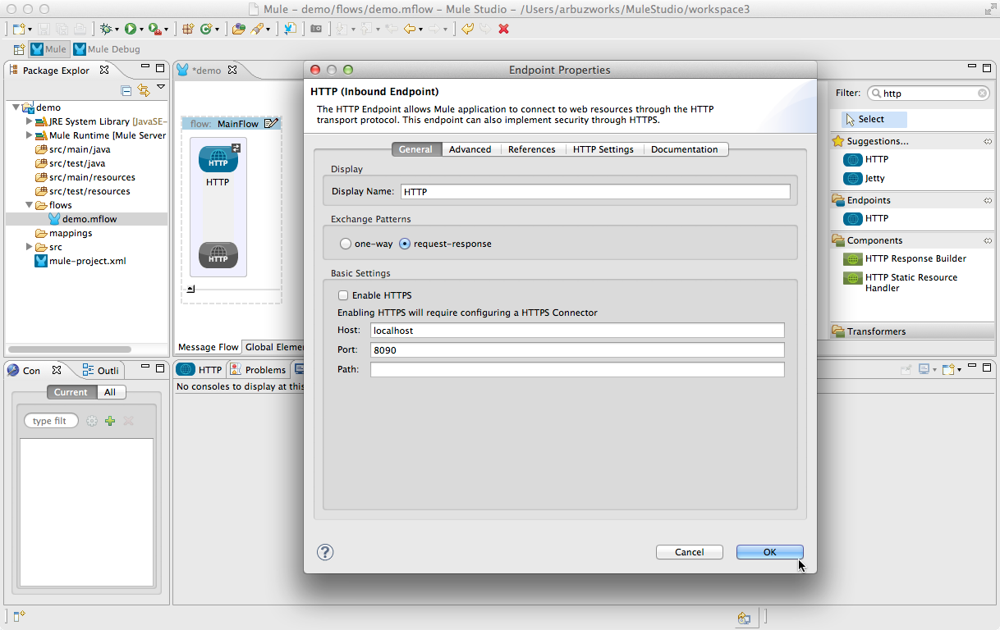

# Anypoint Service Registry Connector

Use Anypoint Service Registry™ connector to dynamically route outbound messages in a Mule application according to service virtualization rules.

[Use Case](#use-case)   
[Prerequisites](#prerequisites)   
[Step 1: Configure Registry Token](#step-1-configure-registry-token)  
[Step 2: Examine Endpoint Details](#step-2-examine-endpoint-details)  
[Step 3: Create Demo Project](#step-3-create-demo-project)  
[Step 4: Flow Configuration](#step-4-flow-configuration)  
[Step 5: Run Project](#step-5-run-project)  
[Step 6: Test Application](#step-6-test-application)  
[Other Resources](#other-resources)   

### Use Case

GFS (Global Freight Service) signs short-term contracts with other shipping vendors to deliver packages to rural areas that are cost-prohibitive for GFS to service via standard delivery channels. These vendors are frequently changed based on which vendor offers the most cost-effective options. For example, in January, all subcontracted delivery in the South American region may be handled by Vendor 1. In February, Vendor 1 may have its contract renewed, or Vendor 2 may have won the contract for that month, or both vendors might have active contracts in that region, so GFS can use either vendor. GFS must ensure that all its shipping applications and services always work with the appropriate subcontractor assigned for their region without having to manually look up current vendor assignments.

GFS has developed the Regional Vendor Assignment service, which, when queried, returns the information about which shipping subcontractor is currently assigned to deliver packages to a particular region. The owner of this service needs to be able to update the vendors for each region at runtime without bringing the service offline. 

Anypoint Service Registry enables service calls to be routed dynamically to endpoints at runtime through [service virtualization](http://stage.mulesoft.org/documentation/display/current/Service+Virtualization).

### Prerequisites

In order to build and run this project you'll need:

*   [MuleStudio Enterprize Edition](http://www.mulesoft.com/mule-studio).
*   MuleSoft community account.   

    Contact MuleSoft (support@mulesoft.com) to set up an account for your organization. If you already have a MuleSoft community account, we simply need your username to give you access privileges to Anypoint Service Registry. If you do not  have a MuleSoft community account, we'll create one for you. If you like, we can pre-populate your registry account with sample data to include the working examples of registered services and applications described in [walkthrough](http://stage.mulesoft.org/documentation/display/current/Walkthrough). 

**Further explanation will be introduced implying that you have your registry account pre-populated with sample data.**

### Step 1: Configure Registry Token

1.  Navigate to [http://registry.mulesoft.com](http://registry.mulesoft.com) then enter your MuleSoft community login credentials. 
2.  Click the **Administration** icon  in the top navigation bar, then click **Agent Tokens**. (Note that the Administration icon is visible only to users with [administrator](http://stage.mulesoft.org/documentation/display/current/Account+Types+and+User+Roles) – organization owner – accounts.)
3.  Click **Generate Token**.
4.  Copy the token that appears.
5.  Launch Mule Studio 3.4.
6.  Go to **MuleStudio** > **Preferences**, then click the arrow next to Mule Studio to expand the node.
7.  Click **Anypoint Service Registry**.
8.  In the **Token** field, paste the token that you copied to your clipboard.
9.  In the **Host** field, type ``agent-registry.mulesoft.com``.
10. Leave the **Port** and **Path** defaults as they are and click **OK**. 

### Step 2: Examine Endpoint Details

Navigate to this service in Anypoint Service Registry and examine the details of the endpoints.

1.  Click the **Services** icon  in the top navigation bar to open your service catalog.
2.  Click **Regional Vendor Assignment Service** to open its main screen. 

   

3.  View the details of each endpoint by clicking the **Edit** icon . Note each endpoint is tagged with custom metadata that tags it to a specific region.  

  

As the service owner (or as an administrator), you can add, change or delete metadata for these endpoints, add additional endpoints with additional metadata or delete endpoints. You can perform all of these actions at runtime with no need to take any applications offline to alter and redeploy.

Any consumers that send service calls should include the correctly-formatted regional metadata in their service calls. Anypoint Service Registry compares the metadata against all the endpoints in the registry and dynamically resolves the request based on the endpoint metadata at the time that the service call occurs. For example, a service call which includes key="region" value="NorthAmerica” invokes the endpoint for Vendor 1, because that one is currently tagged with the region "NorthAmerica" in the registry. 

### Step 3: Create Demo Project

*    Run Mule Studio and select **File \> New \> Mule Project** menu item.  
*    Type **demo** as a project name and click **Next**.  

*    Then click **Next**.

*    And finally click **Finish**.

### Step 4: Flow Configuration   

*    Switch to the **Message Flow** tab in the flow editor. 
*    Add a new flow by dragging it from the Palette.  
*    Double click the new flow to open its properties and rename it to **MainFlow**. Click **OK**. 

*    Using the filter find and drag **HTTP Endpoint** to the **MainFlow** flow. Double click it to show its properties and adjust them as displayed on the following image.

  

*    Using the filter find and drag **Anypoint Service Registry** endpoint to the **MainFlow** flow. Double click it to show its properties and adjust them as displayed on the following image.

   

*    Put another flow to the **Message Flow** area and name it **Vendor1**. 
*    Using the filter find and drag **HTTP Endpoint** to the **Vendor1** flow. Double click it to show its properties and adjust them as displayed on the following image.

 

*    Using the filter find and drag **Set Payload** transformer to the **Vendor1** flow. Double click it to show its properties and adjust them as displayed on the following image.  

 

*    Put one more flow to the **Message Flow** area and name it **Vendor2**. 
*    Using the filter find and drag **HTTP Endpoint** to the **Vendor2** flow. Double click it to show its properties and adjust them as displayed on the following image.

 

*    Using the filter find and drag **Set Payload** transformer to the **Vendor2** flow. Double click it to show its properties and adjust them as displayed on the following image.  

Save the flow. 

### Step 5: Run Project

*    Right Click **src/main/app/demo.xml \> Run As/Mule Application**.

 

*    Check the console to see when the application starts.  

You should see a log message on the console:  
 
    ++++++++++++++++++++++++++++++++++++++++++++++++++++++++++++    
    + Started app 'demo'                                       +    
    ++++++++++++++++++++++++++++++++++++++++++++++++++++++++++++   

### Step 6: Test Application

1.  When the application is started, open a browser window and navigate to [http://localhost:8090/](http://localhost:8090/)
2.  You should see a message reading ``"Dynamic Router chose Vendor 1."`` Confirm this is the correct vendor for the North American region by returning to Anypoint Service Registry and checking the metadata assigned to the first endpoint.

  

Next, assume that you are the service owner or the administrator of the vendor assignment service, and that you have just received the updated information that Vendor 2 has relocated and now provides service in the North American region (the same region as Vendor 1). Update the metadata for the Vendor 2 endpoint in the registry to reflect this change: 

1.  Navigate to the service in Anypoint Service Registry.
2.  Click the **Services** icon  in the top navigation bar to open your service catalog.
3.  Click **Regional Vendor Assignment Service** to open its main screen. 
4.  Next to ``http://localhost:8092/services/Vendor2/PriceTrack`` link, click  the Edit icon.
5.  Delete the existing metadata by clicking the trash can icon.
  

6.  Add new metadata:
    *   In the **Key** field, type **region**.
    *   In the **Value** field, type **NorthAmerica**.
    *   Click **Append Metadata** to commit the metadata. 

  
7.  Click **Update Endpoint** to save your changes. Now you have two endpoints serving the North American region.   
8.  Call the service again:   

  *   Return to your browser and refresh it, still using http://localhost:8090/. 
  *   Refresh several times and watch the message on the screen.
  *   Upon each refresh, the browser should alter the messages ``"Dynamic Router chose Vendor 1."`` and ``"Dynamic Router chose Vendor 2."`` Anypoint Service Registry is directing the service calls to the matching endpoints based on the Round-Robin algorithm enabled in the configuration. 

### Other Resources

For more information on:

- Mule AnyPoint® connectors, please visit [http://www.mulesoft.org/connectors](http://www.mulesoft.org/connectors)
- Mule platform and how to build Mule apps, please visit [http://www.mulesoft.org/documentation/display/current/Home](http://www.mulesoft.org/documentation/display/current/Home)

