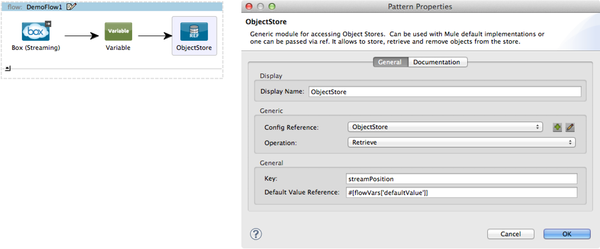

[Purpose](#purpose)  
[Prerequisites](#prerequisites)  
[Step 1: Create Box.com Developer account](#step1)    
[Step 2: Install Mule Box Connector from Update Site](#step2)   
[Step 3: Create Demo Project](#step3)  
[Step 4: Add Global Elements](#step4)   
[Step 5: Create Authorize Flow](#step5)    
[Step 6: Run Demo project](#step6)   
[Step 7: Test Authorize Flow](#step7)  
[Step 8: Create Search Flow](#step8)  
[Step 9: Test Search Flow](#step9)   
[Step 10: Create Long Polling Flow](#step10)    
[Step 11: Test LongPolling Flow](#step11)   
[Flow XML](#flowXML)    
[Other Resources](#other)    

### Purpose

This document provides detailed instructions on how to install MuleSoft's Box.com connector and demonstrates how to build and run simple demo application that uses this connector.

### Prerequisites

In order to build and run this project you'll need:

*       [Box.com](https://www.box.com) account.
*       [MuleStudio](http://www.mulesoft.org/download-mule-esb-community-edition).
*       Web browser.

### Step 1: Create Box.com Developer account

*      Create an account on [https://www.box.com/signup](https://www.box.com/signup).
*      Log in to [https://www.box.com/login/](https://www.box.com/login/).
*      Go to [http://developers.box.com/](http://developers.box.com/).
*      Click **Get API Key** link at top right corner \> Enter name for your application (f.e. **box-connector-test**) \> Click **Create App** button \> Click **Edit Application**, and note **client\_id** and **client\_secret** fields.

### Step 2: Install Mule Box Connector from update Site

*    In Mule Studio select **Help** \> **Install New Software...**.
*    Select **MuleStudio Cloud Connectors Update Site** in **Work With** drop-down.
*    Check two items from Community folder: **Mule Box Cloud Connector Mule Studio Extension** and **Mule Object Store Module Mule Studio Extension** and click **Next**.
*    Follow installation steps.

### Step 3: Create Demo project

*    Run Mule Studio and select **File \> New \> Mule Project** menu item.  
*    Type **Demo** as a project name and click **Next**.  

Accept default values on the next screen of project creation wizard and click **Finish**.

### Step 4: Add Global Elements   

*    Double click on **src/main/app/Demo.xml** to open it, select **Global Elements** tab in view.
 
Add two Global Elements.  

*    Click on **Create** button and add **ObjectStore** to the configuration.   

*    In ObjectStore configuration put **_defaultInMemoryObjectStore** to the **Object Store Reference** field.  

*     Similarly, add **Box Connector**.

*     Set Box Connector parameters as displayed on the following screenshots.  

### Step 5. Create Authorize Flow.

*     Switch to **Message Flow** tab and add a new flow by dragging it from the palette.

 
 
*     Name new flow **authorize**. It can be done by right-clicking on flow's header and selecting **Rename** from context menu.  

*     Add **HTTP Endpoint** to your flow by dragging it from the palette. Double click it to display properties and enter **auth** as a path value.  
  

*     Add **Box Cloud Connector** to the flow by dragging it from the palette. 
Double click it to show connector properties and select **Box** in **Config Reference** drop-down.
  

Next, we need to provide values for **box.clientId** and **box.clientSecret** parameters. 

*     Copy values from your application settings on Box.com (see Step 1) and put to **src/main/app/flows/mule-app.properties** file.   

### Step 6: Run Demo project

*     Right Click on **flows/box-connector-demo.mflow \> Run As/Mule Application**.

*     Check the console to see when the application starts.  

You should see a log message on the console:  
 
    ++++++++++++++++++++++++++++++++++++++++++++++++++++++++++++    
    + Started app 'demo'                                       +
    ++++++++++++++++++++++++++++++++++++++++++++++++++++++++++++

### Step 7: Test Authorize Flow

*    Open browser and go to [http://localhost:8081/auth](http://localhost:8081/auth).
*    You should be redirected to authorization screen at Box.com [https://api.box.com/oauth2/authorize](https://api.box.com/oauth2/authorize).  
*    Log in with your Box.com account created in Step 1. 
*    Click **Allow** to let your application access your Box.com account.
*    You should be redirected to http://localhost:8080/... and see callback code in your browser.

*    Stop mule server by clicking **Terminate** icon in console.

### Step 8: Create Search Flow

*    Add a new flow by dragging it from the palette and name it **search**.  

*    Add HTTP endpoint to the new flow similar to Step 5 but set its path to **search**.  

*    Add Box connector to the new flow and configure its properties according to the following images:

 
*    Finally, add **Object to JSON** transformer to the flow.
  

  
### Step 9: Test Search Flow

*    Run demo project as explained in Step 6 and open URL like this **http://localhost:8081/search?query=C3&user=es@arbuzworks.com**  

Note two parameters in search string - **query** and **user**. **Query** contains search string for Box.com and **user** contains your Box.com username.  

You should receive JSON response like this
 

*    Stop mule server. 

### Step 10: Create Long Polling Flow.

*    Drag **Box Cloud Connector** from the palette and drop it onto the canvas. New flow will be created and Box will be its message source.    
*    Double click on Box item, select **Box** as Config Reference and use **Listen Events** operation.  

We need to track Box stream position. Default value for stream position is 0. Let's introduce variable for this purpose.   

*    Add **ObjectStore** to the flow. It will be used to store stream position.

*     Then add **Box Connector** to the flow and configure it to **Get Events** as follows:

*    Make sure to specify how to find **Access Token Id** 

*     Add another **ObjectStore** and configure it to store streamPosition. 
 

We will use a couple of **Groovy Transformers** to filter out unneeded events. 

*    The first one will filter events by type.

*    The second one will filter events from file operations in root folder only.

*    To display event information in console append **for-each scope** to the flow and put **logger** inside of it. Following is the logger configuration.

                          

### Step 11: Test LongPolling flow

*    Run demo application as explained in Step 6.
*    Remember to authorize as explained in Step 7. 
*    View or download some document in root folder of your Box.com storage.

You should see a log message on the console:   
    
    INFO 2013-06-14 14:21:05,414 [[demo].longPolling.stage1.02] org.mule.api.processor.LoggerMessageProcessor: Box user <your box username> has seen the file <filename>
    
*    Stop mule server. 

### Flow XML

The final flow XML should look like that:

        <?xml version="1.0" encoding="UTF-8"?>
        
        <mule xmlns:ajax="http://www.mulesoft.org/schema/mule/ajax" xmlns:tracking="http://www.mulesoft.org/schema/mule/ee/tracking" xmlns:scripting="http://www.mulesoft.org/schema/mule/scripting" xmlns:objectstore="http://www.mulesoft.org/schema/mule/objectstore" xmlns:json="http://www.mulesoft.org/schema/mule/json" xmlns:box="http://www.mulesoft.org/schema/mule/box" xmlns:http="http://www.mulesoft.org/schema/mule/http" xmlns="http://www.mulesoft.org/schema/mule/core" xmlns:doc="http://www.mulesoft.org/schema/mule/documentation" xmlns:spring="http://www.springframework.org/schema/beans" version="EE-3.4.0" xmlns:xsi="http://www.w3.org/2001/XMLSchema-instance" xsi:schemaLocation="http://www.mulesoft.org/schema/mule/json http://www.mulesoft.org/schema/mule/json/current/mule-json.xsd
            http://www.mulesoft.org/schema/mule/box http://www.mulesoft.org/schema/mule/box/2.0/mule-box.xsd
            http://www.mulesoft.org/schema/mule/http http://www.mulesoft.org/schema/mule/http/current/mule-http.xsd
            http://www.mulesoft.org/schema/mule/objectstore http://www.mulesoft.org/schema/mule/objectstore/1.0/mule-objectstore.xsd
            http://www.mulesoft.org/schema/mule/scripting http://www.mulesoft.org/schema/mule/scripting/current/mule-scripting.xsd
            http://www.springframework.org/schema/beans http://www.springframework.org/schema/beans/spring-beans-current.xsd
            http://www.mulesoft.org/schema/mule/core http://www.mulesoft.org/schema/mule/core/current/mule.xsd
            http://www.mulesoft.org/schema/mule/ee/tracking http://www.mulesoft.org/schema/mule/ee/tracking/current/mule-tracking-ee.xsd
            http://www.mulesoft.org/schema/mule/ajax http://www.mulesoft.org/schema/mule/ajax/current/mule-ajax.xsd">
            
            <box:config name="Box" clientId="${box.clientId}" clientSecret="${box.clientSecret}" doc:name="Box">
                <box:oauth-callback-config domain="localhost" localPort="8080" remotePort="8080" path="callback"/>
            </box:config>
            <objectstore:config name="ObjectStore" objectStore-ref="_defaultInMemoryObjectStore" doc:name="ObjectStore"/>
            
            
            <flow name="authorize" doc:name="authorize">
                <http:inbound-endpoint exchange-pattern="request-response" host="localhost" port="8081" path="auth" doc:name="HTTP"/>
                <box:authorize config-ref="Box" doc:name="Box"/>
            </flow>
            <flow name="longPolling" doc:name="longPolling">
                <box:listen-events config-ref="Box" doc:name="Box (Streaming)"/>
                <set-variable variableName="defaultValue" value="0" doc:name="Variable"/>
                <objectstore:retrieve config-ref="ObjectStore" key="streamPosition" defaultValue-ref="#[flowVars['defaultValue']]" doc:name="ObjectStore"/>
                <box:get-events config-ref="Box" streamPosition="#[payload]" accessTokenId="#[message.inboundProperties['boxAccessTokenId']]" doc:name="Box" />
                <ajax:outbound-endpoint channel="" responseTimeout="10000" doc:name="Ajax"/>
                <objectstore:store config-ref="ObjectStore" key="streamPosition" value-ref="#[payload.nextStreamPosition]" overwrite="true" doc:name="ObjectStore"/>
                <scripting:transformer doc:name="Groovy">
                    <scripting:script engine="Groovy"><![CDATA[return payload.entries.findAll{it.eventType =='ITEM_DOWNLOAD' || it.eventType == 'ITEM_PREVIEW'}
                ]]></scripting:script>
                </scripting:transformer>
                        
                <scripting:transformer doc:name="Groovy">
                    <scripting:script engine="Groovy"><![CDATA[return payload.findAll{it.source?.type == "file" && it.source?.parent.id == "0"}
                ]]></scripting:script>
                </scripting:transformer>
                
                <foreach doc:name="Foreach">
                    <logger message="Box user #[payload.createdBy.login] has seen the file #[payload.source.name]" level="ERROR" doc:name="Logger"/>
                </foreach>
                    
                
            </flow>
            <flow name="box-connector-demoFlow1" doc:name="box-connector-demoFlow1">
                <http:inbound-endpoint exchange-pattern="request-response" host="localhost" port="8081" path="search" doc:name="HTTP"/>
                <box:search config-ref="Box" query="#[message.inboundProperties['query']]" accessTokenId="#[message.inboundProperties['user']]" doc:name="Box"/>
                <json:object-to-json-transformer doc:name="Object to JSON"/>
            </flow>
            
            
        </mule>

### Other Resources

For more information on:

- Box.com connector, please visit [https://github.com/mulesoft/salesforce-connector/tree/master/doc](https://github.com/mulesoft/salesforce-connector/tree/master/doc)
- Mule AnyPoint® connectors, please visit [http://www.mulesoft.org/extensions](http://www.mulesoft.org/extensions)
- Mule platform and how to build Mule apps, please visit [http://www.mulesoft.org/documentation/display/current/Home](http://www.mulesoft.org/documentation/display/current/Home)