# DB2 JDBC Connector

The JDBC Connector allows you to send and receive messages with a database using the JDBC protocol. Common usage includes retrieving, inserting, updating, and deleting database records, as well as invoking stored procedures (e.g., to create new tables dynamically).

### Contents 

[Prerequisites](#prerequisites)  
[Step 1: Prepare database](#step-1-prepare-database)  
[Step 2: Create Demo Project](#step-2-create-demo-project)  
[Step 3: Configure application](#step-3-configure-application)  
[Step 4: Create System Info flow](#step-4-create-system-info-flow)  
[Step 5: Run project](#step-5-run-project)  
[Step 6: Test System Info flow](#step-6-test-system-info-flow)  
[Step 7: Create listItems flow](#step-7-create-listitems-flow)  
[Step 8: Test listItems flow](#step-8-test-listitems-flow)  
[Step 9: Create createItem flow](#step-9-create-createitem-flow)  
[Step 10: Test createItem flow](#step-10-test-createitem-flow)  
[Step 11: Create flows for rest of actions (Update, Delete, Find by ID)](#step-11-create-flows-for-rest-of-actions-update-delete-find-by-id)  
[Step 12: Test updateItem, deleteItem and findById flows](#step-12-test-updateitem-deleteitem-and-findbyid-flows)   
[Other resources](#other-resources)

### Prerequisites

In order to build and run this project you'll need:

*   [MuleStudio](http://www.mulesoft.org/download-mule-esb-community-edition).
*   Installed [IBM DB2](http://www.ibm.com/software/data/db2/) database. In order to use the DB2 database in our application you have to know:    
        * host    
        * port    
        * username    
        * password     
*   A JDBC Driver for IBM DB2. You can download it from [DB2 JDBC Driver](http://www.ibm.com/support/docview.wss?uid=swg21363866)


### Step 1: Prepare database

Create a database with a command:   
```sql
CREATE DB mulesoft
```
    
Connect to the new database with a command:   
```sql
CONNECT TO mulesoft
```

Create a table:    
```sql
CREATE TABLE demo_tbl
(
  id INT GENERATED BY DEFAULT AS IDENTITY (START WITH 1, INCREMENT BY 1, NO CACHE) PRIMARY KEY NOT NULL,
  title VARCHAR(100), 
  description VARCHAR(100)
)   
```    
### Step 2: Create Demo Project

*    Run Mule Studio and select **File \> New \> Mule Project** menu item.  
*    Type **jdbc_db2_demo** as a project name and click **Next**.  

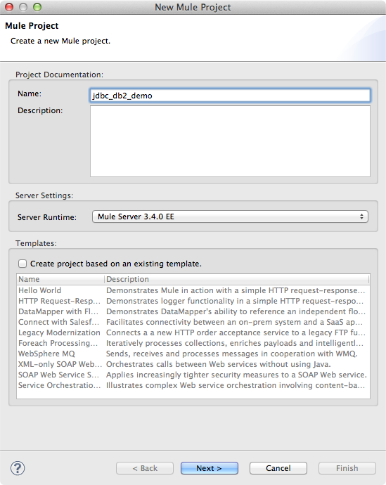

*    Then click **Finish**.

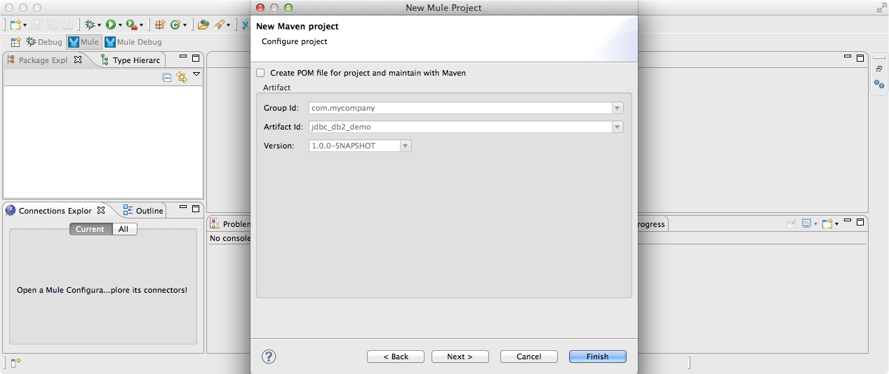

### Step 3: Configure application
    
We need to provide values for the database parameters. Open **src/main/app/flows/mule-app.properties** file and add the following lines: 
```ini
db.connection_string=jdbc:db2://db2:60000/mulesoft   
db.user=username    
db.password=password    
```

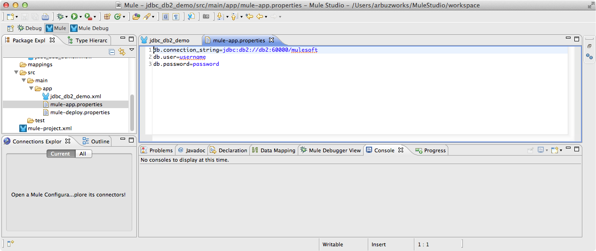    

To be able to access the DB2 database, we need to add a DB2 JDBC client jar file to our build path. Right-click your project, select **Build Path** and choose **Add External Archives**. Choose the **db2jcc4.jar** file from the **/lib** directory of the demo project. 

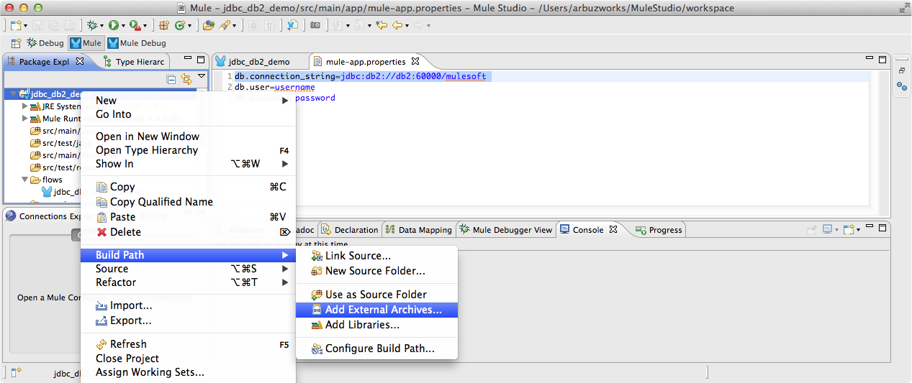

##### Configuration of DB2 Data Source

Open **flows/jdbc_db2_demo.mflow** file. For configuration of DB2 Data Source select **Global Elements** tab, click **Create** button and using the filter find and select the **DB2 Data Source**. Click **OK**. You will see a window for **DB2 Data Source** configuration, adjust the fields as displayed on the following image.

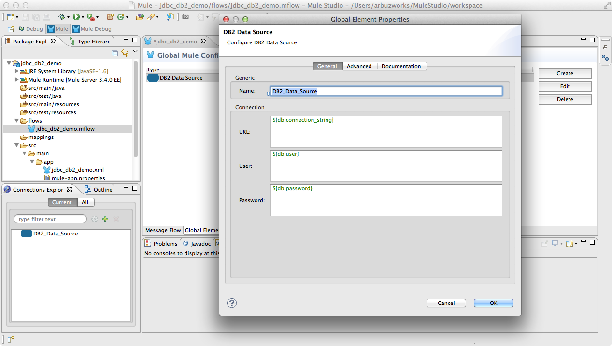

##### Configuration of the JDBC Connector

Click **Create** button and using the filter find and select the **Database** connector. Then click **OK**. You will see a window for **JDBC endpoint** configuration. In the **Database Specific** dropdown select **DB2_Data_Source** which we configured earlier.

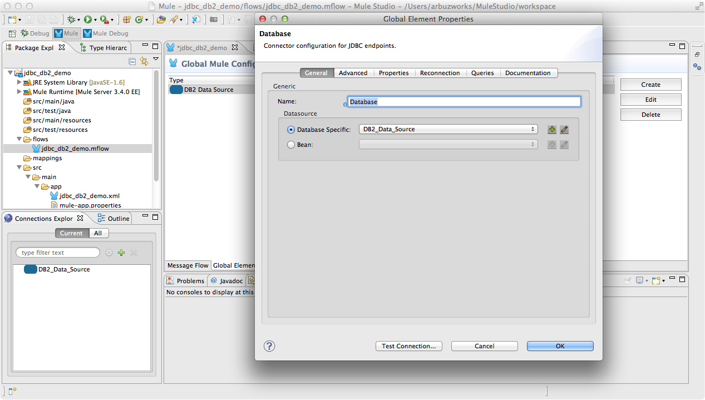

We will implement the main actions for the work with the database in our application. They are: sysinfo, create, retrieve, update and delete items. In this window select the **Queries** tab and add a query to retrieve all items from the table. For this purpose click **+** button, set **Query Key** as **selectAll** and **Query** as

```sql
SELECT * FROM demo_tbl
```

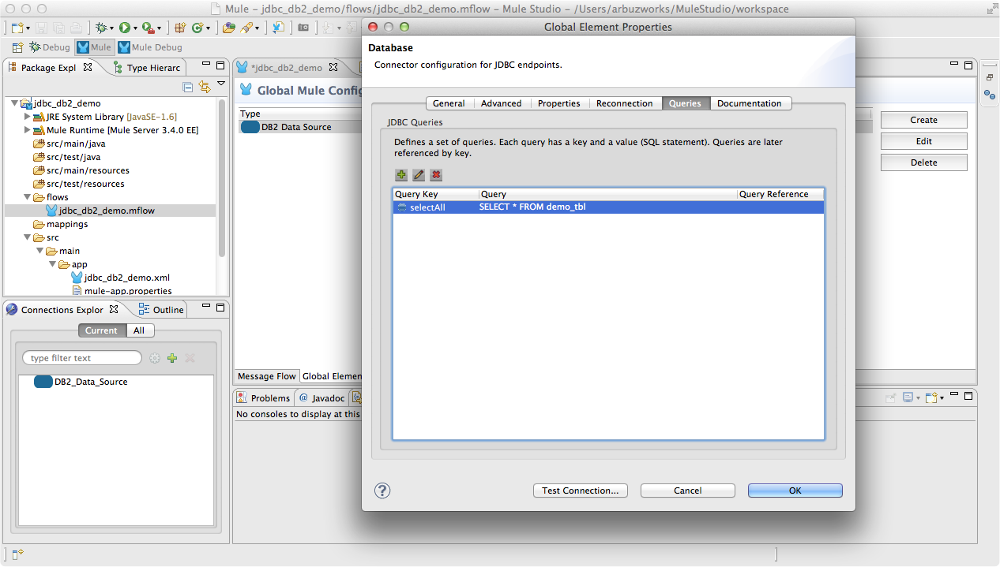

In the following list you can see all the queries to be used in our application. Add them in the same way:

* selectAll:  
```sql
SELECT * FROM demo_tbl
```

* insertItem:    
```sql
INSERT INTO demo_tbl (title, description) VALUES (#[message.inboundProperties['title']], #[message.inboundProperties['description']])
```
* updateItem:     
```sql
UPDATE demo_tbl SET title=#[message.inboundProperties['title']], description=#[message.inboundProperties['description']] WHERE id=#[message.inboundProperties['id']]
```

* deleteItem:    
```sql
DELETE FROM demo_tbl WHERE id=#[message.inboundProperties['id']]
```

* findById:    
```sql
SELECT * FROM demo_tbl  WHERE id=#[message.inboundProperties['id']]
```

* sysinfo:    
```sql
SELECT * FROM SYSIBMADM.ENV_INST_INFO
```

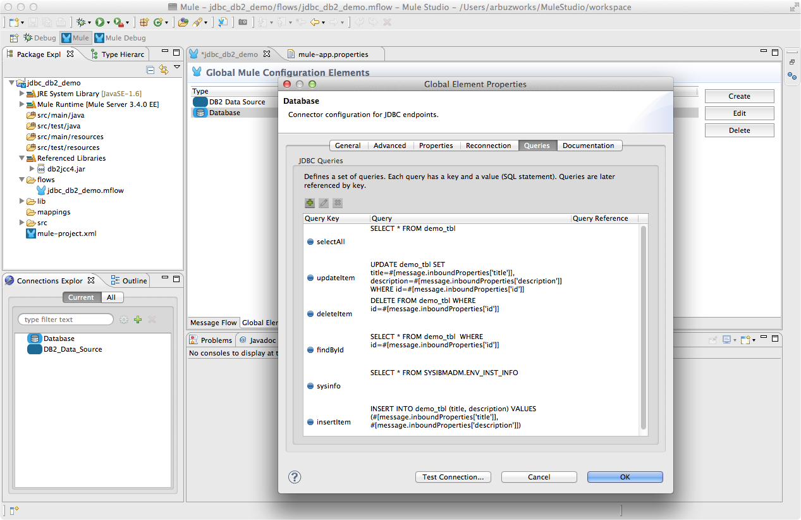

After you have added all the queries click **OK** button.

### Step 4: Create System Info flow

*    Switch to the **Message Flow** tab in the flow editor.
*    Add a new flow by dragging it from the Palette.
*    Double click the new flow to open its properties and rename it to **sysInfo**. Click **OK**.

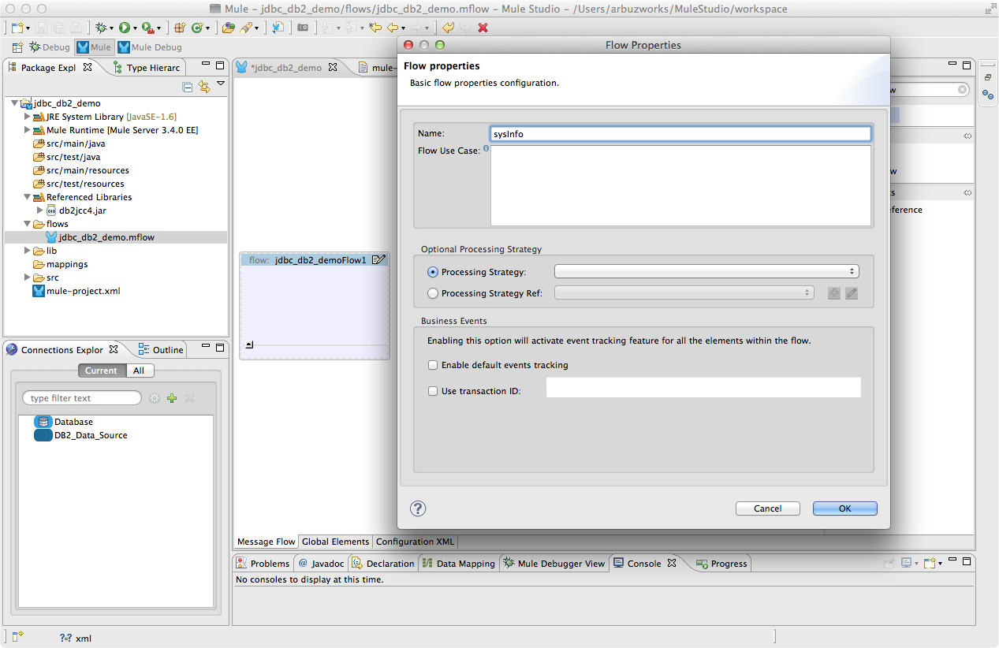

*    Drag **HTTP Endpoint** to the flow. Double click it to show its properties and adjust them as displayed on the following image.

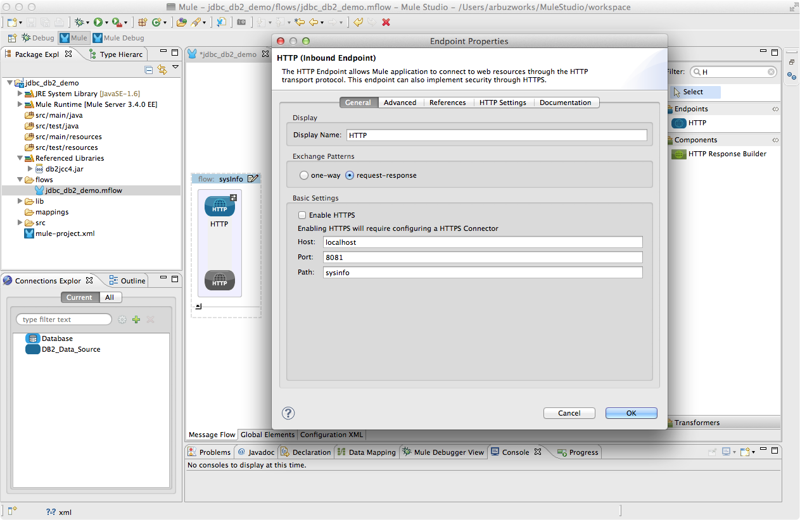

*    Drag **Database Endpoint** to the flow. Double click it to show its properties. Set **Display name** as **Select all items**, choose **request-response** as **Exchange Patterns**.
*    Switch to the **References** tab and in the **Connector Reference** dropdown select the **Database** which we configured earlier on Step 3.

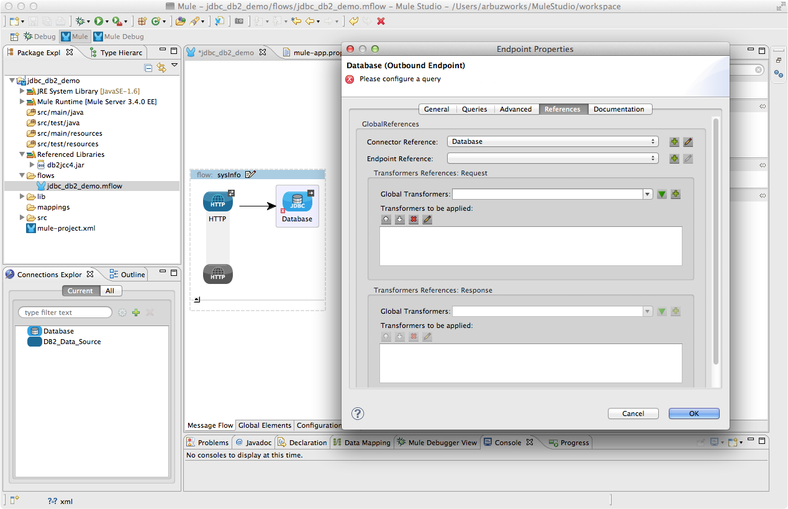

*    Switch to the **General** tab. Now in **SQL Statement** panel in the **Key** dropdown list you can see all keys of queries you added when configuring the JDBC Connector. Select **sysinfo** and click **OK**.
 
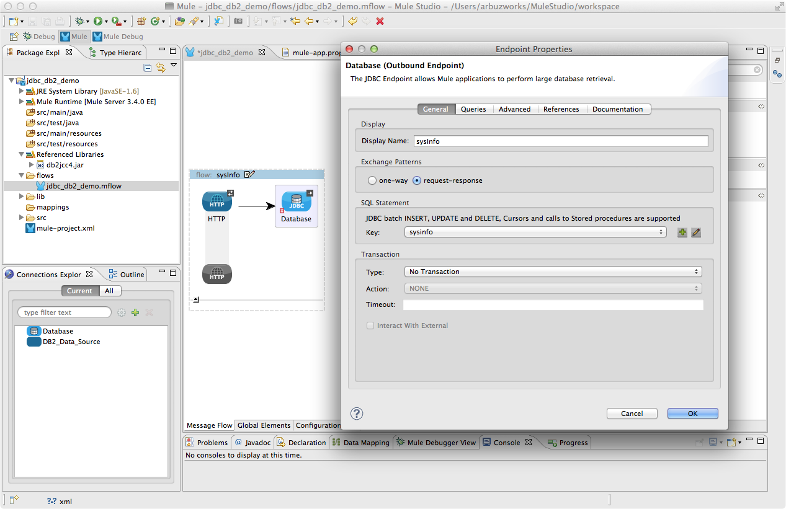

*    Drag **Object to JSON** transformer to the flow. It does not need any additional settings.

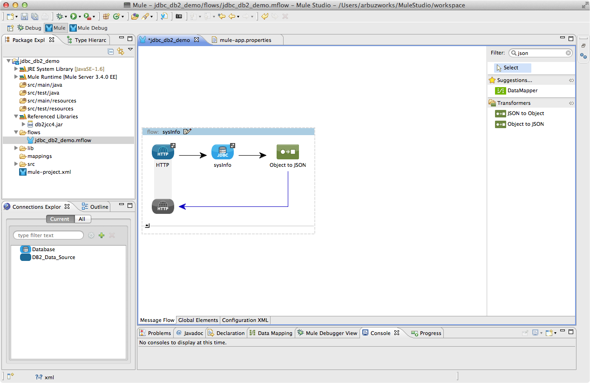

*    Save the flow.

### Step 5: Run project

*    Right Click **src/main/app/jdbc_demo.xml \> Run As/Mule Application**.

 

*    Check the console to see when the application starts.  

You should see a log message on the console:  
 
    ++++++++++++++++++++++++++++++++++++++++++++++++++++++++++++    
    + Started app 'jdbc_db2_demo'                                  +    
    ++++++++++++++++++++++++++++++++++++++++++++++++++++++++++++   

### Step 6: Test System Info flow

*    When the application is started, open your browser and point it to [http://localhost:8081/sysinfo](http://localhost:8081/sysinfo).

*    You should see the database system information in JSON format.

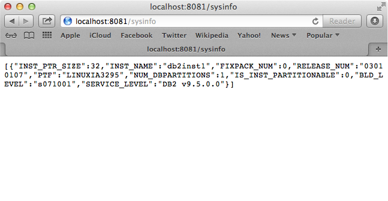 

*    Stop Mule server. 

### Step 7: Create listItems flow 

*    Switch to the **Message Flow** tab in the flow editor.
*    Add a new flow by dragging it from the Palette.
*    Double click the new flow to open its properties and rename it to **listItems**. Click **OK**.

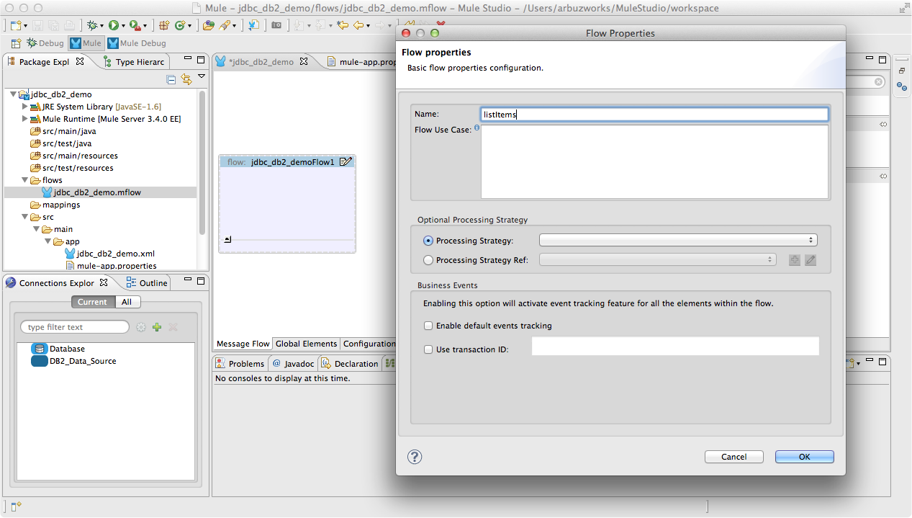

*    Drag **HTTP Endpoint** to the flow. Double click it to show its properties and adjust them as displayed on the following image.

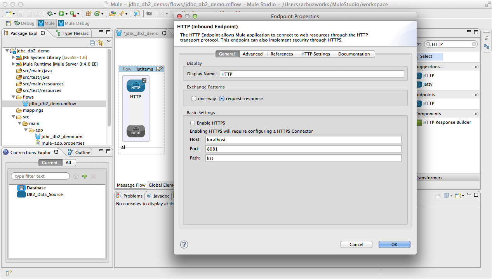

*    Drag **Database Endpoint** to the flow. Double click it to show its properties. Set **Display name** as **Select all items**, choose **request-response** as **Exchange Patterns**.
*    Switch to the **References** tab and in the **Connector Reference** dropdown select the **Database** which we configured earlier on Step 3.

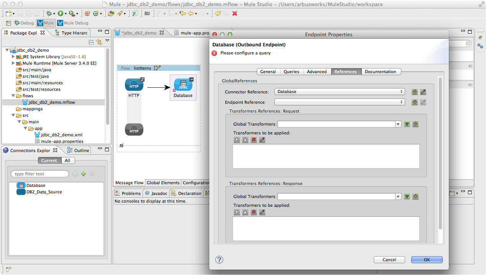

*    Switch to the **General** tab. Now in the **SQL Statement** panel in the **Key** dropdown list you can see all keys of queries you added when configuring the JDBC Connector. Select **selectAll** and click **OK**.
 
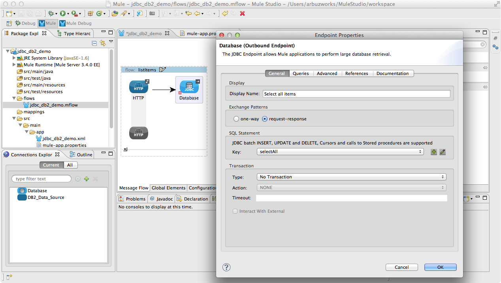

*    Drag **Object to JSON** transformer to the flow. It does not need any additional settings.

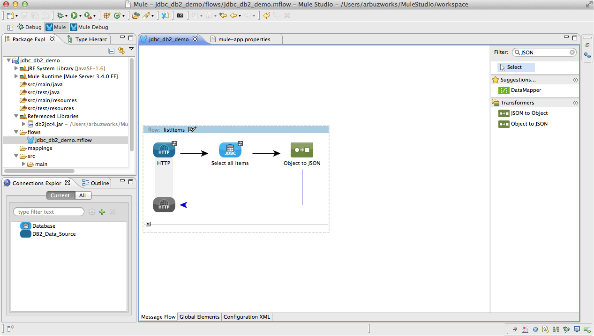

*    Save the flow.


### Step 8: Test listItems flow

*    When the application is started, open your browser and point it to [http://localhost:8081/list](http://localhost:8081/list).

*    You should see the string of empty JSON array because our table in the database is still empty.

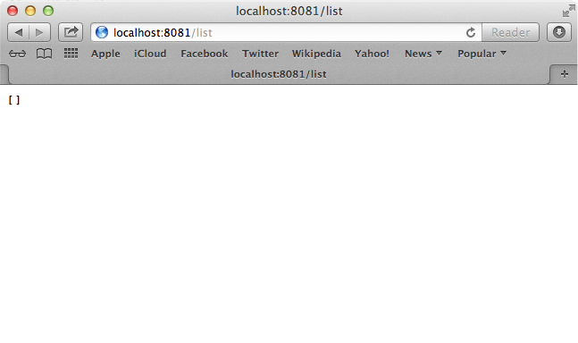 

*    Stop Mule server.  

### Step 9: Create createItem flow

*    Add a new flow by dragging it from the Palette.
*    Double click the new flow to open its properties and rename it to **createItem**. Click **OK**.

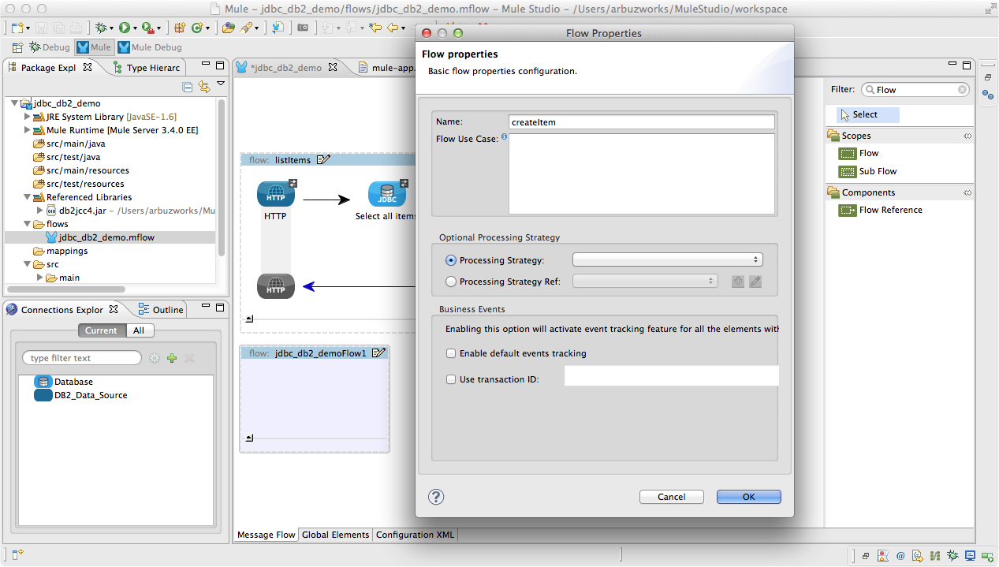

*    Drag **HTTP Endpoint** to the flow. Double click it to show its properties and adjust them as displayed on the following image.

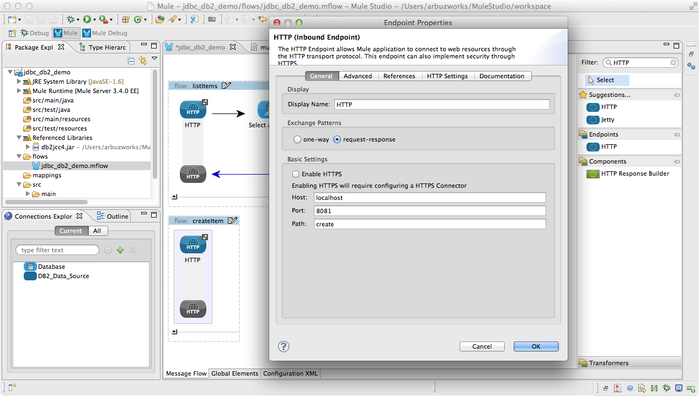

*    Drag **Database Endpoint** to the flow. Double click it to show its properties. Set **Display name** as **Insert new item**. Switch to the **References** tab and in the **Connector Reference** dropdown select the **Database** which we configured earlier on Step 3.
*    Switch to the **General** tab. In the **SQL Statement** panel in the **Key** dropdown list select **insertItem** and click **OK**.

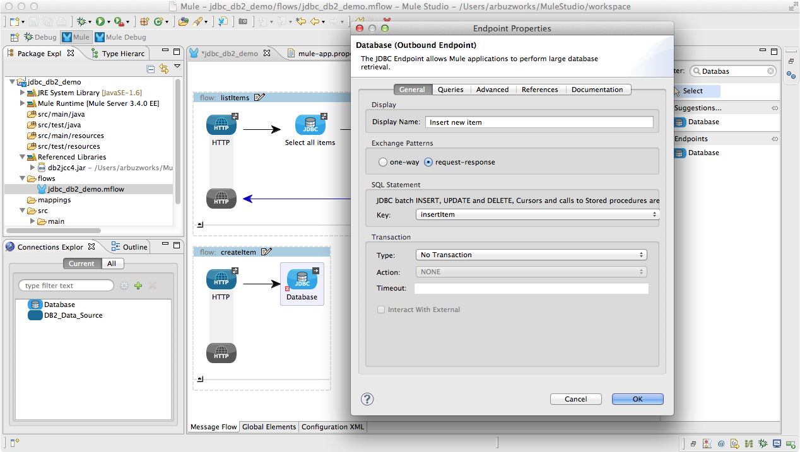

*    Drag another **Database Endpoint** to the flow and configure it in the same way as **System Info** endpoint on Step 4.
*    Drag **Object to JSON** transformer to the flow.

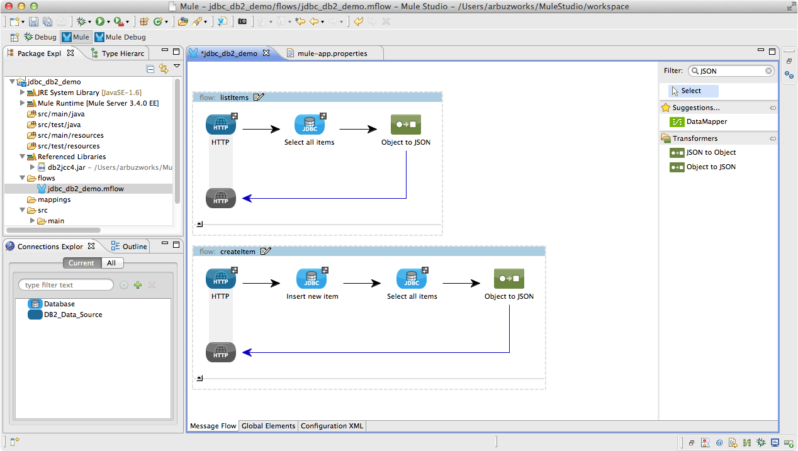

*    Save the flow.

### Step 10: Test createItem flow

*    Run the project.
*    Open your browser and point it to [http://localhost:8081/create?title=TestTitle&description=TestDescription](http://localhost:8081/create?title=TestTitle&description=TestDescription).
*    You should see the JSON array which contains the created item based on GET request parameters.

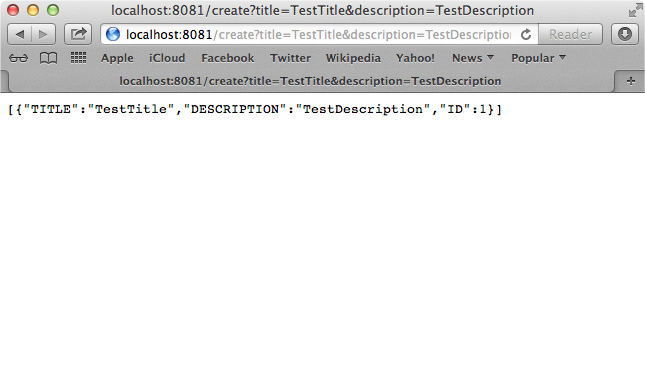

*    Point your browser to [http://localhost:8081/list](http://localhost:8081/list) and you should see all items of the **demo_tbl** table.

*    Stop Mule server.  

### Step 11: Create flows for rest of actions (Update, Delete, Find by ID)

*   In the same way as we created **createItem flow** you have to create **updateItem flow**, **deleteItem flow** and **findById flow**. You have to use **updateItem**, **deleteItem** and **findById** query keys to Update, Delete and Find by ID actions in the flows.

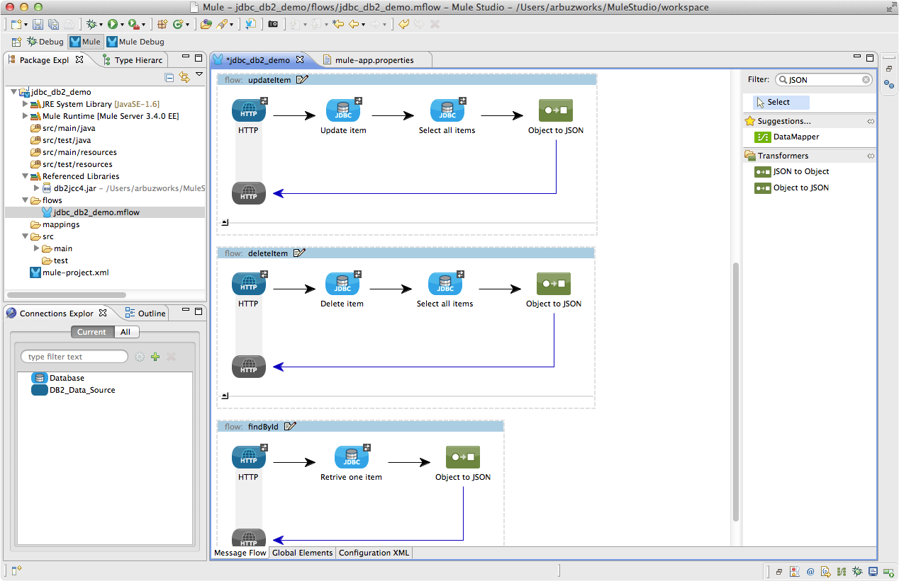

### Step 12: Test updateItem, deleteItem and findById flows

*    Run the project.
*    Test each flow:
    *    Retrieve one item: [http://localhost:8081/find?id=1](http://localhost:8081/find?id=1)
    *    Update the item: [http://localhost:8081/update?id=1&title=NewTitle&description=NewDescription](http://localhost:8081/update?id=1&title=NewTitle&description=NewDescription)
    *    Select all items: [http://localhost:8081/list](http://localhost:8081/list)
    *    Delete the item: [http://localhost:8081/delete?id=1](http://localhost:8081/delete?id=1)
*    Stop Mule server.   

### Other Resources

For more information on:

- Mule AnyPoint® connectors, please visit [http://www.mulesoft.org/connectors](http://www.mulesoft.org/connectors)
- Mule platform and how to build Mule apps, please visit [http://www.mulesoft.org/documentation/display/current/Home](http://www.mulesoft.org/documentation/display/current/Home)


