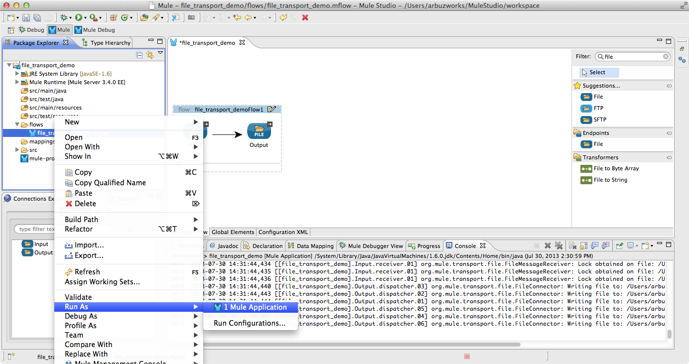

# File Connector

The File connector allows files in the local file system to be read from and written to. The connector can be configured to filter the file it reads and the way the files are written whether the output is placed in a new file or is to be appended.

### Contents 

[Prerequisites](#prerequisites)  
[Step 1: Create Demo Project](#step-1-create-demo-project)  
[Step 2: Configure application](#step-2-configure-application)  
[Step 3: Create File Connector demo flow](#step-3-create-file-connector-demo-flow)  
[Step 4: Run project](#step-4-run-project)  
[Step 5: Test File Connector demo flow](#step-5-test-file-connector-demo-flow)  
[Step 6: Expanded example. Move file](#step-6-expanded-example-move-file)  
[Step 7: Test moving a file](#step-7-test-moving-a-file)  
[Other Resources](#other-resources)  
 

### Prerequisites

In order to build and run this project you'll need:

*   [MuleStudio](http://www.mulesoft.org/download-mule-esb-community-edition).

### Step 1: Create Demo Project

*    Run Mule Studio and select **File \> New \> Mule Project** menu item.  
*    Type **demo** as a project name and click **Next**.  

*    Then click **Next**.

*    And finally click **Finish**.

### Step 2: Configure application

The following simple example copies files from /tmp/input to /tmp/output every 1 second (1000 ms). As input files are not deleted they are processed every time. Changing the **autoDelete** property value to **true** will just move files.

First, create **input** and **output** folders within the **tmp** folder.

Open **flows/demo.mflow** file. 

To configure File Connectors select the **Global Elements** tab. 

**Step 2.1** Click **Create** button and using the filter find and select **File** within the **Connectors** dropdown list. Click **OK**. You will see a window with the **Global Element Properties** header, here you can setup connector configuration for the file endpoints. 

Adjust the fields as displayed on the following image. It is advised to uncheck the **Auto Delete** checkbox.

**Step 2.2** Then create the second File Connector by repeating Step 2.1. Adjust the fields as displayed on the following image.

### Step 3: Create File Connector demo flow

*    Switch to the **Message Flow** tab in the flow editor.
*    Add a new flow by dragging it from the Palette.
*    Double click the new flow to open its properties, here you can rename it to whatever name you want. Click **OK**.

*    Drag **File Endpoint** to the flow. Double click it to show its properties. Set **Display name** as **Input**, fill in the **Path** field with the path to the input folder (manually or by clicking **Browse** button).

*    Switch to the **References** tab and in the **Connector Reference** dropdown list select **Input** which we have configured on Step 2.

*    Then drag one more **File Endpoint** to the flow. Double click it to show its properties. Set **Display name** as **Output**, fill in the **Path** field with the path to the input folder (manually or by clicking **Browse** button).

*    Switch to the **References** tab and in the **Connector Reference** dropdown list select the **Output** which we have configured on Step 2.
Save the project.

### Step 4: Run project

*    Right Click **src/main/app/demo.xml \> Run As/Mule Application**.

 

*    Check the console to see when the application starts.  

You should see a log message on the console:  
 
    ++++++++++++++++++++++++++++++++++++++++++++++++++++++++++++    
    + Started app 'demo'                                       +    
    ++++++++++++++++++++++++++++++++++++++++++++++++++++++++++++   

### Step 5: Test File Connector demo flow

*    In order to perform a test, open two windows, one pointing to the tmp/input folder and the second pointing to the tmp/output folder respectively.
*    Using the built-in text editor create a **test** file and fill it in with some text, for example "This is a test message!".
*    In a second you will find the same file in the output folder.

 

*    Copy/Paste the existing file in the input folder with whatever name and in a second you will find the same file in the output folder.

 

*    Stop Mule server. 

### Step 6: Expanded example. Move file

The following example moves files from /tmp/input to /tmp/output every 5 second (5000 ms), saving a backup file of the original file (with the extension backup) in /tmp/backup. A new file is renamed with the current date and time as a prefix. Note that fileAge will prevent moving files that are still being generated as the file has to be untouched for at least half a second.

Create a **backup** folder within the **tmp** folder.

*    Switch to the **Global Elements** tab and open the properties window of the input file connector. Tick the **Auto Delete** checkbox.

*    Double click the **Input** file endpoint and open the properties window. Adjust fields as displayed on the screen below. 
Fill in **Move to Pattern** with the "#[header:originalFilename].backup", **Move to Directory** field  with "/Users/arbuzworks/tmp/backup" value, and **Polling Frequency** and **File Age** fields with 1000 and 500 values respectively. Click **OK**.

*    Double click the **Output** file endpoint and open the properties window. Adjust fields as displayed on the screen below.
Fill in **Output Pattern** with "#[function:datestamp]-#[message.inboundProperties['originalFilename']]". Click **OK**.

### Step 7: Test moving a file

*    Start the application as it is described on Step 4. Lets create a file (in our case "test.rtf") and insert there certain text. Then put the file to the input folder.

*    Finally you can see that original file has been moved to the output folder and renamed on the basis of the pattern " datestamp + 'filename' "; at the same time a new file has been created in the backup folder and named as " 'filename'.backup ".

*    Stop Mule server.

### Other Resources

For more information on:

- Mule AnyPoint® connectors, please visit [http://www.mulesoft.org/connectors](http://www.mulesoft.org/connectors)
- Mule platform and how to build Mule apps, please visit [http://www.mulesoft.org/documentation/display/current/Home](http://www.mulesoft.org/documentation/display/current/Home)

