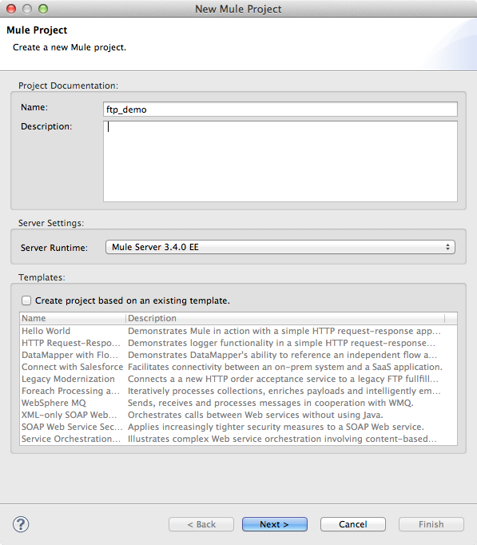
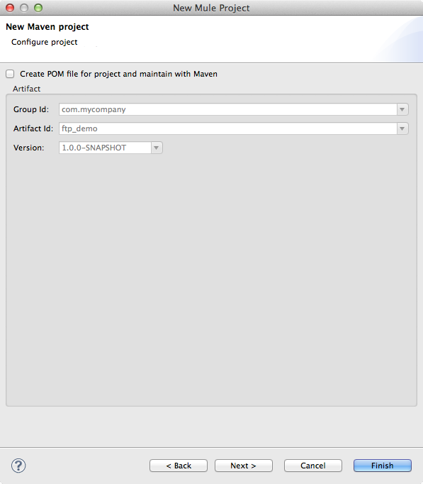
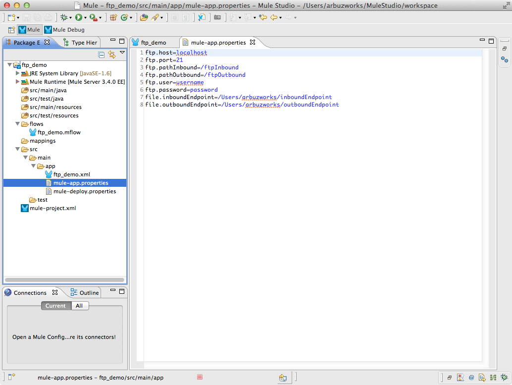
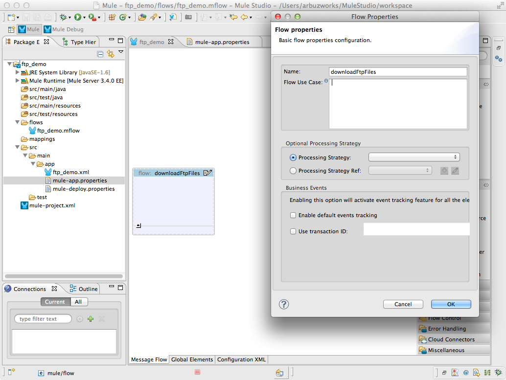
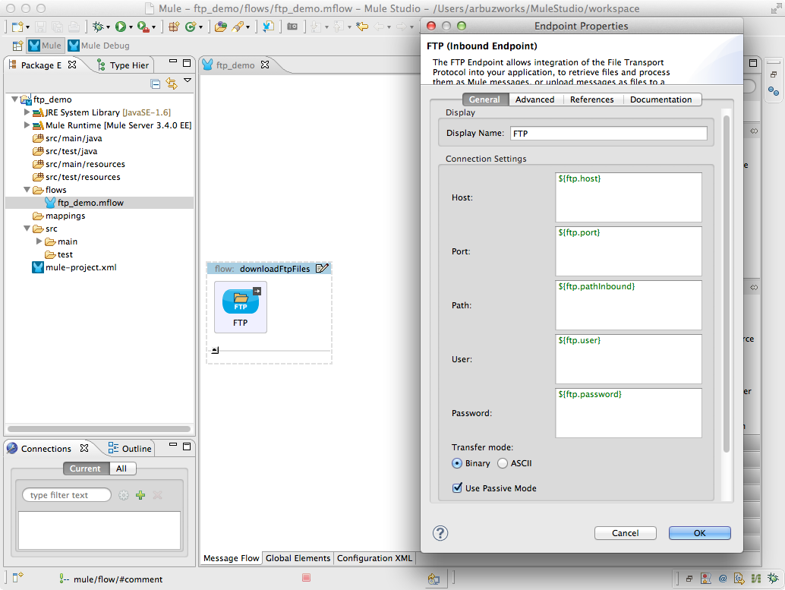
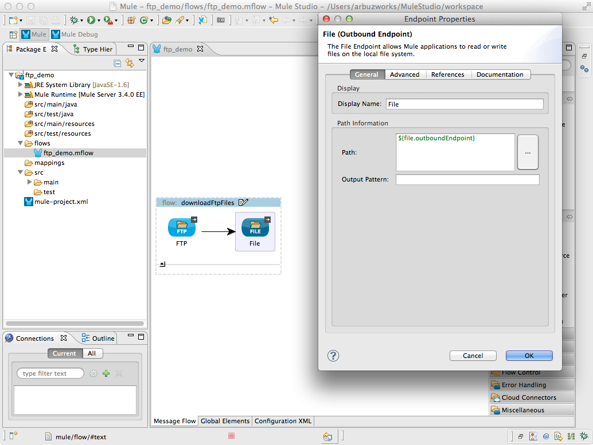
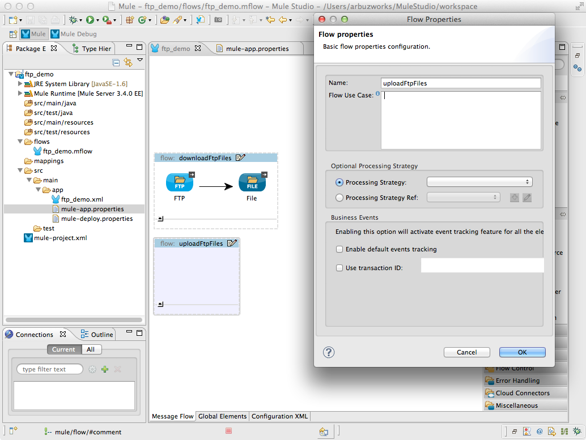
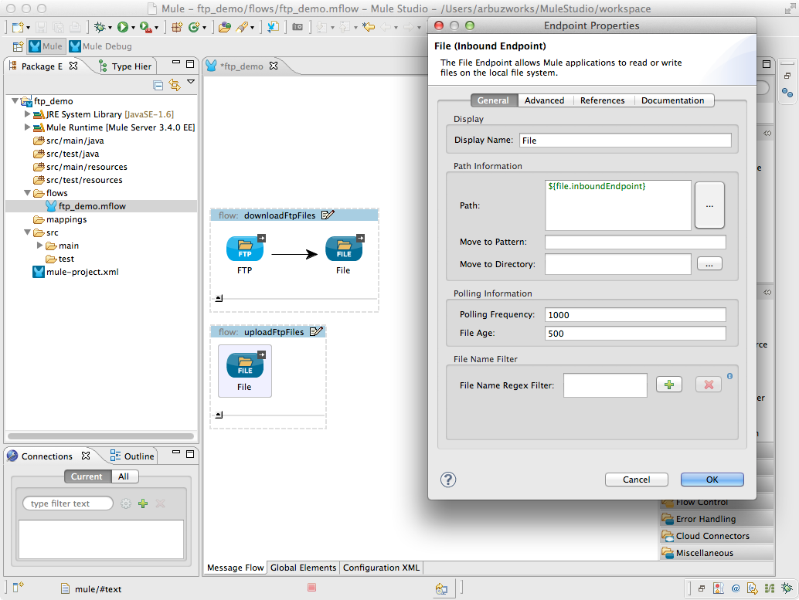
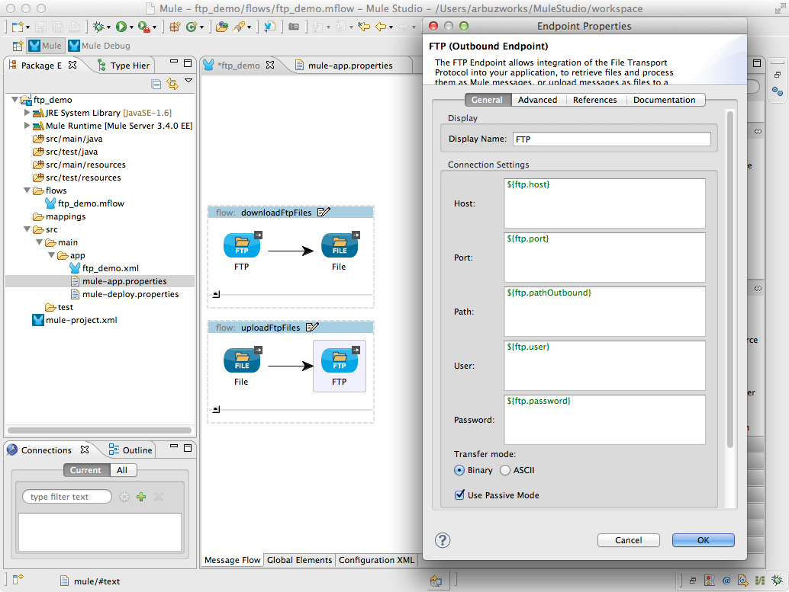

# FTP Connector

The FTP connector allows integration of the File Transfer Protocol into Mule. Mule can poll a remote FTP server directory, retrieve files and process them as Mule messsages. Messages can also be uploaded as files to a directory on a remote FTP server.

### Contents 

[Prerequisites](#prerequisites)  
[Step 1: Create Demo Project](#step-1-create-demo-project)  
[Step 2: Configure the application](#step-2-configure-the-application)  
[Step 3: Create Flow for downloading from FTP server to the connected file system](#step-3-create-flow-for-downloading-from-ftp-server-to-the-connected-file-system)  
[Step 4: Run Demo Project](#step-4-run-demo-project)  
[Step 5: Test downloadFtpFiles Flow](#step-5-test-downloadftpfiles-flow)  
[Step 6: Create Flow for uploading files to FTP server](#step-6-create-flow-for-uploading-files-to-ftp-server)  
[Step 7: Test uploadFtpFiles Flow](#step-7-test-uploadftpfiles-flow)  
[XML Flow](#xml-flow)  
[Other Resources](#other-resources)  

### Prerequisites

In order to build and run this project you'll need:

*   [MuleStudio](http://www.mulesoft.org/download-mule-esb-community-edition).
*   Two target directories on the connected file system (your local machine).
    *    **/users/arbuzworks/inboundEndpoint** - a location within the connected file system of the file being transferred into the flow.
    *    **/users/arbuzworks/outboundEndpoint** - a directory on the connected file system to which the file currently in the flow will be written. 

*    An FTP client to connect to a FTP server. You have to know the following parameters to get an access to the FTP server:
    *    **host** - An IP address (such as www.mulesoft.com, localhost, or 192.168.0.1).
    *    **port** - The port number to connect on.
    *    **user** - If FTP is authenticated, this is the username used for authenitcation.
    *    **password** - The password for the user being authenticated.

*    Working FTP server with two required directories with the FTP user access to read and write files.
    *    **localhost:21/ftpInbound** - a directory on the FTP server from which the file will be downloaded to the connected file system.
    *    **localhost:21/ftpOutbound** - a directory on the FTP server to which the file will be uploaded from the connected file system

    
### Step 1: Create Demo Project

*    Run Mule Studio and select **File \> New \> Mule Project** menu item.  
*    Type **ftp_demo** as a project name and click **Next**.  

*    Then click **Finish**.

### Step 2: Configure the application

We need to provide values for the FTP server and the connected file system parameters. Open **src/main/app/flows/mule-app.properties** file and add the following lines:
    ftp.host=localhost    
    ftp.port=21     
    ftp.pathInbound=/ftpInbound     
    ftp.pathOutbound=/ftpOutbound    
    ftp.user=username     
    ftp.password=password    
    file.inboundEndpoint=/Users/arbuzworks/inboundEndpoint    
    file.outboundEndpoint=/Users/arbuzworks/outboundEndpoint    

### Step 3: Create Flow for downloading from FTP server to the connected file system
The aim of this Flow is to download files from the FTP server directory **localhost:21/ftpInbound** to the connected file system directory **/users/arbuzworks/outboundEndpoint**.

*    Switch to the **Message Flow** tab in the flow editor.
*    Add a new flow by dragging it from the Palette.
*    Double click the new flow to open its properties and rename it to **downloadFtpFiles**. Click **OK**.

*    Drag **FTP Endpoint** to the flow. Double click it to show its properties and adjust them as displayed on the following image.

*    Drag **File Endpoint** to the flow. Double click it and set a path to the directory where files will be saved.

*    Save the flow.

### Step 4: Run Demo Project

*    Right Click on **src/main/app/ftp_demo.xml \> Run As/Mule Application**.

 

*    Check the console to see when the application starts.  

You should see a log message on the console:  
 
    ++++++++++++++++++++++++++++++++++++++++++++++++++++++++++++    
    + Started app 'ftp_demo'                                   +
    ++++++++++++++++++++++++++++++++++++++++++++++++++++++++++++
    
### Step 5: Test downloadFtpFiles Flow

*    Open the FTP client and download a file to the FTP server directory **localhost:21/ftpInbound**.    
*    You should see the uploaded file in the connected file system directory **/users/arbuzworks/outboundEndpoint**.    
*    Stop Mule server.   

### Step 6: Create Flow for uploading files to FTP server

The aim of this Flow is to upload files from the connected file system directory **/users/arbuzworks/inboundEndpoint** to the FTP server directory **localhost:21/ftpOutbound**.

*    Switch to the **Message Flow** tab in the flow editor.
*    Add a new flow by dragging it from the Palette.
*    Double click the new flow to open its properties and rename it to **uploadFtpFiles**. Click **OK**.

*    Drag **File Endpoint** to the flow. Double click it and set a path to the directory from which the files will be uploaded to the FTP server.

*    Drag **FTP Endpoint** to the flow. Double click it to show its properties and adjust them as displayed on the following image.

*    Save the flow.

### Step 7: Test uploadFtpFiles Flow

*    Run Demo Project as it is described on **Step 4**.
*    Paste the file to the local directory **/users/arbuzworks/inboundEndpoint**.
*    Open the FTP client.
*    You should see the new file in the FTP server directory **localhost:21/ftpOutbound**. The file will be removed from  **/users/arbuzworks/inboundEndpoint** automatically.

### XML Flow 

The final XML flow should look like that:

<?xml version="1.0" encoding="UTF-8"?>

    <mule xmlns:ftp="http://www.mulesoft.org/schema/mule/ee/ftp" xmlns:file="http://www.mulesoft.org/schema/mule/file" xmlns:tracking="http://www.mulesoft.org/schema/mule/ee/tracking" xmlns="http://www.mulesoft.org/schema/mule/core" xmlns:doc="http://www.mulesoft.org/schema/mule/documentation" xmlns:spring="http://www.springframework.org/schema/beans" version="EE-3.4.0" xmlns:xsi="http://www.w3.org/2001/XMLSchema-instance" xsi:schemaLocation="http://www.springframework.org/schema/beans http://www.springframework.org/schema/beans/spring-beans-current.xsd http://www.mulesoft.org/schema/mule/core http://www.mulesoft.org/schema/mule/core/current/mule.xsd http://www.mulesoft.org/schema/mule/file http://www.mulesoft.org/schema/mule/file/current/mule-file.xsd http://www.mulesoft.org/schema/mule/ee/tracking http://www.mulesoft.org/schema/mule/ee/tracking/current/mule-tracking-ee.xsd http://www.mulesoft.org/schema/mule/ee/ftp http://www.mulesoft.org/schema/mule/ee/ftp/current/mule-ftp-ee.xsd">
    <flow name="downloadFtpFiles" doc:name="downloadFtpFiles">
        <ftp:inbound-endpoint host="${ftp.host}" port="${ftp.port}" path="${ftp.pathInbound}" user="${ftp.user}" password="${ftp.password}" responseTimeout="10000" doc:name="FTP"/>
        <file:outbound-endpoint path="${file.outboundEndpoint}" responseTimeout="10000" doc:name="File"/>
    </flow>     
    <flow name="uploadFtpFiles" doc:name="uploadFtpFiles">
        <file:inbound-endpoint path="${file.inboundEndpoint}" responseTimeout="10000" doc:name="File"/>
        <ftp:outbound-endpoint host="${ftp.host}" port="${ftp.port}" path="${ftp.pathOutbound}" user="${ftp.user}" password="${ftp.password}" responseTimeout="10000" doc:name="FTP"/>
    </flow>    
</mule>
        
### Other Resources

For more information on:

- Mule AnyPoint® connectors, please visit [http://www.mulesoft.org/connectors](http://www.mulesoft.org/connectors)
- Mule platform and how to build Mule apps, please visit [http://www.mulesoft.org/documentation/display/current/Home](http://www.mulesoft.org/documentation/display/current/Home)
