# HTTP Connector

Mule uses HTTP Endpoints to send and receive requests over HTTP transport protocol, or HTTPS over the SSL protocol. Configured as either inbound (also known as message sources) or outbound, HTTP endpoints use one of two message exchange patterns: request-response or one-way.

### Contents

[Step 1: Related Documentation and Examples](#step-1-related-documentation-and-examples)  
[Step 2: Hello, Mule Example](#step-2-hello-mule-example)  
[Step 3: Serving a Static File](#step-3-serving-a-static-file)  
[Step 4: HTTP Outbound Endpoint](#step-4-http-outbound-endpoint)  
[Step 5: HTTPS Server Configuration](#step-5-https-server-configuration)  
[Other Resources](#other-resources)  

### Step 1: Related Documentation and Examples 

- If you are new to Mule Studio, please read how to [create and then run the example application in Mule Studio](http://www.mulesoft.org/documentation/display/current/Mule+Examples#MuleExamples-CreateandRunExampleApplications).

- [Hello World Example](http://www.mulesoft.org/documentation/display/current/Hello+World+Example) demonstrates a simple HTTP request-response activity.

- [HTTP Request-Response with Logger Example](http://www.mulesoft.org/documentation/display/current/HTTP+Request-Response+with+Logger+Example) illustrates how to use message payload in the HTTP Endpoint component.

This document describes 4 simple flows that use HTTP\HTTPS connector.

### Step 2: Hello Mule Example

In this example we will modify the **Hello World** application referenced above to use the request parameters and log their values.

- In Mule Studio [create](http://www.mulesoft.org/documentation/display/current/Mule+Examples#MuleExamples-CreateandRunExampleApplications) a new project.

- Drag an **HTTP** Endpoint from the Studio Palette onto the canvas. A new flow will be created and the HTTP Endpoint will become its inbound endpoint.

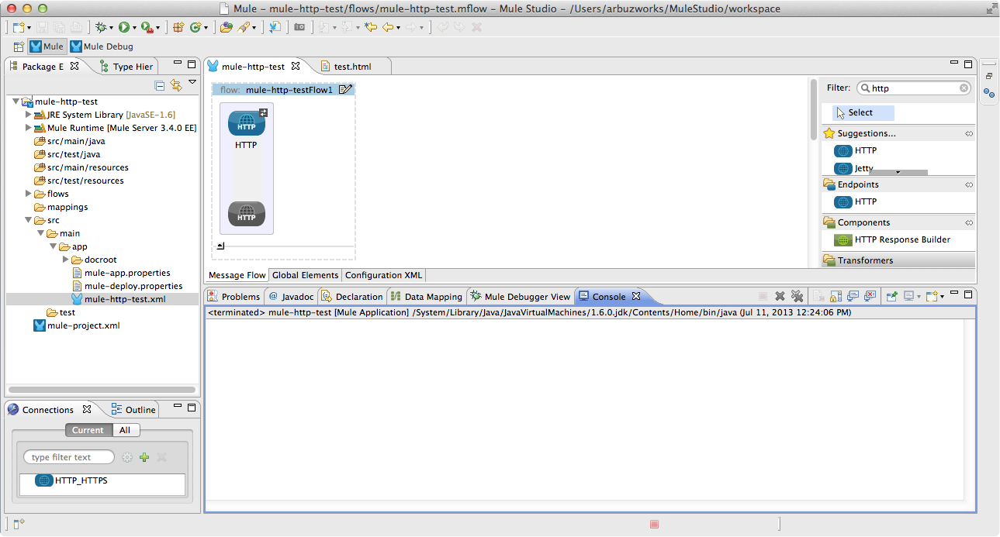

- Double click the endpoint to display its properties. Set **Path** property to **hello**.

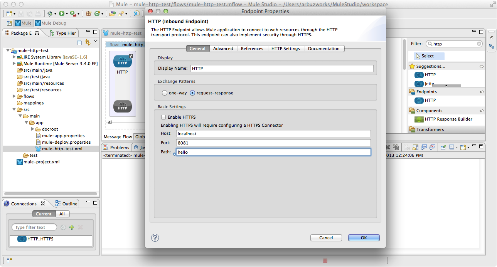

- Add the **Logger** component to the flow. Double click **Logger** and configure it according to the following screenshot:

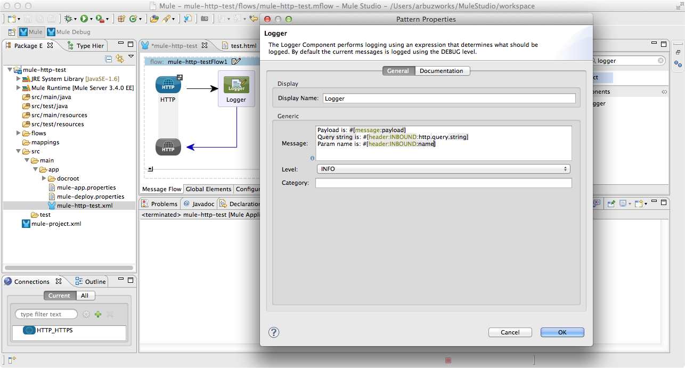

The above confguration will log the following properties:

- Message payload which is the path and query portions of the URL being accessed.
- HTTP query string.
- Request parameter titled **name**.

A full list of the supported properties is available here: [HTTP Transport Documentation](http://www.mulesoft.org/documentation/display/current/HTTP+Transport+Reference#HTTPTransportReference-HTTPProperties).

- Add the **Set Payload** component to the flow and configure it to use the request parameter **name** as displayed on the following screenshot:

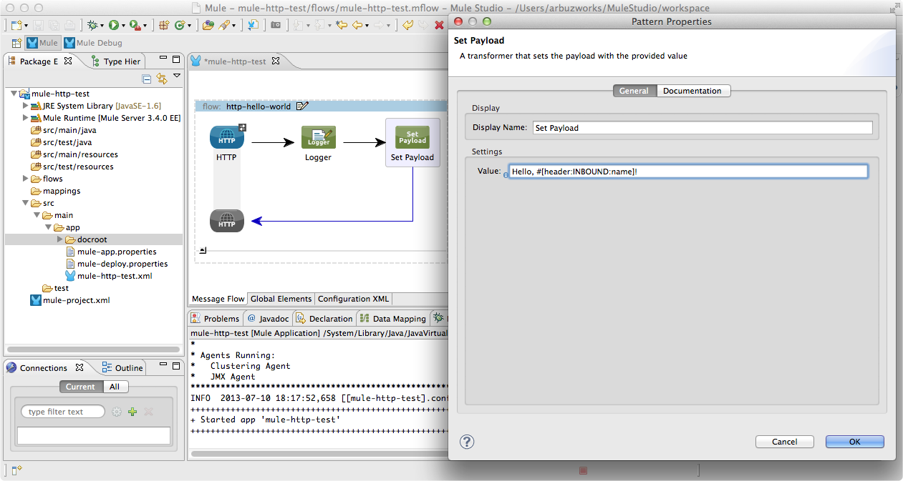

- Save the flow.

- Start the application and point your browser to [http://localhost:8081/hello?name=Mule](http://localhost:8081/hello?name=Mule). See the response from Mule.

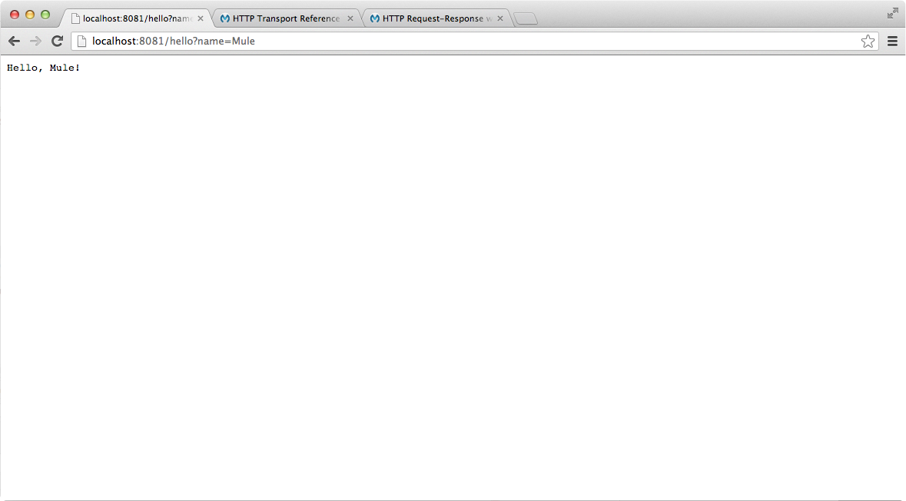

Also, note the **Logger** output in the Console.

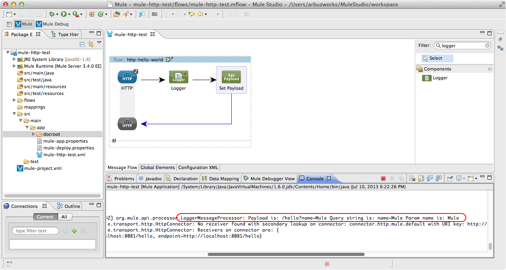

- Stop the Mule server by clicking on the **Terminate** button in the Mule Studio console.

### Step 3: Serving a Static File

This example demonstrates how to return a static file for an HTTP request.

- Add another flow to the project and name it **http-static-test**.

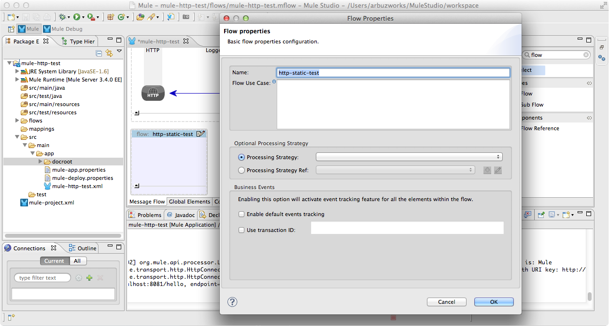

- Add an **HTTP** endpoint to the flow and set its **Path** to **static**.

- Create a **test.thml** file in the **src/main/app/docroot** folder. Add some content to the file and save it.

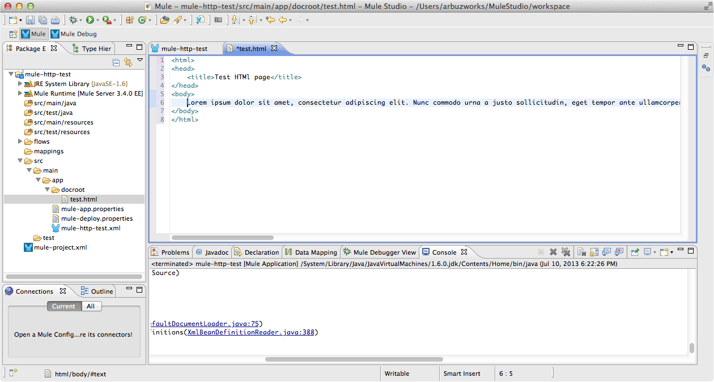

- Switch to the **Configuration XML** view in Mule Studio and add **static resource hanler** to the flow as follows:

	<http:static-resource-handler resourceBase="${app.home}/docroot"  defaultFile="test.html"/>

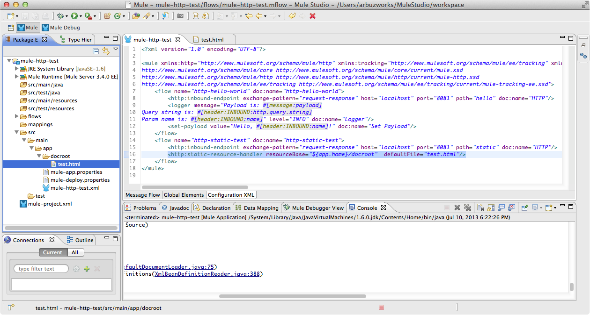.

Run the project and point your browser to the endpoint's URL [http://localhost:8081/static/](http://localhost:8081/static/).

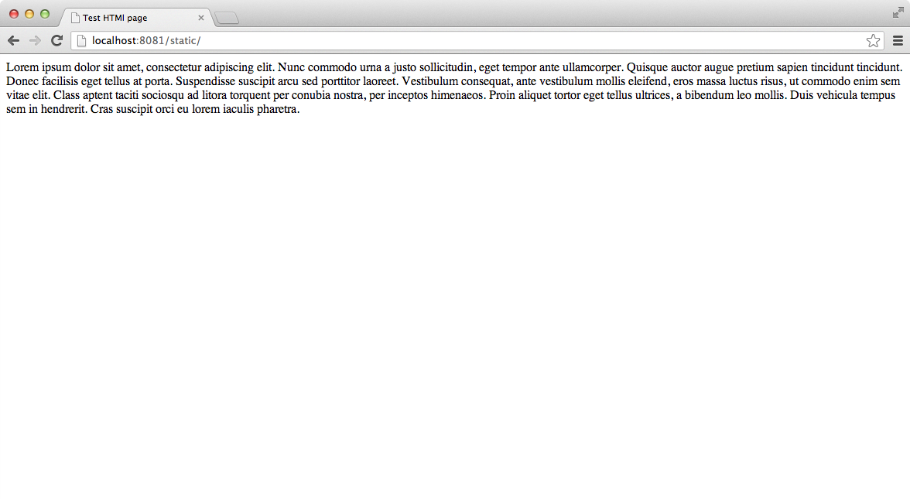

### Step 4: HTTP Outbound Endpoint

In this example we will use an HTTP Endpoint for querying an external website. We will forward the query string to Google and display the search results.

- Add a new flow to the project and name it **google-test**.

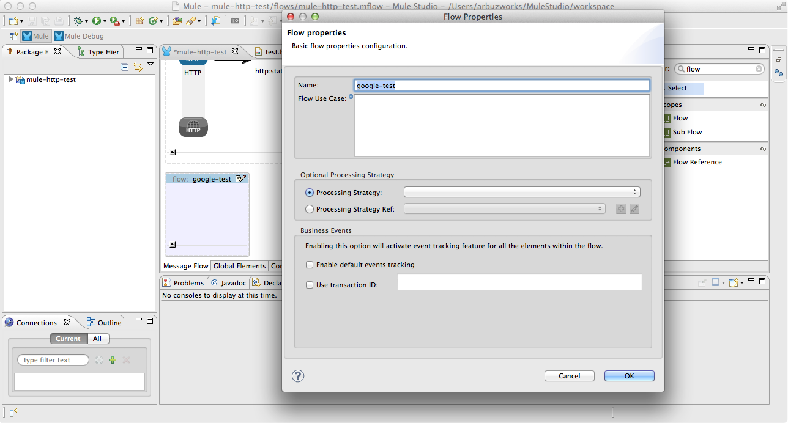

- Drag the **HTTP** icon from the Studio Palette to the flow. Double click the **HTTP** building block to open its **Pattern Properties** panel. Set its **Path** property to **Google**.

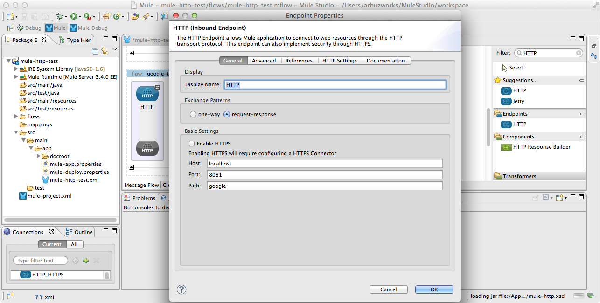

- Drag another copy of the **HTTP** Endpoint from the Studio Palette to the flow. It will become an Ounbound Endpoint because it is not at the beginning of the flow.
 Double click it to open its properties window. Change settings according to the following image:

  
 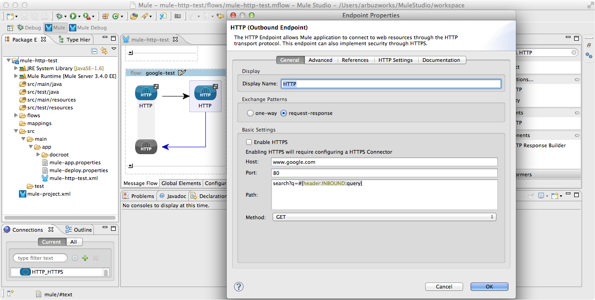

``www.google.com`` is the host we will request. Path ``search?q=#[header:INBOUND:query]`` corresponds to the Google search URL.

If you have to use a proxy server for Internet connection, please refer to the next section of this document on how to configure a proxy server for your HTTP Endpoint.

- Save the project and run it.

- When the application is started, open your browser and point it to [http://localhost:8081/google?query=Mule](http://localhost:8081/google?query=Mule).

You should see Google search results in your browser.

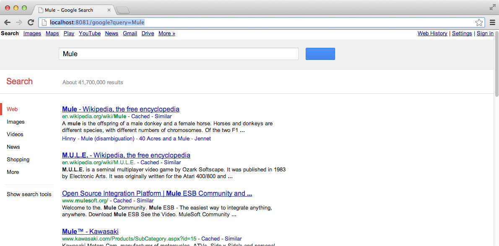

#### Proxy Configuration for HTTP Endpoint

This step is only needed if you have to use proxy for your HTTP connection.

- Click the **Global Elements** tab in the flow editor. Click on the **Create** button, find the "HTTP\HTTPS" connector and click **OK**.

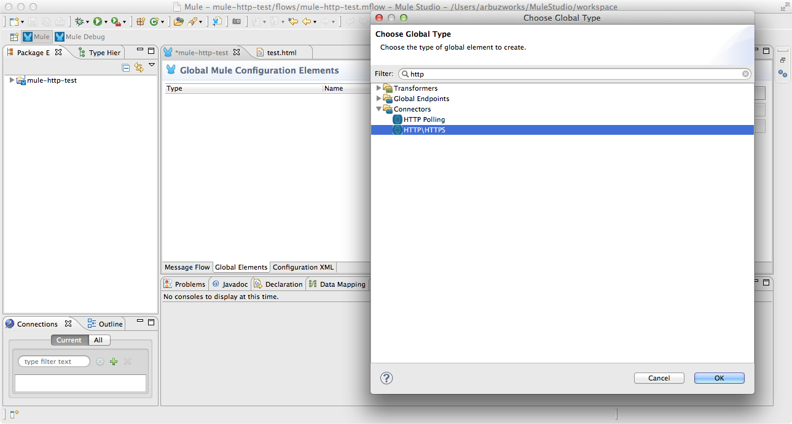

- The Properties window will automatically open. Switch to the **Proxy Settings** tab and specify proxy server parameters for your network.

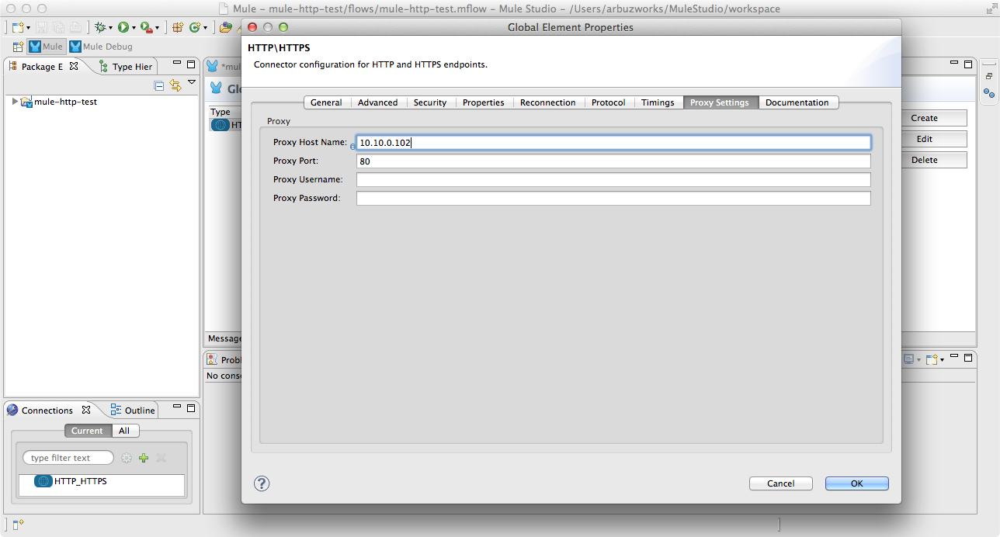

In order to use this global proxy configuration, switch back to the **Message Flow** tab in Mule Studio, double click on the outbound endpoint's building block in the **google-test** flow, click the **References** tab in the endpoint properties window and select our global **HTTP_HTTPS** connector configuration in the **Connector Reference** dropdown.

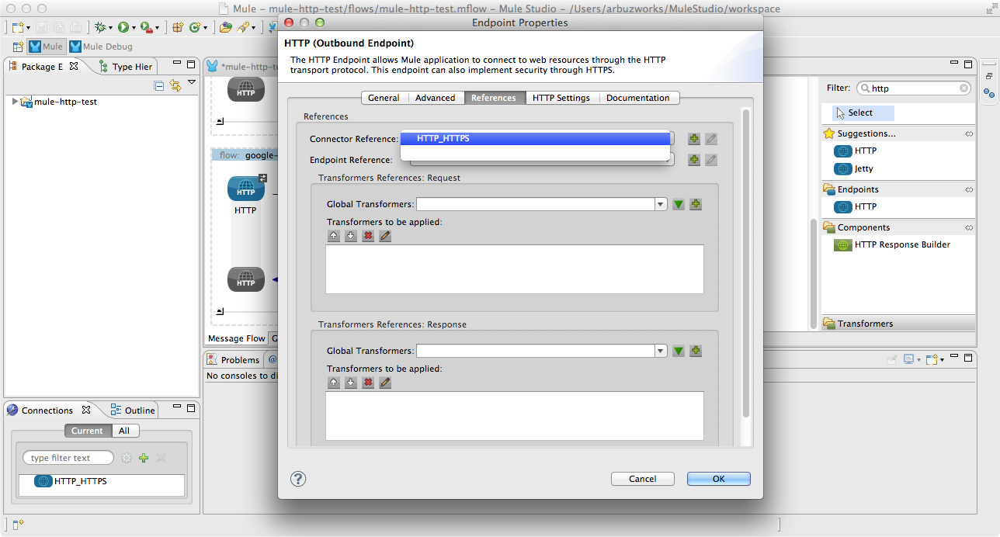

### Step 5: HTTPS Server Configuration
In order to setup an HTTPS server, you need to create a keystore. Detailed instructions on how to work with the keys can be found in [Oracle Documentation](http://docs.oracle.com/javase/7/docs/technotes/guides/security/jsse/JSSERefGuide.html#CreateKeystore). For this example, however, we only need one command to be executed: 

	keytool -genkey -alias mule -keyalg RSA -keystore keystore.jks  

Now we can start building a new flow that will serve the HTTPS requests.

- Switch to the **Global Elements** tab in the view editor and click on the **Create** button. The Global Element Properties window will be opened automatically. 

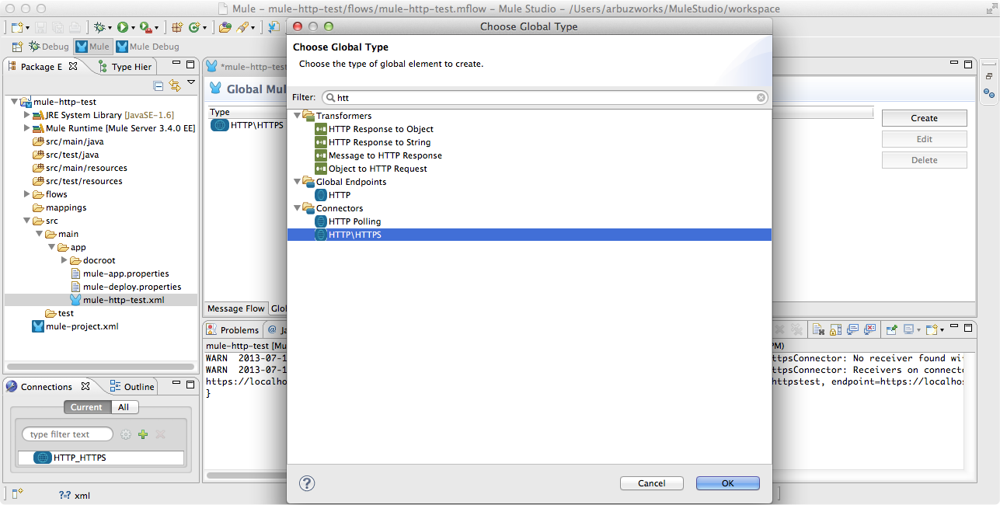

- On the **General** tab specify name **httpsConnector**.

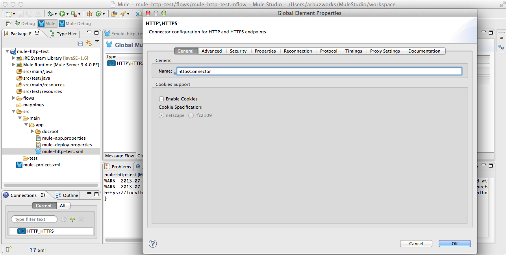

- Switch to the **Security** tab, check the **Enable HTTPS** checkbox and specify the location and passwords for your keystore as follows:

	- Path: `${keystore.path}`;  
	- Key Password: `${key.pass}`;  
	- Store Password `${store.pass}`; 

Please note that content of password fields will not be readable when you type. It would be better to copy values from this document and then paste them to the form. 

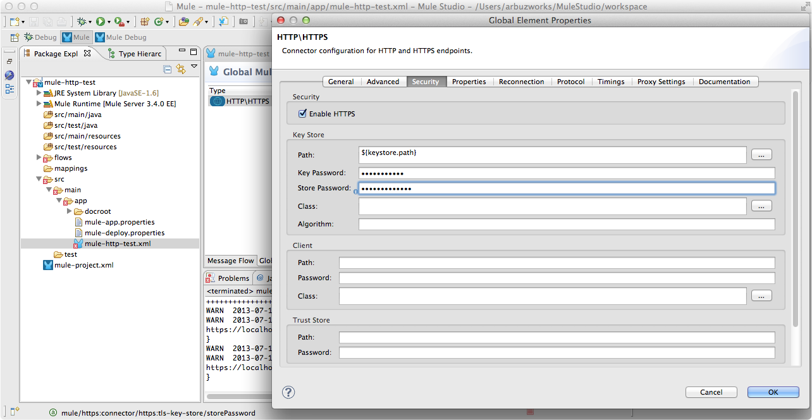

Also, double check entered values using **Flow XML** view.

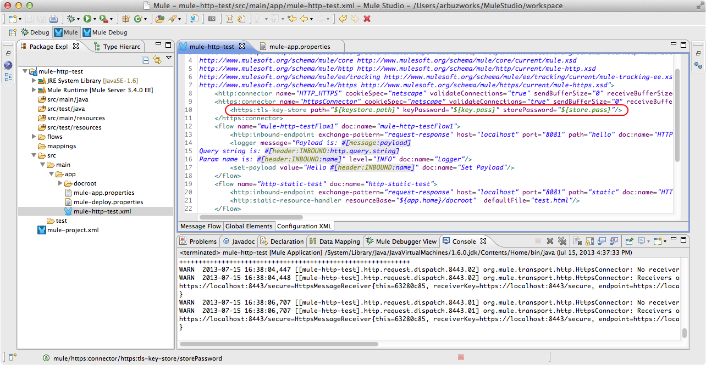

- Open file **mule-app.properties** and provide vaules for all three placeholders we used in above configuration.   

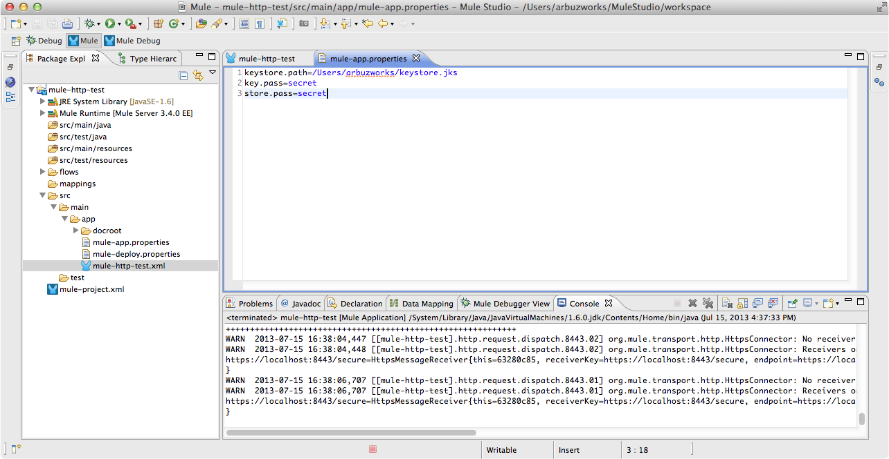

Now we can use this global configuration in new flow. 

- Drop the **HTTP** Endpoint onto the canvas. A new flow will be created. Double click the HTTP Endpoint building block to display its properties. Check the **Enable HTTPS** checkbox, change the port to **8443** and specify **Path** parameter as displayed on the screenshot.

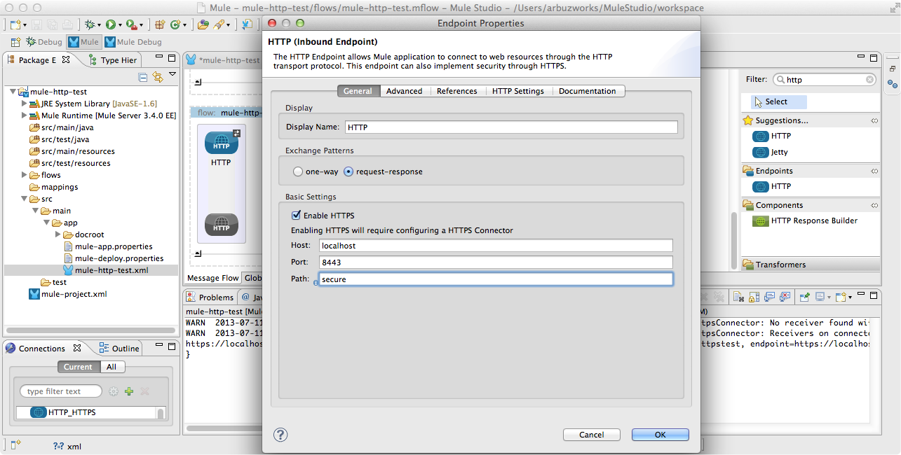

- Now switch to the **References** tab and select **httpsConnector** created earlier as a connector reference. Click **OK**.

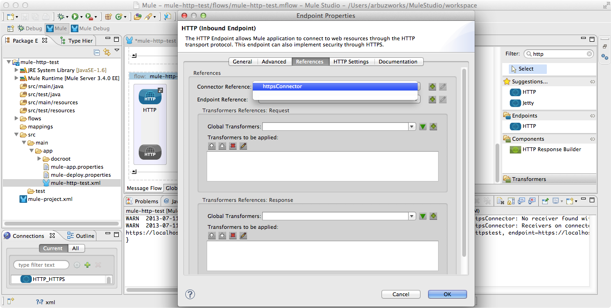

- Add a **Set Payload** transformer to the flow, double click it and specify some content value. 

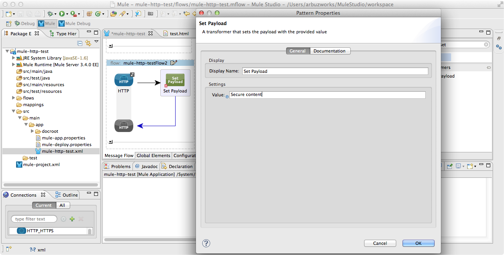

Now we can test the new flow.
 
- Save the proejct and run it.
- When the application starts, visit the endpoint's URL in the browser.

The browser will warn you that the created certificate is not trusted. 

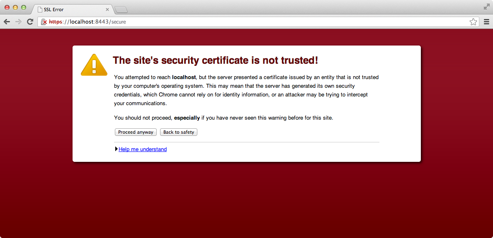

Click on the **Proceed anyway** button (depends on your browser) and you should see the response from our https web server.

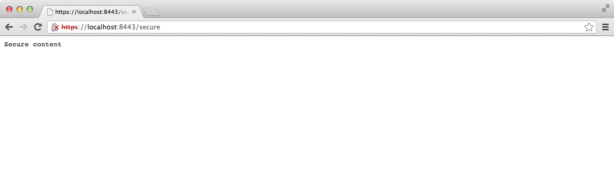

### Other Resources

For more information on:

- Mule platform and how to build Mule apps, please visit [http://www.mulesoft.org/documentation/display/current/Home](http://www.mulesoft.org/documentation/display/current/Home)
- Mule AnyPoint&reg; connectors, please visit [http://www.mulesoft.org/connectors](http://www.mulesoft.org/connectors)
- Mule HTTP transport reference, please visit [http://www.mulesoft.org/documentation/display/current/HTTP+Transport+Reference](http://www.mulesoft.org/documentation/display/current/HTTP+Transport+Reference)
- Mule HTTPS transport reference, please visit [http://www.mulesoft.org/documentation/display/current/HTTPS+Transport+Reference](http://www.mulesoft.org/documentation/display/current/HTTPS+Transport+Reference)
- Mule HTTP endpoint reference, please visit [http://www.mulesoft.org/documentation/display/current/HTTP+Endpoint+Reference](http://www.mulesoft.org/documentation/display/current/HTTP+Endpoint+Reference)
