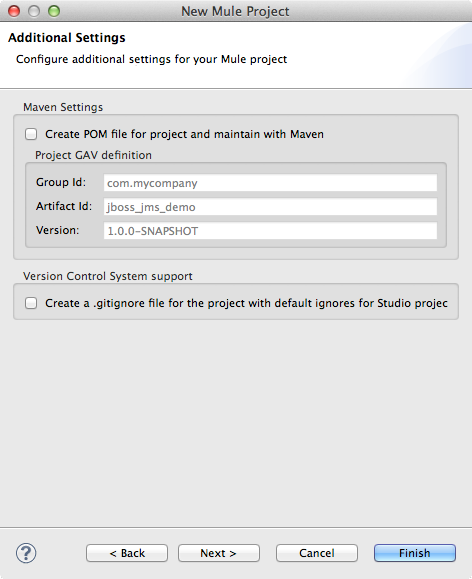

# JBoss JMS Connector

JMS (Java Message Service) is a widely-used API for Message Oriented Middleware. It allows communication between different components of a distributed application to be loosely coupled, reliable and asynchronous. Mule's JMS transport allows you to easily send and receive messages to queues and topics for any message service which implements the JMS specification.

### Contents

[Prerequisites](#prerequisites)  
[Step 1: Create Demo Project](#step-1-create-demo-project)  
[Step 2: Configure JMS_JBoss connector](#step-2-configure-jms_jboss-connector)  
[Step 3: Create testQueue flow](#step-3-create-testqueue-flow)  
[Step 4: Run project](#step-4-run-project)  
[Step 5: Test testQueue flow](#step-5-test-testqueue-flow)  
[Other Resources](#other-resources)  


### Prerequisites

* [MuleStudio](http://www.mulesoft.org/download-mule-esb-community-edition)
* Installed and running [JBoss EAP](http://www.jboss.org/products/eap.html). In this example, we use JBoss EAP 6.1.0 release.

##### Configure JMS Using the JBoss CLI Tool Interactively

* Start the JBoss Enterprise Application Platform 6 by typing the following:

```
For Linux:  $JBOSS_HOME/bin/standalone.sh -c standalone-full.xml
For Windows:  %JBOSS_HOME%\bin\standalone.bat -c standalone-full.xml
```

* To start the JBoss CLI tool, open a new command line, navigate to the JBOSS_HOME directory and type the following:

```
For Linux: bin/jboss-cli.sh --connect
For Windows: bin\jboss-cli.bat --connect
```

* At the prompt in order to add a queue address type the following:

```
[standalone@localhost:9999 /] jms-queue add --queue-address=testQueue --entries=queue/test,java:jboss/exported/jms/queue/test
```

* Using the following command create administrator and application users for JBoss EAP:

```
For Linux:  $JBOSS_HOME/bin/add-user.sh 
For Windows:  %JBOSS_HOME%\bin\add-user.bat
```

### Step 1: Create Demo Project

* Run Mule Studio and select **File \> New \> Mule Project** menu item.  
* Type **jboss_jms_demo** as a project name and click **Next**.  


* Then click **Finish**.



### Step 2: Configure JMS_JBoss connector

* To configure the project in order to use JBoss EAP libraries, right-click your project, select **Build Path** and choose **Add External Archives**. Choose **jboss-cli-client.jar** and **jboss-client.jar** files from the **/lib** directory of the demo project.


* Open **flows/jboss_jms_demo.mflow** file. Select **Global Elements** tab, click **Create** button and using the filter find and select the **Connectors \> JMS** connector. Click **OK**. You will see a window for global configuration of the JMS MQ connector. In **User Name** and **Password** fields set parameters which you use to create an application user.


* Switch to the **Advanced** tab and adjust the fields as displayed on the following image.


### Step 3: Create testQueue flow

* Switch to the **Message Flow** tab in the flow editor.
* Add a new flow by dragging it from the Palette.
* Double click the new flow to open its properties and rename it to **testQueue**. Click **OK**.


* Drag **HTTP Endpoint** to the flow. Double click it to show its properties and adjust them as displayed on the following image.


* Drag **JMS Endpoint** to the flow. Double click it to show its properties. Set **Generic \> Queue** as **testQueue**.


* Switch to the **References** tab and in the **Connector Reference** dropdown select  **JMS_JBoss** which we configured earlier on Step 2. Click **OK**.


* Save the flow.

### Step 4: Run project

* Right Click **src/main/app/jboss_jms_demo.xml \> Run As/Mule Application**.

 

* Check the console to see when the application starts.  

You should see a log message on the console:  
 
    ++++++++++++++++++++++++++++++++++++++++++++++++++++++++++++    
    + Started app 'jboss_jms_demo'                             +    
    ++++++++++++++++++++++++++++++++++++++++++++++++++++++++++++  

### Step 5: Test testQueue flow

* Run the project.
* Open your browser and point it to [http://localhost:8081/jms](http://localhost:8081/jms).
* You should see a **/jms** message in the browser's window.


* Check sent messages by examining the JBoss EAP administration page at [http://localhost:9990/console/App.html#jms-metrics](http://localhost:9990/console/App.html#jms-metrics). You can see that there is **1** message under the **Messages Processed \> Messages Added** row in the **Actual** column.


* Stop Mule server.

### Other Resources

For more information on:

- Mule AnyPoint® connectors, please visit [http://www.mulesoft.org/connectors](http://www.mulesoft.org/connectors)
- Mule platform and how to build Mule applications, please visit [http://www.mulesoft.org/documentation/display/current/Home](http://www.mulesoft.org/documentation/display/current/Home)