# Jetty Connector

Jetty Connector allows Mule to expose Mule Services over HTTP using a Jetty HTTP server. A single Jetty server is created for each connector instance. One connector can serve many endpoints. The Jetty connector can be configured using a Jetty XML config file, but the default configuration is sufficient for most scenarios. Note that the Jetty Connector can only be used for inbound endpoints.

### Contents

[Prerequisites](#prerequisites)  
[Step 1: Create Demo Project](#step-1-create-demo-project)  
[Step 2: Create JettyHello flow](#step-2-create-jettyhello-flow)  
[Step 3: Run project](#step-3-run-project)  
[Step 4: Test JettyHello flow](#step-4-test-jettyhello-flow)  
[Step 5: Create JettyStatic flow](#step-5-create-jettystatic-flow)  
[Step 6: Test JettyStatic flow](#step-6-test-jettystatic-flow)  
[Other Resources](#other-resources)  


### Prerequisites

In order to build and run this project you'll need [MuleStudio](http://www.mulesoft.org/download-mule-esb-community-edition).

### Step 1: Create Demo Project

* Run Mule Studio and select **File \> New \> Mule Project** menu item.  
* Type **jetty_demo** as a project name and click **Next**.  

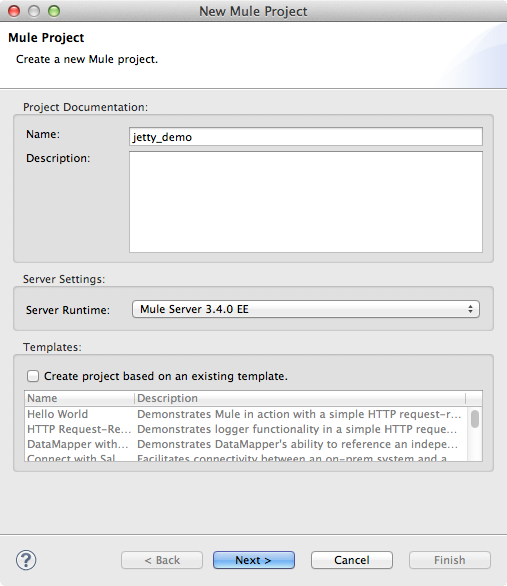

* Then click **Finish**.

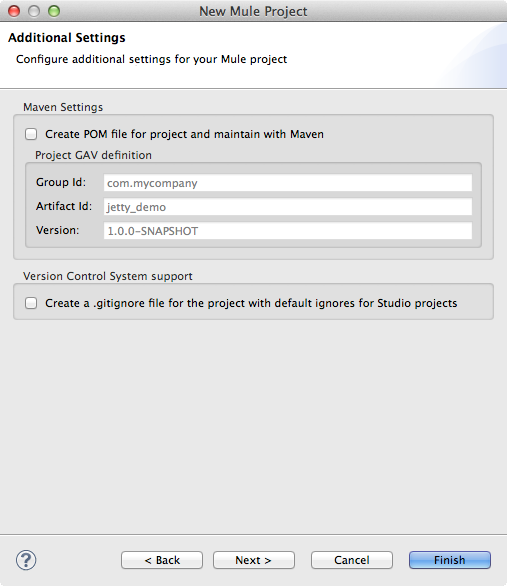

### Step 2: Create JettyHello flow

* Switch to the **Message Flow** tab in the flow editor.
* Add a new flow by dragging it from the Palette.
* Double click the new flow to open its properties and rename it to **JettyHello**. Click **OK**.

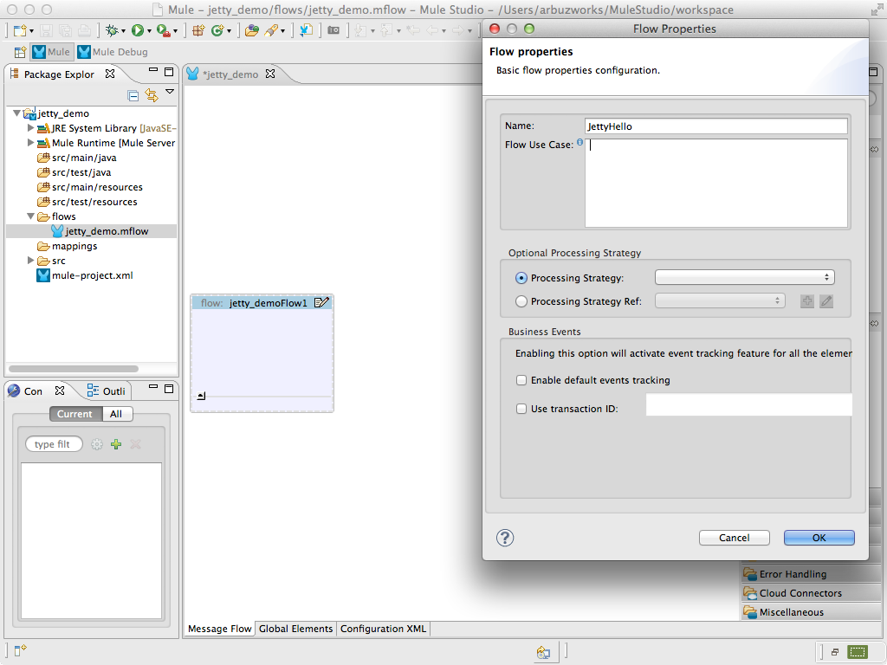

* Drag **Jetty Endpoint** to the flow. Double click it to show its properties. Switch to the **Advanced** tab and set the **Generic \> Address** field as **http://localhost:8090/hello** and **MIME Type** field as **text/plain**. Click **OK**.

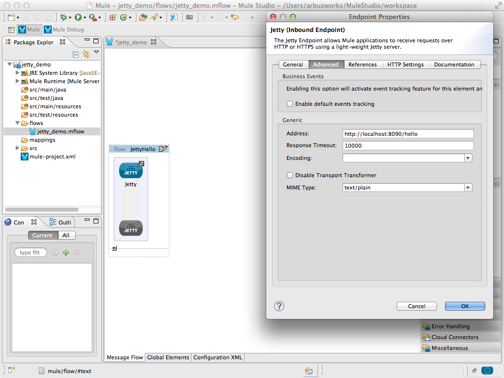

* Add the **Logger** component to control the messages on the server side. Drag the **Logger** component to the flow. Double click it to show its properties and adjust them as displayed on the following image.

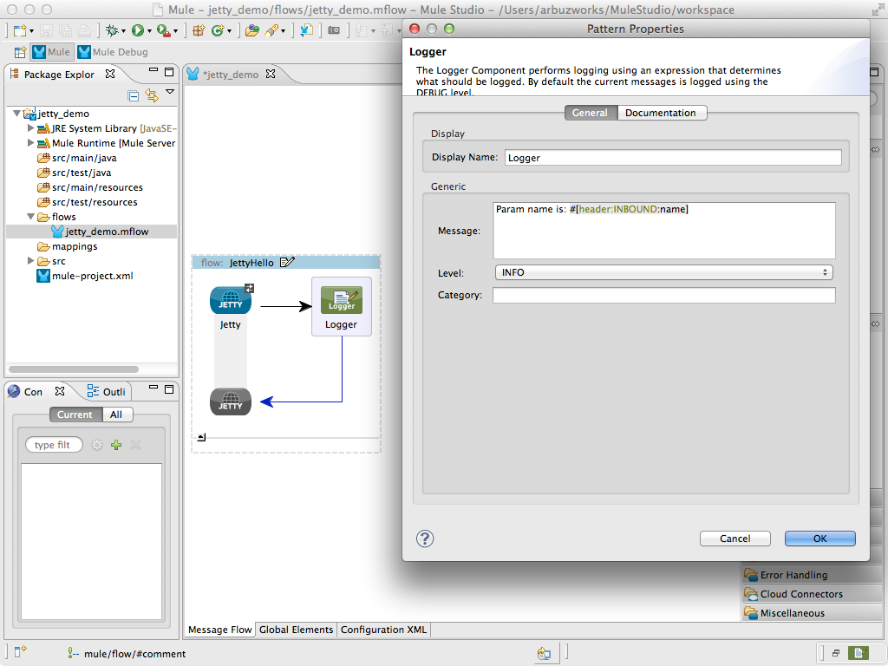

* Add the **Set payload** transformer to generate response. Drag the **Set payload** transformer to the flow. Double click it to show its properties and set the **Settings \> Value** field as **Hello, #[header:INBOUND:name]!**. Click **OK**.

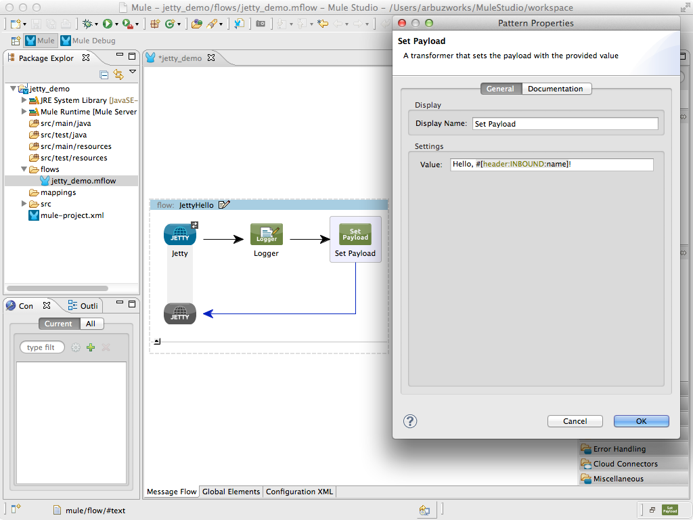

* Save the flow.

### Step 3: Run project

* Right Click **src/main/app/jetty_demo.xml \> Run As/Mule Application**.

 

* Check the console to see when the application starts.  

You should see a log message on the console:  
 
    ++++++++++++++++++++++++++++++++++++++++++++++++++++++++++++    
    + Started app 'jetty_demo'                                  +    
    ++++++++++++++++++++++++++++++++++++++++++++++++++++++++++++

### Step 4: Test JettyHello flow

* Open your browser and point it to [http://localhost:8090/hello?name=Bob](http://localhost:8090/hello?name=Bob). In response you will see a message generated by the server.

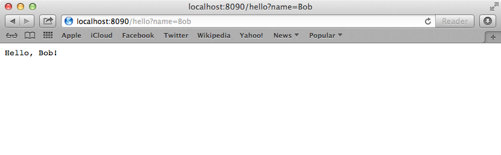 

* Stop Mule server. 

### Step 5: Create JettyStatic flow

* Add a new flow by dragging it from the Palette.
* Double click the new flow to open its properties and rename it to **JettyStatic**. Click **OK**.

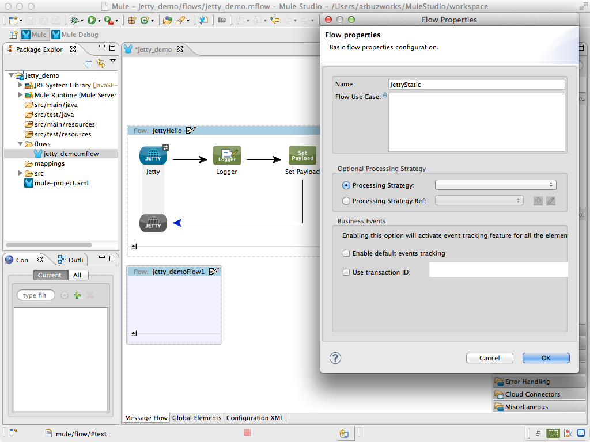

* Drag **Jetty Endpoint** to the flow. Double click it to show its properties. Switch to the **Advanced** tab and set the **Generic \> Address** field as **http://localhost:8090/static** and **MIME Type** field as **text/plain**. Click **OK**.

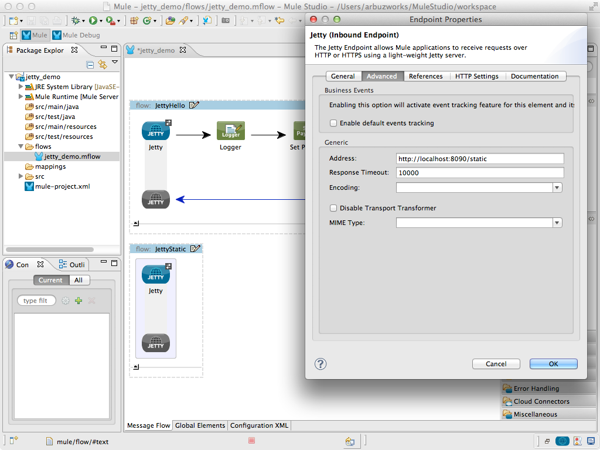

* Switch to the **Configuration XML** view in Mule Studio and add **static resource handler** to the **JettyStatic** flow as follows:

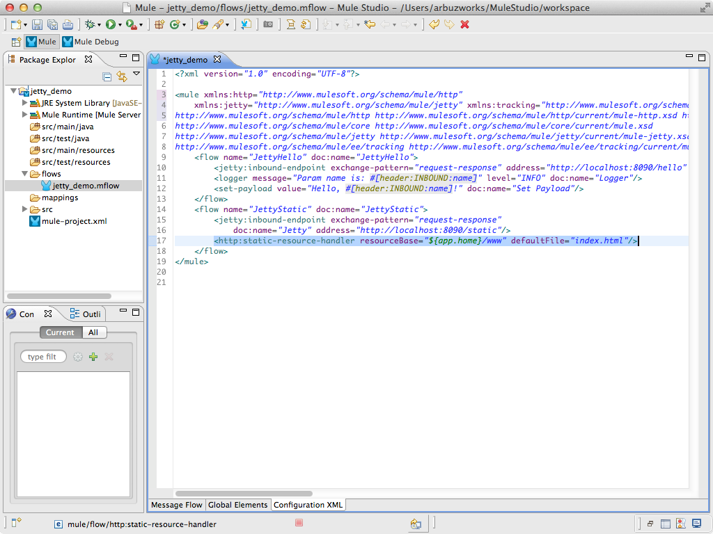

* Create a new **src/main/app/www/index.html** file and add the following HTML code. 

```html
<!DOCTYPE>
<html>
<head>
</head>
<body>
	<h2>Hello form:</h2>
	<form action="/hello" method="GET">
		<label>Name:</label>
		<input type="text" name="name" value=""/>
		<input type="submit" value="Send"/>
	</form>
</body>
</html>
```

* Save the file.

### Step 6: Test JettyStatic flow

* Run the project.
* Open your browser and point it to [http://localhost:8090/static](http://localhost:8090/static). In response you will see a simple form. 

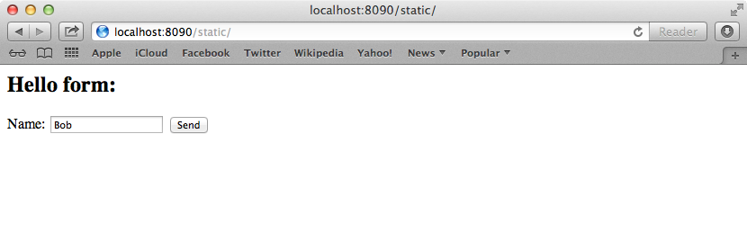
 
* Write your name in the **Name** field and push the **Send** button. In response you will see a message generated by the server in the **JettyHello** flow.

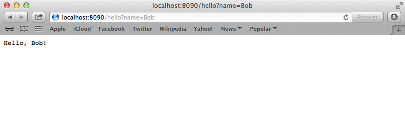

* Stop Mule server.

### Other Resources

For more information on:

- Mule AnyPoint® connectors, please visit [http://www.mulesoft.org/connectors](http://www.mulesoft.org/connectors)
- Mule platform and how to build Mule apps, please visit [http://www.mulesoft.org/documentation/display/current/Home](http://www.mulesoft.org/documentation/display/current/Home)