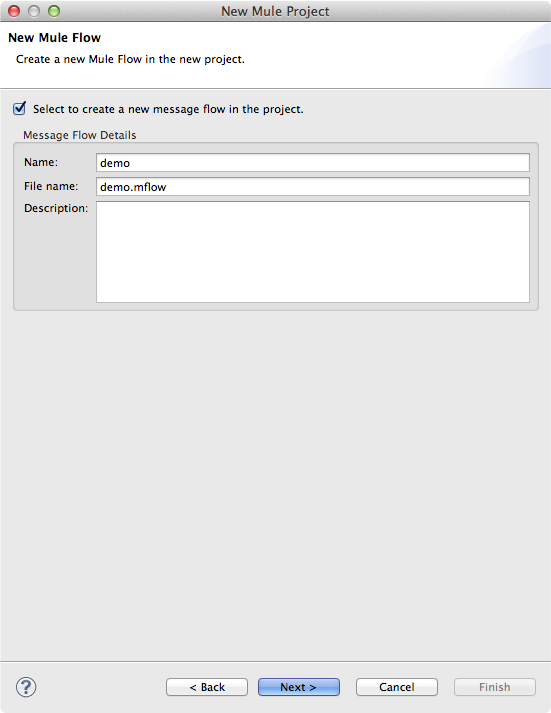

# LDAP Connector

The LDAP Connector allows to connect to any LDAP server and perform such LDAP operation as binding, searching, entry and attribute manipulation, etc. 
Please refer to [LDAP Connector Documentation](http://mulesoft.github.io/ldap-connector/mule/ldap-config.html) for full list of supported features.

### Contents 

[Prerequisites](#prerequisites)    
[Step 1: Create Demo Project](#step1)    
[Step 2: Install Mule LDAP Connector from update Site](#step2)   
[Step 3: Configure application](#step3)  
[Step 4: Create search flow](#step4)   
[Step 5: Run project](#step5)   
[Step 6: Test search flow](#step6) 
[Other Resources](#other)   

### Prerequisites

In order to build and run this project you'll need:

*   [MuleStudio](http://www.mulesoft.org/download-mule-esb-community-edition).

### Step 1: Create Demo Project

*    Run Mule Studio and select **File \> New \> Mule Project** menu item.  
*    Type **demo** as a project name and click **Next**.  


*    Then click **Next**.



*    And finally click **Finish**.


### Step 2: Install Mule LDAP Connector from update Site

- In Mule Studio select **Help** \> **Install New Software...**.
- Select **MuleStudio Cloud Connectors Update Site** in the **Work With** dropdown.
- Find **LDAP Connector Mule Studio Extension** under the **Community** folder. Check it and click **Next**.
- Follow installation steps.


### Step 3: Configure application

##### Set connection properties.
    
We need to provide values for the connection to LDAP. Open **src/main/app/flows/mule-app.properties** file and add the following lines: 
```ini
ldap.userDn=uid=john.doe,ou=Employees,ou=People,o=company.com
ldap.password=password
ldap.url=ldap://url:389   
```

Please note that all values are specific for your local environment. Correct attributes and credentials should be obtained from your system administrator.


##### Configure LDAP Connector.

Open **src/main/app/demo.xml** and switch to the **Global Elements** tab, then click **Create**. Using filter find and select the **LDAP** within the **Cloud Connectors** dropdown list. Click **OK**. You will see the window with the **Global Element Properties** header, adjust its general tab as it is shown on the following image.


### Step 4: Create search flow

##### Adding the *search*  flow.

*    Switch to the **Message Flow** tab. Then using filter find the **Flow** scope in the palette and drag it to the message flow area.
*    Double click the flow's header and rename it to **search**.


##### Adding and adjusting *HTTP* endpoint.

*    Find the **HTTP** endpoint in the palette using filter and drag it to the **search** flow.
*    Double click the **HTTP** endpoint and adjust its general tab as it is shown on the following image. 


##### Adding and adjusting *LDAP* connector.

*    Find the **LDAP** cloud connector using filter and drag it to the **search** flow.
*    Double click the **LDAP** connector and adjust its general tab as it is shown on the following image.


Please note that the LDAP search filter uses the **name** request parameter passed from the HTTP Endpoint to the LDAP Connector.  

##### Adding and adjusting *Collection Splitter* element.

*    Find the **Collection Splitter** element using filter and drag it to the **search** flow.
*    Double click that element and adjust its general tab as it is shown on the following image.


##### Adding and adjusting *LDAP* transformer.

*    Find the **LDAP** transformer using filter and drag it to the **search** flow.
*    Double click that element and adjust its general tab as it is shown on the following image.


##### Adding *Collection Aggregator* transformer.

*    Find the **Collection Aggregator** element using filter and drag it to the **search** flow.
*    Double click that element and rename it to "Aggregate entries".


##### Adding *Object to String* transformer.

*    Find the **Object to String** transformer using filter and drag it to the **search** flow.


### Step 5: Run project

*    Right Click **src/main/app/demo.xml \> Run As/Mule Application**.

 

*    Check the console to see when the application starts.  

You should see a log message on the console:  
 
    ++++++++++++++++++++++++++++++++++++++++++++++++++++++++++++    
    + Started app 'demo'                                       +    
    ++++++++++++++++++++++++++++++++++++++++++++++++++++++++++++   

### Step 6: Test search flow

*    When the application is started, open your browser and point it to [http://localhost:8081/ldapSearch?name=john](http://localhost:8081/ldapSearch?name=john).
*    You should see detailed information related to the people with the name John. In our case only one record has been matched. Changing the value of the **name** parameter in url you may get different results. Also please note that the set of fields in result will differ depending on your LDAP configuration.   

 

*    Stop Mule server.   

### Other Resources

For more information on:

- Mule AnyPoint® connectors, please visit [http://www.mulesoft.org/connectors](http://www.mulesoft.org/connectors)
- Mule platform and how to build Mule apps, please visit [http://www.mulesoft.org/documentation/display/current/Home](http://www.mulesoft.org/documentation/display/current/Home)


