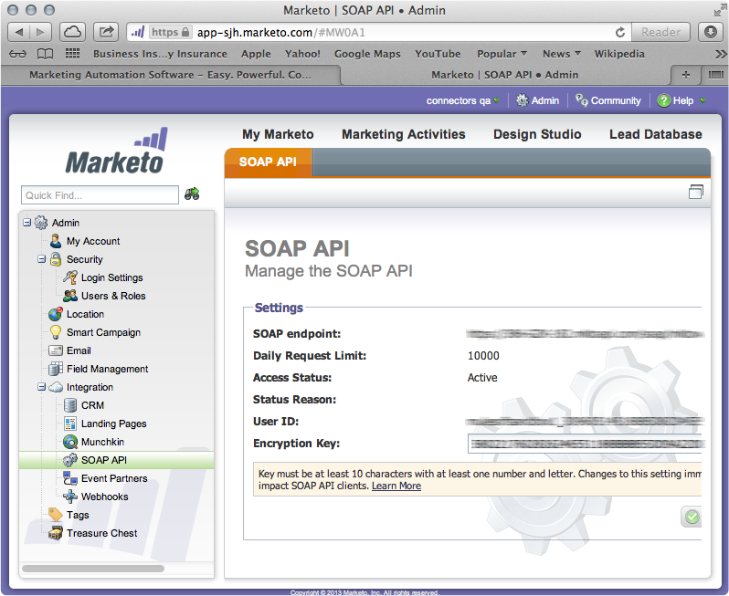
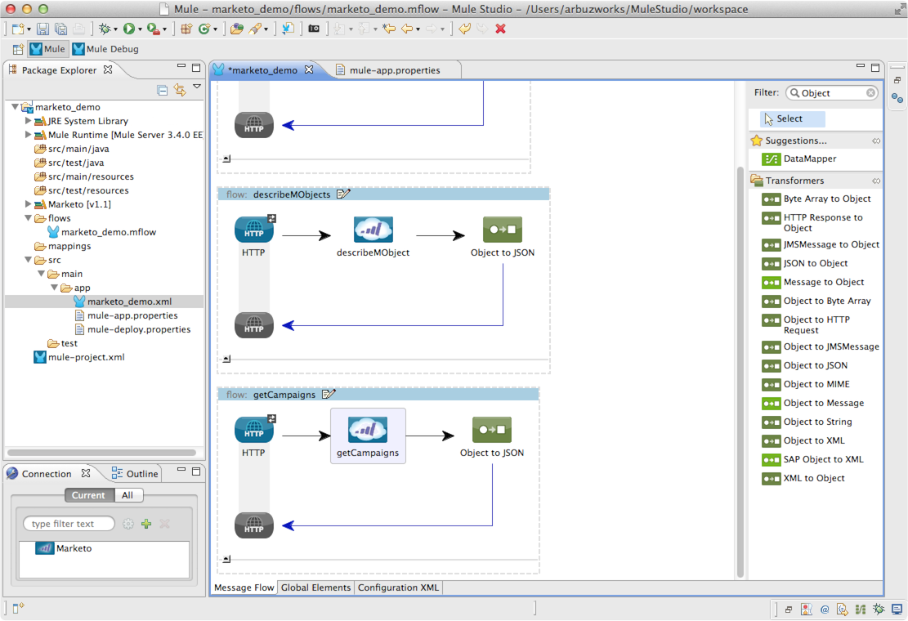

[Purpose](#purpose)  
[Prerequisites](#prerequisites)  
[Step 1: Install Mule Marketo Connector From Update Site](#step1)    
[Step 2: Install S3 Cloud Connector From Update Site](#step2)   
[Step 3: Create Demo Project](#step3)  
[Step 4: Configure Marketo Connection Parameters](#step4)   
[Step 5: Add Marketo Configuration](#step5)    
[Step 6: Create Flow for Loading List of Available MObjects](#step6)   
[Step 7: Run Demo Project](#step7)  
[Step 8: Test listMObjects Flow](#step8)  
[Step 9: Create Flow to Describe MObject](#step9)   
[Step 10: Test describeMObjects Flow](#step10)    
[Step 11: Create Flow to Load Campaigns](#step11)    
[Step 12: Test getCampaigns Flow](#step12)  
[Flow XML](#flowXML)    
[Other Resources](#other)    

### Purpose

This document provides detailed instructions on how to install MuleSoft's Marketo connector and demonstrates how to build and run a simple demo application that uses this connector.

### Prerequisites

In order to build and run this project you'll need:

*       [Marketo](http://www.marketo.com/) account.
*       [MuleStudio](http://www.mulesoft.org/download-mule-esb-community-edition).
*       Web browser.

### Step 1: Install Mule Marketo Connector From Update Site

*    In Mule Studio select **Help** \> **Install New Software...**.
*    Select **MuleStudio Cloud Connectors Update Site** in **Work With** drop-down.
*    Find **Marketo Connector Mule Studio Extension** by typing a word **Marketo** in filter string and click **Next**.
*    Follow installation steps.

### Step 2: Install S3 Cloud Connector From Update Site

*    Similar to Step 1, select **Help** \> **Install New Software...** in Mule Studio.
*    Select **MuleStudio Cloud Connectors Update Site** in **Work With** drop-down.
*    Find **Mule S3 Connector Mule Studio Extension** by typing symbols **S3** in filter string and click **Next**.
*    Follow installation steps.

### Step 3: Create Demo Project

*    Run Mule Studio and select **File \> New \> Mule Project** menu item.  
*    Type **marketo_demo** as a project name and click **Next**.  

*    Accept default values on the next screen of project creation wizard and click **Next** and then **Finish**.

### Step 4: Configure Marketo Connection Parameters

*      Login to your Marketo account. 

*      Go to Administration section by clicking **Admin** link.

*      Select **SOAP API** from the **Integration** subfolder.

*      Note three parameters: **SOAP endpoint**, **User ID** and **Encription Key**.  
*      Put values for all 3 parameters to **/src/main/app/mule-app.properties** file as follows.  

### Step 5: Add Marketo Configuration   

*    Double click on **src/main/app/marketo-demo.xml** to open it, select **Global Elements** tab in view.
 

*    Click on **Create** button and add **Marketo** Cloud Connector to the configuration.   

*    Properties of the new Global Element will be automatically opened. Populate General tab with references to configuration parameters defined in Step 4. 
 

*     Click **Test Connection** button and ensure that connection is successful.
*     Uncheck checkbox **Enable DataSense** as it can cause error while saving configuration in current connector version.
*     Click **OK** to apply changes.        

### Step 6: Create Flow for Loading List of Available MObjects     

*     Switch to the **Message Flow** tab in the flow editor.
*     Add a new flow by dragging it from the Palette.
*     Double click the new flow to open its properties and rename it to **listMObjects**. Click **OK**.

*     Drag **HTTP Endpoint** to the flow. Set **Path** parameter to **listMObjects** in endpoint properties.
  

*     Similarly, add **Marketo Cloud Connector** to the flow. Double click it to show properties and adjust them as displayed on the following image.  

*     To display properties of a fetched object in JSON format, also add **Object to JSON** transformer to the flow. No need to adjust its properties.

*     Save the flow.

### Step 7. Run Demo Project

*     Right Click on **src/main/app/marketo_demo.xml \> Run As/Mule Application**.

 

*     Check the console to see when the application starts.  

You should see a log message on the console:  
 
    ++++++++++++++++++++++++++++++++++++++++++++++++++++++++++++    
    + Started app 'marketo_demo'                               +
    ++++++++++++++++++++++++++++++++++++++++++++++++++++++++++++

### Step 8: Test listMObjects Flow

*    Open browser and go to [http://localhost:8081/listMObjects](http://localhost:8081/listMObjects).
*    You should see the following response in your browser.

*    Note names of available MObjects. We will build a flow that loads description for one of them in the next step.   
*    Switch back to Mule Studio and stop Mule server by clicking **Terminate** icon in console.

### Step 9: Create Flow to Describe MObject

*    Add a new flow by dragging it from the palette and name it **describeMObjects**.  

*    Add HTTP endpoint to the new flow similar to Step 6 but set its path to **describe**.  

*    Add Marketo connector to the flow and configure its properties according to the following image:

Note that **Object Name** field contains a name of one of the MObjects received in Step 8.  
 
*    Finally, add **Object to JSON** transformer to the flow.
  

  
### Step 10: Test describeMObjects Flow

*    Run demo project as explained in Step 7 and open URL [http://localhost:8081/describe](http://localhost:8081/describe)  

You should receive MObject description in JSON format like this
 

*    Stop Mule server. 

### Step 11: Create Flow to Load Campaigns

*    Add a new flow by dragging it from the palette and name it **getCampaigns**.  

*    Add HTTP endpoint to the new flow and set its path to **campaigns**.  

*    Add Marketo connector to the flow and configure its properties according to the following image:

*    Finally, add **Object to JSON** transformer to the flow.
  

                          

### Step 12: Test getCampaigns Flow

*    Run demo project as explained in Step 7 and open URL [http://localhost:8081/campaigns](http://localhost:8081/campaigns)  

You should receive a list of sales campaigns in JSON format like this
 

*    Stop Mule server. 

### Flow XML

The final flow XML should look like that:

    <?xml version="1.0" encoding="UTF-8"?>
    
    <mule xmlns:marketo="http://www.mulesoft.org/schema/mule/marketo" xmlns:http="http://www.mulesoft.org/schema/mule/http" xmlns:json="http://www.mulesoft.org/schema/mule/json" xmlns:tracking="http://www.mulesoft.org/schema/mule/ee/tracking" xmlns="http://www.mulesoft.org/schema/mule/core" xmlns:doc="http://www.mulesoft.org/schema/mule/documentation" xmlns:spring="http://www.springframework.org/schema/beans" version="EE-3.4.0" xmlns:xsi="http://www.w3.org/2001/XMLSchema-instance" xsi:schemaLocation="http://www.springframework.org/schema/beans http://www.springframework.org/schema/beans/spring-beans-current.xsd
    http://www.mulesoft.org/schema/mule/core http://www.mulesoft.org/schema/mule/core/current/mule.xsd
    http://www.mulesoft.org/schema/mule/marketo http://www.mulesoft.org/schema/mule/marketo/1.0/mule-marketo.xsd
    http://www.mulesoft.org/schema/mule/ee/tracking http://www.mulesoft.org/schema/mule/ee/tracking/current/mule-tracking-ee.xsd
    http://www.mulesoft.org/schema/mule/json http://www.mulesoft.org/schema/mule/json/current/mule-json.xsd
    http://www.mulesoft.org/schema/mule/http http://www.mulesoft.org/schema/mule/http/current/mule-http.xsd">
        <marketo:config name="Marketo" userId="${user.id}" key="${user.key}" endpointUrl="${endpoint}" doc:name="Marketo">
            <marketo:connection-pooling-profile initialisationPolicy="INITIALISE_ONE" exhaustedAction="WHEN_EXHAUSTED_GROW"/>
        </marketo:config>
        <flow name="listMObjects" doc:name="listMObjects">
            <http:inbound-endpoint exchange-pattern="request-response" host="localhost" port="8081" path="listMObjects" doc:name="HTTP"/>
            <marketo:list-mobjects config-ref="Marketo" doc:name="ListMObjects"/>
            <json:object-to-json-transformer doc:name="Object to JSON"/>
        </flow>
        <flow name="getCampaigns" doc:name="getCampaigns">
            <http:inbound-endpoint exchange-pattern="request-response" host="localhost" port="8081" path="campaigns" doc:name="HTTP"/>
            <marketo:get-campaigns-for-source config-ref="Marketo" source="SALES" doc:name="getCampaigns"/>
            <json:object-to-json-transformer doc:name="Object to JSON"/>
        </flow>
        <flow name="describeMObjects" doc:name="describeMObjects">
            <http:inbound-endpoint exchange-pattern="request-response" host="localhost" port="8081" path="describe" doc:name="HTTP"/>
            <marketo:describe-mobjects config-ref="Marketo" objectName="Opportunity" doc:name="describeMObjects"/>
            <json:object-to-json-transformer doc:name="Object to JSON"/>
        </flow>
    </mule>

### Other Resources

For more information on:

- Marketo connector reference, please visit [http://www.mulesoft.org/connectors/marketo-connector](http://www.mulesoft.org/connectors/marketo-connector)
- Mule AnyPoint® connectors, please visit [http://www.mulesoft.org/connectors](http://www.mulesoft.org/connectors)
- Mule platform and how to build Mule apps, please visit [http://www.mulesoft.org/documentation/display/current/Home](http://www.mulesoft.org/documentation/display/current/Home)