# RabbitMQ AMQP Connector

Mule AMQP connector provides an easy way to interface with different implementations of Advanced Message Queuing Protocol (AMQP) from within the Mule ESB or CloudHub™ environment. This connector allows users to utilize AMQP capabilities without having to deal with the AMQP APIs directly. Mule AMQP connector is a part of MuleSoft’s open-source suite of connectors downloadable in Mule Studio.

### Contents

[Prerequisites](#prerequisites)  
[Step 1: Create Demo Project](#step-1-create-demo-project)  
[Step 2: Configure AMQP connector](#step-2-configure-amqp-connector)  
[Step 3: Configure AJAX connector](#step-3-configure-ajax-connector)  
[Step 4: Create IncomeFlow flow](#step-4-create-incomeflow-flow)  
[Step 5: Create OutcomeFlow flow](#step-5-create-outcomeflow-flow)  
[Step 6: Run project](#step-6-run-project)  
[Step 7: Test application](#step-7-test-application)  
[Other Resources](#other-resources)  


### Prerequisites

In order to build and run this project you'll need:

* [MuleStudio](http://www.mulesoft.org/download-mule-esb-community-edition) with installed **Mule Studio AMQP Plugin** (AMQP Connector). 
* Installed [RabbitMQ](http://www.rabbitmq.com/) server.
* Configured RabbitMQ:
    * created **test.topic** exchange;
    * created **test.queue** queue.

### Step 1: Create Demo Project

* Run Mule Studio and select **File \> New \> Mule Project** menu item.
* Type **rabbitmq_demo** as a project name and click **Next**.

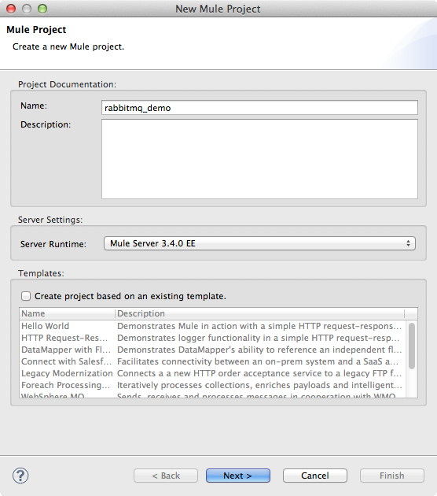

* Then click **Finish**.

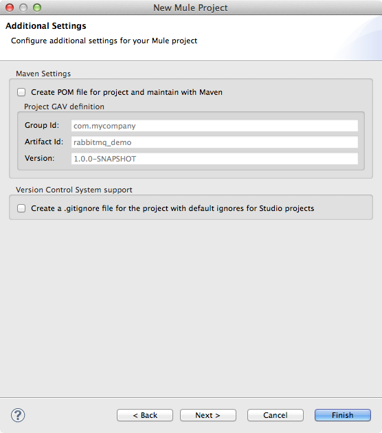

### Step 2: Configure AMQP connector

Open **flows/rabbitmq_demo.mflow** file. For configuration of the AMQP Connector select the **Global Elements** tab, click **Create** button and using the filter find and select **AMQP Connector** in the list of connectors. Click **OK**. You will see a window for the AMQP Connector configuration. Set the **Name** field as **AMQP_Connector**. Switch to the **Protocol** tab and adjust the fields as displayed on the following image.

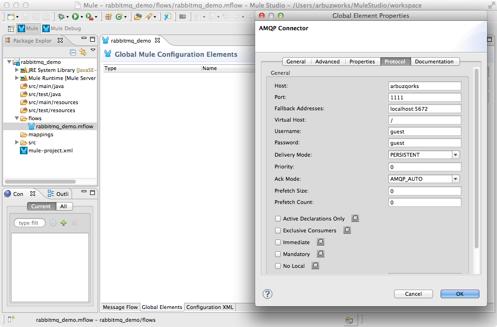

This flow uses configuration with **host:port** that doesn't exist, and defines "**Fallback Address**" with real **host:port** of the current running broker.

When the application starts and an endpoint is using this configuration, it will fail the first attempt to connect and will try to use one of the fallback addresses.

**Note:** the error is internal and is not displayed in the console. If none of the brokers can be found in the host:ports provided, then it will fail.

### Step 3: Configure AJAX connector

For configuration of the AJAX Connector select the **Global Elements** tab, click **Create** button and using the filter find and select **AJAX** in the list of connectors. Click **OK**. You will see a window for the AJAX Connector configuration, adjust the fields as displayed on the following image.

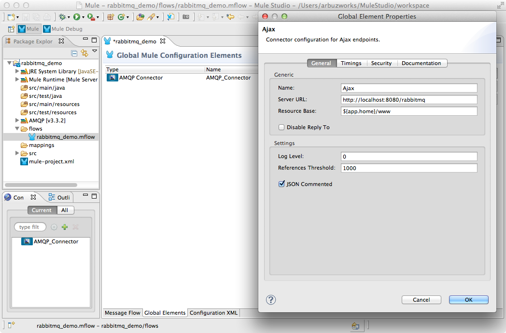

This starts the AJAX server which is ready to start publishing and subscribing.

Create a new **src/main/app/www/index.html** file and add the following HTML code. 

```html
<!DOCTYPE>
<head>
    <script type="text/javascript" src="mule-resource/js/mule.js"></script>
    <script type="text/javascript">
    	function init(){
    		mule.subscribe("/outcome", function(data){
    	    	document.getElementById('messages').value += data.data + '\n';
    	    	document.getElementById('message').value = '';
    	    });
    	}    
    
        function publishToMule() {                       
            var message = document.getElementById('message').value;
            mule.publish("/income", message);
        }      
    </script>
</head>

<body onLoad="init()">
	<h3>RabbitMQ</h3>
	<table>
		<tr>
			<td colspan="2">
				<label>Messages:</label><br/>
				<textarea id="messages" style="width:100%; height:150px;" disabled="disabled"></textarea>
			</td>
		</tr>
		<tr>
			<td>
				<label>Message:</label> <input id="message" type="text"/>				
			</td>
			<td>
				<input id="sendButton" class="button" type="submit" name="Send" value="Send" onclick="publishToMule();"/>	
			</td>
		</tr>
	</table>
 </body>
</html>
```

The browser will send messages to Mule (using JavaScript Mule client) when a button is pushed. Also it will read all messages from Mule server and write them to the **Messages** textarea.

### Step 4: Create IncomeFlow flow

In the **IncomeFlow** flow there is **AJAX Inbound Endpoint**, which listens to the messages on the **/income** configured channel. The flow adds incoming messages to the "**test.queue**" queue and then adds the message to the "**test.topic**" exchange.

**Important:** all the AMQP Endpoints should be configured as one-way endpoints. This can be accomplished in the "**Advance**" section of the endpoint.

* Switch to the **Message Flow** tab in the flow editor.
* Add a new flow by dragging it from the Palette.
* Double click the new flow to open its properties and rename it to **IncomeFlow**. Click **OK**.

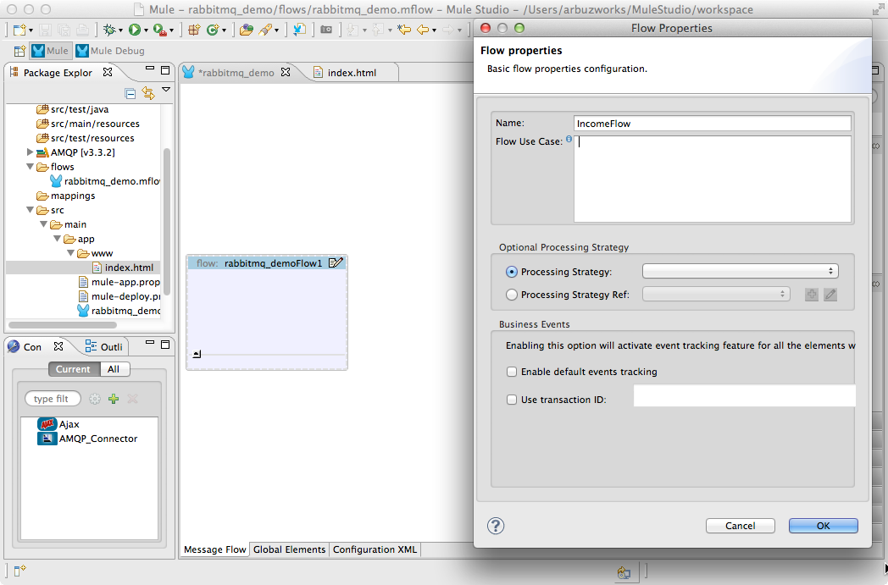

* Drag **AJAX Endpoint** to the flow. Double click it to show its properties and set the **General \> Generic \> Channel** field as **/income**.

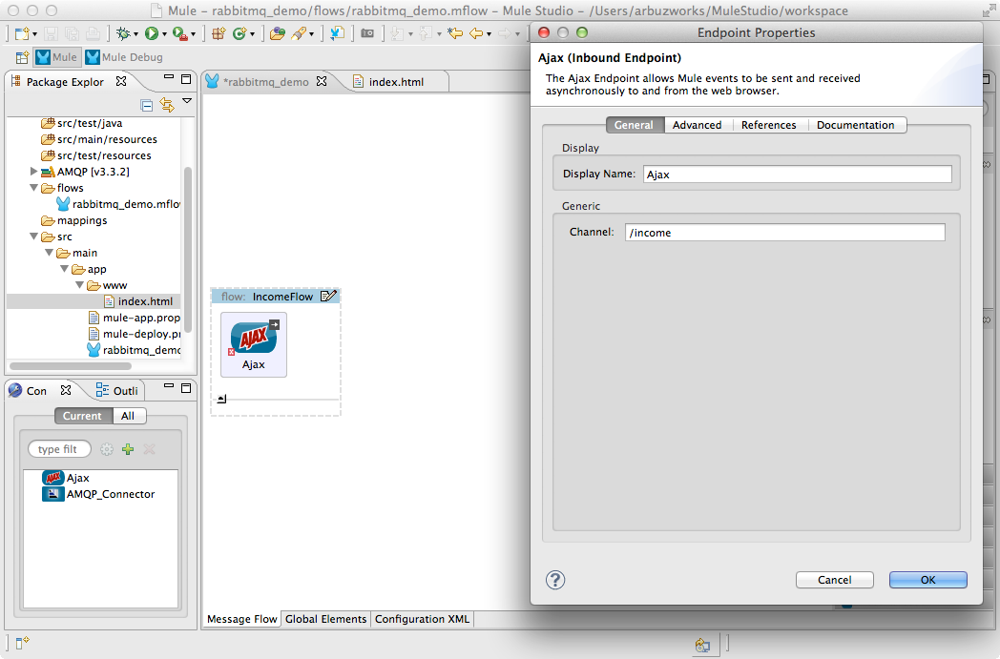

* Switch to the **References** tab and in the **Connector Reference** dropdown select **Ajax** which we configured earlier on Step 3 and click **OK**.

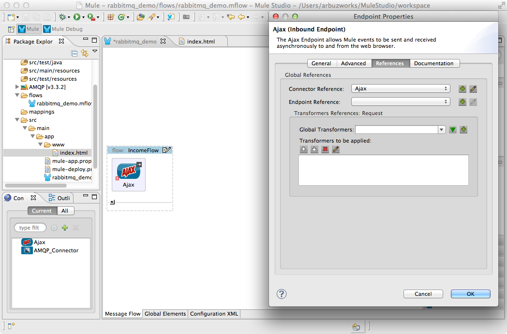

* Drag **Set payload** transformer to the flow. Double click it to show its properties and set the **Value** field as **#[payload:]**.

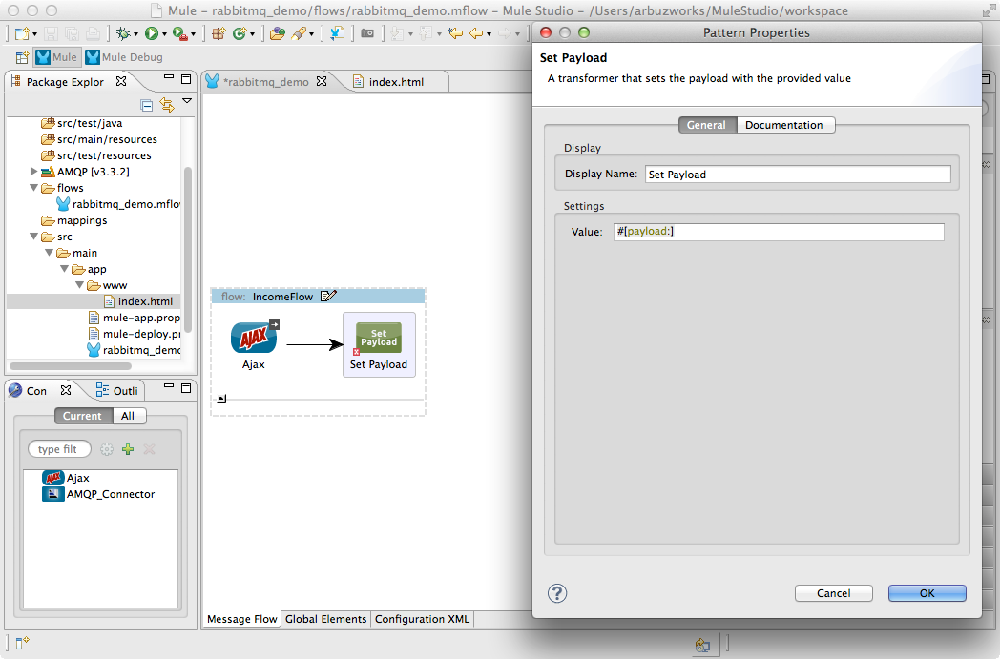

* Drag **AMQP Endpoint** to the flow. Double click it to show its properties and set the **General \> Address Attributes \> Queue Name** field as **test.queue**.

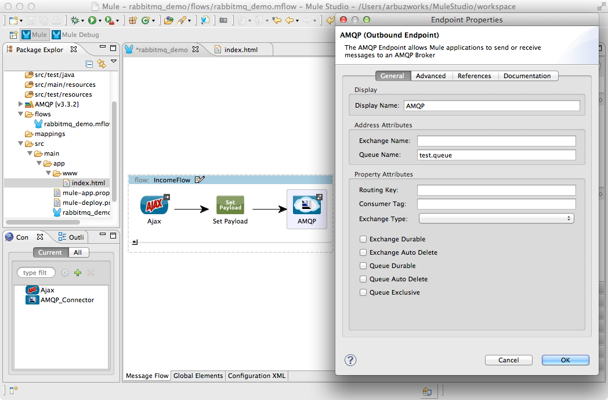

* Switch to the **Advanced** tab and set the **Exchange Patterns** radio button as **one-way**.

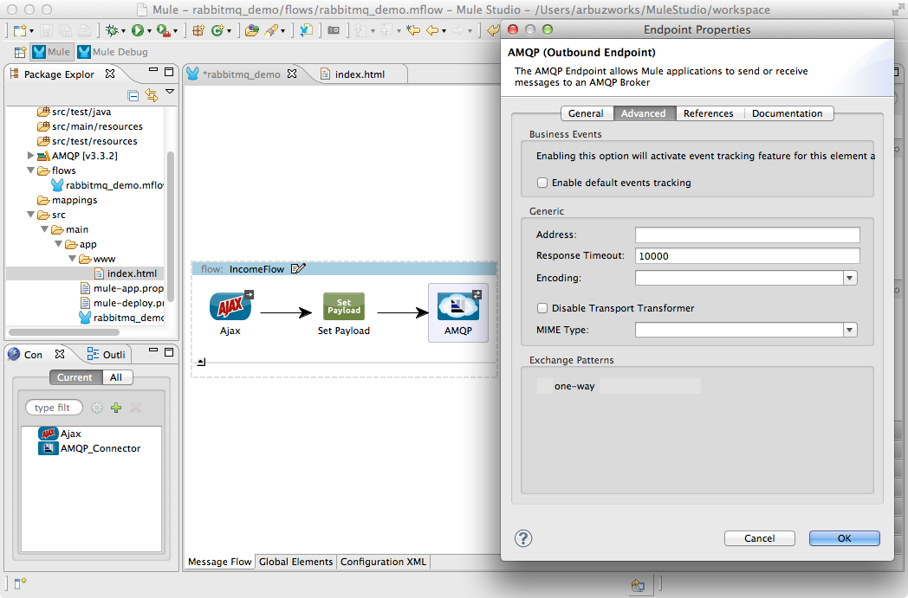

* Switch to the **References** tab and in the **Connector Reference** dropdown select **AMQP_Connector** which we configured earlier on Step 2 and click **OK**.

* Drag another **AMQP Endpoint** to the flow. Double click it to show its properties and set the **General \> Address Attributes \> Exchange Name** field as **test.topic**.

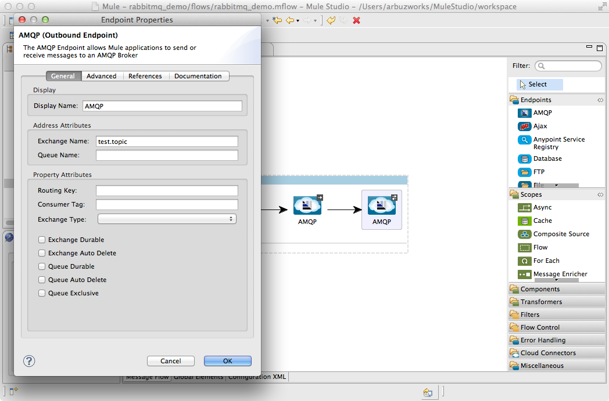

* Switch to the **Advanced** tab and set the **Exchange Patterns** radio button as **one-way**.

* Switch to the **References** tab and in the **Connector Reference** dropdown select **AMQP_Connector** and click **OK**.

* Save the flow.

### Step 5: Create OutcomeFlow flow

The **OutcomeFlow** flow reads messages from the "**test.topic**" topic and then publishes them via the AJAX outbound endpoint.

* Add a new flow by dragging it from the Palette.
* Double click the new flow to open its properties and rename it to **OutcomeFlow**. Click **OK**.

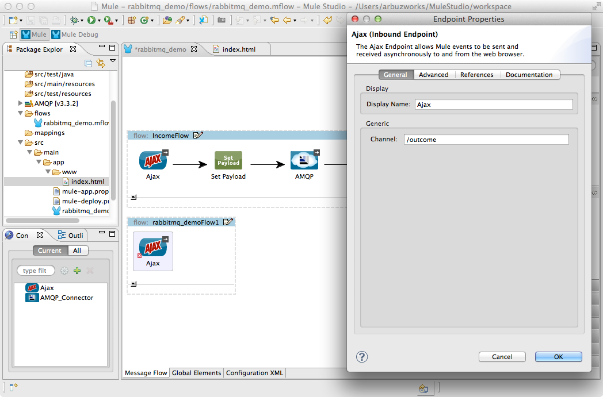

* Drag **AMQP Endpoint** to the flow. Double click it to show its properties and set the **General \> Address Attributes \> Exchange Name** field as **test.topic**.

* Switch to the **Advanced** tab and set the **Exchange Patterns** radio button as **one-way**.

* Switch to the **References** tab and in the **Connector Reference** dropdown select **AMQP_Connector** which we configured earlier on Step 2 and click **OK**.

* Drag **Byte Array to String** to the flow. It does not need any additional settings.

* Drag **AJAX Endpoint** to the flow. Double click it to show its properties and set the **General \> Generic \> Channel** field as **/outcome**.

* Switch to the **References** tab and in the **Connector Reference** dropdown select **Ajax** which we configured earlier on Step 3 and click **OK**.

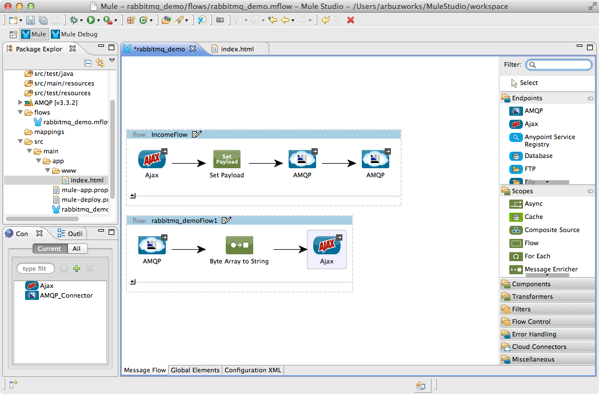

* Save the flow.

### Step 6: Run project


* Right Click **src/main/app/rabbitmq_demo.xml \> Run As/Mule Application**.

 

* Check the console to see when the application starts.

You should see a log message on the console:
 
    ++++++++++++++++++++++++++++++++++++++++++++++++++++++++++++    
    + Started app 'rabbitmq_demo'                             +    
    ++++++++++++++++++++++++++++++++++++++++++++++++++++++++++++  

### Step 7: Test application

* Run the project.
* Open your browser and point it to [http://localhost:8080/rabbitmq](http://localhost:8080/rabbitmq).
* You should see empty **Messages** textarea and **Message** text field.
* Type several messages in the text field, then push **Send** button to submit them to Mule via AJAX/AMQP. Mule confirms receipt of the messages.

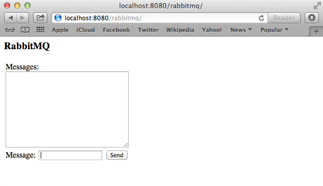

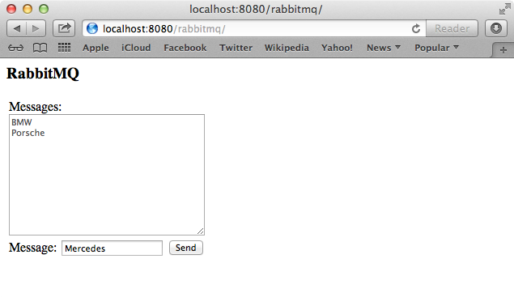

* If you open several tabs the messages will be displayed in all **Messages** textareas.
* Stop Mule server.

### Other Resources

For more information on:

- Mule AnyPoint® connectors, please visit [http://www.mulesoft.org/connectors](http://www.mulesoft.org/connectors)
- Mule platform and how to build Mule applications, please visit [http://www.mulesoft.org/documentation/display/current/Home](http://www.mulesoft.org/documentation/display/current/Home)
