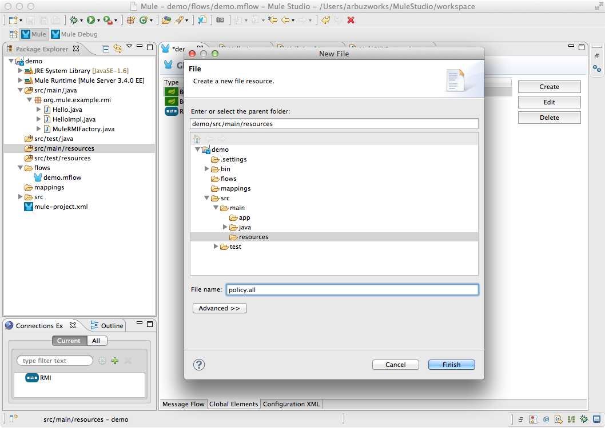

# RMI Connector

The RMI Connector can be used to send and receive Mule events over [JRMP](http://en.wikipedia.org/wiki/JRMP). This connector has a dispatcher that invokes an RMI method and a polling receiver that repeatedly does the same.

[Prerequisites](#prerequisites)  
[Step 1: Create Demo Project](#step-1-create-demo-project)  
[Step 2: Implement RMI Server](#step-2-implement-rmi-server)  
[Step 3: Add Security Policy](#step-3-add-security-policy)  
[Step 4: Add Global Element](#step-4-add-global-element)  
[Step 5: Create RMI Flow](#step-5-create-rmi-flow)  
[Step 6: Test RMI Flow](#step-6-test-rmi-flow)  
[XML Flow](#xml-flow)  
[Other Resources](#other-resources)  

### Prerequisites

In order to build and run this project, you'll need:

- [MuleStudio](http://www.mulesoft.org/download-mule-esb-community-edition) 

### Step 1: Create Demo Project

- Run Mule Studio and select the **File \> New \> Mule Project** menu item.  
- Type **Demo** in the Project Name field and click **Next**.  

Accept default values in the next screen of the project creation wizard and click **Finish**.

### Step 2: Implement RMI Server 

RMI server is needed to demonstrate the work of RMI connector. We implement simple RMI server and run it as embedded in Mule Application.

- Create a package: right click the **src/main/java** folder and select **New -> Package**

- Type **org.mule.example.rmi** in the Name field, click **Finish**.

- Create **Hello** interface: right click the **org.mule.example.rmi** folder and select **New -> Interface**

- Type **Hello** in the Name field, click **Finish**.

- Open **Hello** interface

Declare interface as follows:

    package org.mule.example.rmi;

    import java.rmi.Remote;
    import java.rmi.RemoteException;

    public interface Hello extends Remote {
        String sayHello(String name) throws RemoteException;
    }

- Create **HelloImpl** class: right click the **org.mule.example.rmi** folder and select **New -> Class**

- Type **HelloImpl** in the Name field, click **Finish**.

- Open **HelloImpl** class

Implement the class as follows:

    package org.mule.example.rmi;
            
    public class HelloImpl implements Hello {
            
        public HelloImpl() {}

        public String sayHello(String name) {
            return "Hello, " + name + "!";
        }
            
    }

- Create **MuleRMIFactory** class: right click the **org.mule.example.rmi** folder and select **New -> Class**
- Type **MuleRMIFactory** in the Name field, click **Finish**.
- Open the **MuleRMIFactory** class

Implement the class as follows:

    package org.mule.example.rmi;

    import java.rmi.server.UnicastRemoteObject;

    import  org.mule.jndi.MuleInitialContextFactory;
    import javax.naming.InitialContext;

    public class MuleRMIFactory
    {

        public Object create() throws Exception
        {
            InitialContext ic = new InitialContext();
            ic.addToEnvironment(InitialContext.INITIAL_CONTEXT_FACTORY, MuleInitialContextFactory.class.getName());

            HelloImpl obj = new HelloImpl();
            Hello stub = (Hello) UnicastRemoteObject.exportObject(obj, 0);

            ic.bind("org.mule.example.rmi.Hello", stub);
            
            return ic;
        }

    }

### Step 3: Add Security Policy

- Right click the **src/main/resources** folder and select **New -> File**

- Type **policy.all** in the File name field and click **Finish**.

Insert the following policy

    grant {
        // Allow everything for now
        permission java.security.AllPermission;
     };

### Step 4: Add Global Element   

- Double click **src/main/app/demo.xml** to open it, select the **Global Elements** tab in the view.
- Click **Create** button and add **Bean** to the configuration.   

- Global Element Properties dialog will be automatically opened, specify the following properties and click **OK**.
    - **ID**: `jndiFactory`
    - **Name**: `jndiFactory`
    - **Class**: `org.mule.example.rmi.MuleRMIFactory`

- Similarly add the second **Bean** to the configuration with the following properties:
    - **ID**: `jndiContext`
    - **Name**: `jndiContext`

- Switch to the **Advanced** tab, specify the following properties and click **OK**.
    - **Factory Method**: `create`
    - **Factory Bean**: `jndiFactory`

- Click **Create** button and add the **RMI** connector to the configuration.   

- Global Element Properties dialog will be automatically opened, specify **Security Policy** to `policy.all`

- Switch to the **JNDI** tab, specify **JNDI Context-Ref** to `jndiContext` and click **OK**.

### Step 5: Create RMI Flow 

- In the Mule Studio flow editor, switch to the **Message Flow** tab.
- Drag **HTTP Endpoint** to the flow. Double click it to show its properties and adjust them as displayed on the following image.

- Drag **RMI** from the palette and drop it onto the canvas.   
- Double click the RMI building block to show its properties, specify the following properties:
    - **Host**: `localhost`  
    - **Port**: `2000`  
    - **Object**: `org.mule.example.rmi.Hello`  
    - **Method**: `sayHello`  

- Save the flow.

### Step 6: Test RMI Flow

- Right Click **flows/demo.mflow \> Run As/Mule Application**.

- Check the console to see when the application starts.  

You should see a log message on the console:  
 
    ++++++++++++++++++++++++++++++++++++++++++++++++++++++++++++    
    + Started app 'demo'                                       +
    ++++++++++++++++++++++++++++++++++++++++++++++++++++++++++++

- When the application is started, open your browser and point it to [http://localhost:8081/rmi](http://localhost:8081/rmi).
- You should see the following screen.

### XML Flow 

The final XML flow should look like that:  

    <?xml version="1.0" encoding="UTF-8"?>

    <mule xmlns:http="http://www.mulesoft.org/schema/mule/http" xmlns:rmi="http://www.mulesoft.org/schema/mule/rmi" xmlns="http://www.mulesoft.org/schema/mule/core" xmlns:doc="http://www.mulesoft.org/schema/mule/documentation" xmlns:spring="http://www.springframework.org/schema/beans" version="EE-3.4.0" xmlns:xsi="http://www.w3.org/2001/XMLSchema-instance" xsi:schemaLocation="http://www.springframework.org/schema/beans http://www.springframework.org/schema/beans/spring-beans-current.xsd
    http://www.mulesoft.org/schema/mule/core http://www.mulesoft.org/schema/mule/core/current/mule.xsd
    http://www.mulesoft.org/schema/mule/http http://www.mulesoft.org/schema/mule/http/current/mule-http.xsd
    http://www.mulesoft.org/schema/mule/rmi http://www.mulesoft.org/schema/mule/rmi/current/mule-rmi.xsd">
        <spring:beans>
            <spring:bean id="jndiFactory" name="jndiFactory" class="org.mule.example.rmi.MuleRMIFactory"/>
            <spring:bean id="jndiContext" name="jndiContext" factory-method="create" factory-bean="jndiFactory"/>
        </spring:beans>
        <rmi:connector name="RMI" securityPolicy="policy.all" validateConnections="true" jndiContext-ref="jndiContext" doc:name="RMI"/>
        <flow name="demoFlow1" doc:name="demoFlow1">
            <http:inbound-endpoint exchange-pattern="request-response" host="localhost" port="8081" path="rmi" doc:name="HTTP"/>
            <rmi:outbound-endpoint exchange-pattern="request-response" host="localhost" port="2000" object="org.mule.example.rmi.Hello" method="sayHello" responseTimeout="10000" doc:name="RMI"/>
        </flow>
    </mule>

### Other Resources

For more information on:

- [RMI Connector Reference](http://www.mulesoft.org/documentation/display/current/RMI+Transport+Reference)  
- Mule platform and how to build Mule apps, please visit [http://www.mulesoft.org/documentation/display/current/Home](http://www.mulesoft.org/documentation/display/current/Home)

