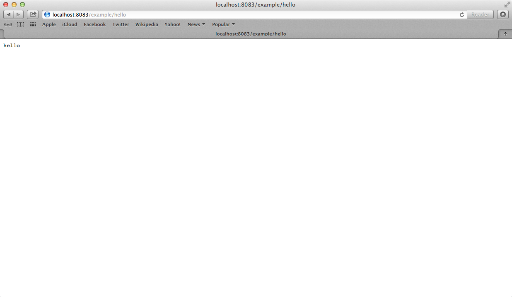

# Servlet Connector

The Servlet Connector allows Mule applications to listen to messages or events received via a Servlet request.

### Contents 

[Prerequisites](#prerequisites)    
[Step 1: Create Demo Project](#step-1-create-demo-project)    
[Step 2: Jetty Connector setup](#step-2-jetty-connector-setup)   
[Step 3: Set up the web related section](#step-3-set-up-the-web-related-section)    
[Step 4: Run project](#step-4-run-project)   
[Step 5: Test System Info flow](#step-5-test-system-info-flow)   
[Other Resources](#other-resources)   

### Prerequisites

In order to build and run this project you'll need:

*   [MuleStudio](http://www.mulesoft.org/download-mule-esb-community-edition).

### Step 1: Create Demo Project

*    Run Mule Studio and select **File \> New \> Mule Project** menu item.  
*    Type **demo** as a project name and click **Next**.  


*    Then click **Next**.


*    And finally click **Finish**.


### Step 2: Jetty Connector setup

First, we need to set up Jetty Connector, which plays the role of a container where servlets are being hosted.

Open **flows/demo.mflow** file. For configuration of Jetty Connector select **Global Elements** tab, click **Create** button and using the filter find and select  **Jetty** Connector. Click **OK**. You will see a window for **Jetty** Connector configuration, provide the values as displayed on the following image. 

  

Save the flow.    

### Step 3: Set up the web related section

Navigate to the **app** folder, that is located under **src**/**main**. Now we have to create the following folder structure: 

```
webapps
| example
| | WEB-INF
```

##### Webapp flow. Creation and setup 

Click the **File** item in the Mule Studio menu. Then select **New** and finally select **Mule Flow** in submenu. Left click and you will get **New Mule Flow** window. Select **demo** within **Project** dropdown list. Put ```webapp-config``` in the **Name** field, then click **Finish**.

  

*    Drag and drop ```webapp-config.xml``` to the WEB-INF folder. Open it by double clicking on it.  

*    Switch to the **Message Flow** tab in the flow editor. 
*    Add a new flow by dragging it from the Palette.  
*    Double click the new flow to open its properties and rename it to **servletFlow**. Click **OK**. 


*    Using the filter find and drag **Servlet Endpoint** to the flow. Double click it to show its properties and adjust them as displayed on the following image.

  

*    Using the filter find and drag **Set Payload** transformer to the flow. Double click it to show its properties and put "hello" word to the **Value** field.

 

Save the flow. 

##### web.xml Configuration 

Lastly, we have to properly setup ```web.xml``` file. This configuration file contains deployment descriptor elements for the correct web application deployment. Some extra information of how to apply certain descriptors may be found [here](http://docs.oracle.com/cd/E13222_01/wls/docs81/webapp/web_xml.html).

*    Choose the **WEB-INF** folder in the **Package Explorer**, then right click and select **New**, next select **Other** in submenu. Finally, choose **XML File** within **XML** dropdown list and click **Next**. Name new file as the ```web.xml```; click **Finish**.

*    Double click on ```web.xml``` file and erase everything, then put the following code there:

```
<?xml version="1.0" encoding="UTF-8"?>

<web-app version="2.5" xmlns="http://java.sun.com/xml/ns/javaee"
         xmlns:xsi="http://www.w3.org/2001/XMLSchema-instance"
         xsi:schemaLocation="http://java.sun.com/xml/ns/javaee http://java.sun.com/xml/ns/javaee/web-app_2_5.xsd">                                                             

    <context-param>
           <param-name>org.mule.config</param-name>
           <param-value>/WEB-INF/webapp-config.xml</param-value>
    </context-param>

    <listener>
           <listener-class>org.mule.config.builders.MuleXmlBuilderContextListener</listener-class>
    </listener>

    <servlet>
          <servlet-name>muleServlet</servlet-name>
          <servlet-class>org.mule.transport.servlet.MuleReceiverServlet</servlet-class>

        <load-on-startup>1</load-on-startup>
    </servlet>

    <servlet-mapping>
           <servlet-name>muleServlet</servlet-name>
           <url-pattern>/*</url-pattern>
    </servlet-mapping>
</web-app>
``` 

Save the file.

### Step 4: Run project

*    Right Click **src/main/app/demo.xml \> Run As/Mule Application**.

 

*    Check the console to see when the application starts.  

You should see a log message on the console:  
 
    ++++++++++++++++++++++++++++++++++++++++++++++++++++++++++++    
    + Started app 'demo'                                       +    
    ++++++++++++++++++++++++++++++++++++++++++++++++++++++++++++   

### Step 5: Test System Info flow

*    When the application is started, open your browser and point it to [http://localhost:8083/example/hello](http://localhost:8083/example/hello).

*    You should see the word "hello".

 

### Other Resources

For more information on:

- Mule AnyPoint® connectors, please visit [http://www.mulesoft.org/connectors](http://www.mulesoft.org/connectors)
- Mule platform and how to build Mule apps, please visit [http://www.mulesoft.org/documentation/display/current/Home](http://www.mulesoft.org/documentation/display/current/Home)


