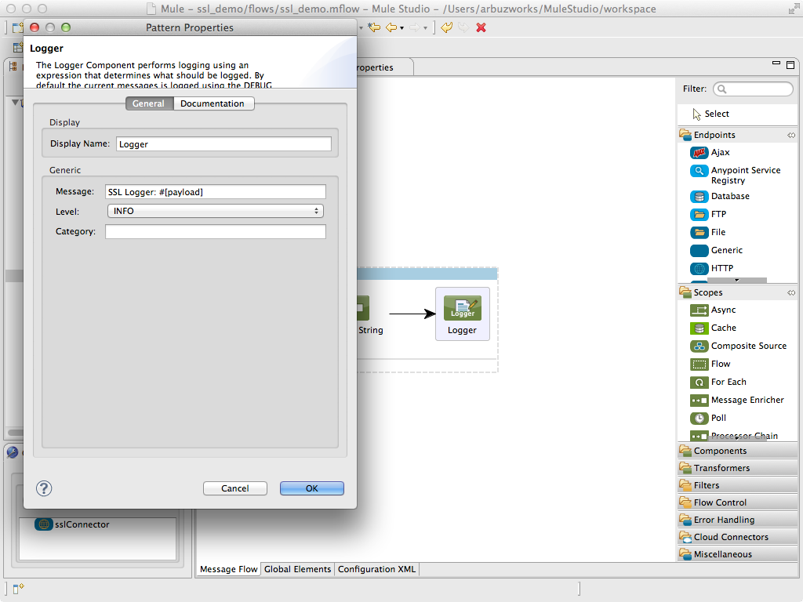

# SSL and TLS Connectors

SSL and TLS are alternative names for the same connector. (For simplicity, this page will refer to this connector only as SSL, but everything here applies to TLS as well.) This connector allows sending or receiving messages over SSL connections.  However, you may want to use the SSL connector directly if you require a specific protocol for reading the message payload that is not supported by one of these higher level protocols.

[Prerequisites](#prerequisites)  
[Step 1: Generate a JKS key](#step-1-generate-a-jks-key)  
[Step 2: Create Demo Project](#step-2-create-demo-project)  
[Step 3: Configure application](#step-3-configure-application)  
[Step 4: Create ssl_server flow](#step-4-create-ssl_server-flow)  
[Step 5: Run project](#step-5-run-project)  
[Step 6: Create ssl_client flow](#step-6-create-ssl_client-flow)  
[Step 7: Test application](#step-7-test-application)  
[Other Resources](#other-resources)  


### Prerequisites

To build and run this application you'll need:

* [MuleStudio](http://www.mulesoft.org/download-mule-esb-community-edition).   
* JDK keytool. This is a key and certificate management utility.


### Step 1: Generate a JKS key

In order to enable connector security, you must create a key store and trust store. These stores are used for ObjectGrid clients, container servers, and are created with  **JDK keytool**.

Using this command, **key.jks** key store with the **"sslsample"** key stored in it is created. The **key.jks** key store will be used as the SSL key store.

```
keytool -genkey -alias sslsample -keystore key.jks -storetype JKS -keyalg rsa -dname "CN=ogsample, OU=Your Organizational Unit, O=Your Organization, L=Your City, S=Your State, C=Your Country" -storepass password -keypass password -validity 3650
```

### Step 2: Create Demo Project

* Run Mule Studio and select **File \> New \> Mule Project** menu item.  
* Type **ssl_demo** as a project name and click **Next**.  


* Then click **Finish**.


### Step 3: Configure application

We need to provide values for the parameters which we will use in the application. Open **src/main/app/flows/mule-app.properties** file and add the following lines:

```
sslkey.path=/Users/arbuzworks/ssl/keys/key.jks
sslkey.password=password
```


To configure the SSL connector open **flows/ssl_demo.mflow** file, select **Global Elements** tab, click **Create** button. Using the filter find and select the **SSL (TLS)** connector. Click **OK**. You will see a window for the SSL connector configuration. Set the **Name** field as **sslConnector**, select the **Security** tab and adjust the fields as displayed on the following image. Click **OK**.


### Step 4: Create ssl_server flow

* Switch to the **Message Flow** tab in the flow editor.
* Add a new flow by dragging it from the Palette.
* Double click the new flow to open its properties and rename it to **ssl_server**. Click **OK**.


* Drag **SSL (TLS)** endpoint to the flow. Double click it to show its properties. 
* Set **Host** and **Port** fields as displayed on the following image.


* Switch to the **References** tab and in the **Connector Reference** dropdown select  **sslConnector** which we configured earlier on Step 3 and click **OK**.


* Drag **Object to string** transformer to the flow. It does not need any additional settings. It will convert a message from the SSL server to the string and send it to the **Logger** component.


* Drag **Logger** component to the flow. Double click it to show its properties and adjust the fields as displayed on the following image. Click **OK**.



* Save the flow.

### Step 5: Run project

* Right Click **src/main/app/ssl_demo.xml \> Run As/Mule Application**.

 

* Check the console to see when the application starts.  

You should see a log message on the console:  
 
    ++++++++++++++++++++++++++++++++++++++++++++++++++++++++++++    
    + Started app 'ssl_demo'                                  +    
    ++++++++++++++++++++++++++++++++++++++++++++++++++++++++++++   

It means that our server is successfully started.

* Stop Mule server.

### Step 6: Create ssl_client flow

* To test our SSL server we have to create a client.
* Add a new flow by dragging it from the Palette.
* Double click the new flow to open its properties and rename it to **ssl_client**. Click **OK**.


* Drag **HTTP** endpoint to the flow. Double click it to show its properties and adjust the fields as displayed on the following image.


* Drag **Set Payload** transformer to the flow. Double click it to show its properties and set the **Value** field  as **#[message.inboundProperties['message']]**.


* Drag **SSl (TLS)** endpoint to the flow. Double click it to show its properties and configure it in the same way as **SSl (TLS)** endpoint on Step 4.


* Save the flow.

### Step 7: Test application

* Run the project.
* Check the console to see when the application starts.
* Open your browser and point it to [http://localhost:8081/client?message=Hello_World](http://localhost:8081/client?message=Hello_World).
* In the console you should see the message:   

```
SSL logger: Hello_world!
```
It means that our server successfully received the message from the client.

* Stop Mule server.

### Other Resources

For more information on:

- Mule AnyPoint® connectors, please visit [http://www.mulesoft.org/connectors](http://www.mulesoft.org/connectors)
- Mule platform and how to build Mule apps, please visit [http://www.mulesoft.org/documentation/display/current/Home](http://www.mulesoft.org/documentation/display/current/Home)
- keytool - Key and Certificate Management Tool [http://docs.oracle.com/javase/6/docs/technotes/tools/solaris/keytool.html](http://docs.oracle.com/javase/6/docs/technotes/tools/solaris/keytool.html)