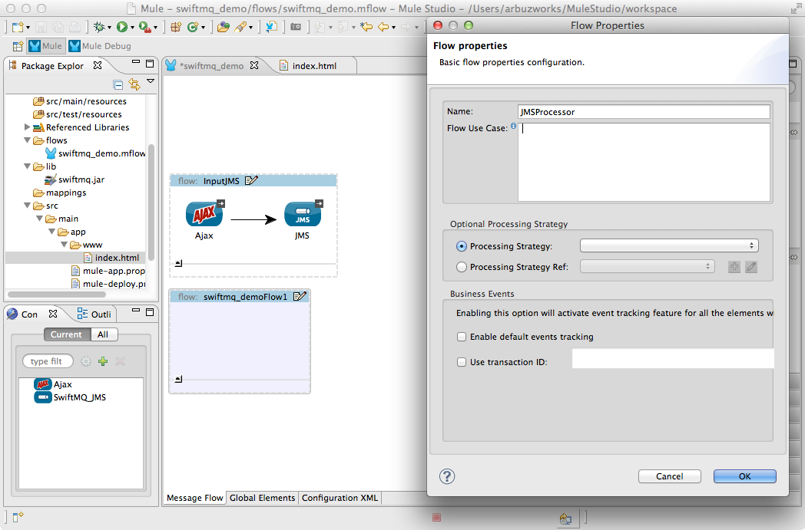

# SwiftMQ JMS Connector

JMS (Java Message Service) is a widely-used API for Message Oriented Middleware. It allows communication between different components of a distributed application to be loosely coupled, reliable and asynchronous. Mule's JMS connector allows you to easily send and receive messages to queues and topics for any message service which implements the JMS specification.

[Prerequisites](#prerequisites)  
[Step 1: Create Demo Project](#step-1-create-demo-project)  
[Step 2: Configure JMS connector](#step-2-configure-jms-connector)  
[Step 3: Configure AJAX connector](#step-3-configure-ajax-connector)  
[Step 4: Create InputJMS flow](#step-4-create-inputjms-flow)  
[Step 5: Create JMSProcessor flow](#step-5-create-jmsprocessor-flow)  
[Step 6: Create OutputJMS flow](#step-6-create-outputjms-flow)  
[Step 7: Run project](#step-7-run-project)  
[Step 8: Test application](#step-8-test-application)  
[Other Resources](#other-resources)  


### Prerequisites

Before you run an example, ensure that your system meets the following conditions:

* Installed [MuleStudio](http://www.mulesoft.org/download-mule-esb-community-edition) 
* Running [SwiftMQ](http://www.swiftmq.com/) router. In this example, we use SwiftMQ 9.3.1 release.
* "**testqueue**" queue and "**testtopic**" topic configured by default in SwiftMQ.

### Step 1: Create Demo Project

* Run Mule Studio and select **File \> New \> Mule Project** menu item.
* Type **swiftmq_demo** as a project name and click **Next**.


* Then click **Finish**.


### Step 2: Configure JMS connector

To be able to access SwiftMQ in Mule Studio, we need to add a **swiftmq.jar** file to our build path. Right-click your project, select **Build Path** and choose **Add External Archives**. Choose the **swiftmq.jar** file from the **/lib** directory of the demo project.


The best approach to integrate SwiftMQ is via JNDI. You will specify the following attributes:

- **jndiInitialFactory** - com.swiftmq.jndi.InitialContextFactoryImpl
- **jndiProviderUrl** - smqp://localhost:4001/timeout=10000
- **jndiDestinations**	- true
- **forceJndiDestinations**	 - true
- **specification Version** - 1.1
- **connectionFactoryJndiName** - ConnectionFactory

Open **flows/swiftmq_demo.mflow** file. For configuration of the JMS Connector select the **Global Elements** tab, click **Create** button and using the filter find and select **JMS** in the list of connectors. Click **OK**. You will see a window for the JMS MQ Connector configuration. Set the **Name** field as **SwiftMQ_JMS**. Select **Specification v1.1**. Leave **Username** and **Passwords** fields empty. Switch to the **Advanced** tab and adjust the fields as displayed on the following image.


### Step 3: Configure AJAX connector

For configuration of the AJAX Connector select the **Global Elements** tab, click **Create** button and using the filter find and select **AJAX** in the list of connectors. Click **OK**. You will see a window for the AJAX Connector configuration, adjust the fields as displayed on the following image.


This starts the AJAX server which is ready to start publishing and subscribing.

Create a new **src/main/app/www/index.html** file and add the following HTML code. 

```html
<!DOCTYPE>
<head>
    <script type="text/javascript" src="mule-resource/js/mule.js"></script>
    <script type="text/javascript">
    	function init(){
    		mule.subscribe("/outcome", function(data){
    	    	document.getElementById('messages').value += data.data + '\n';
    	    });
    	}    
    
        function publishToMule() {                       
            var message = document.getElementById('message').value;
            mule.publish("/income", message);
        }      
    </script>
</head>

<body onLoad="init()">
	<h3>Swift MQ</h3>
	<table>
		<tr>
			<td colspan="2">
				<label>Messages:</label><br/>
				<textarea id="messages" style="width:100%; height:150px;" disabled="disabled"></textarea>
			</td>
		</tr>
		<tr>
			<td>
				<label>Message:</label> <input id="message" type="text"/>				
			</td>
			<td>
				<input id="sendButton" class="button" type="submit" name="Send" value="Send" onclick="publishToMule();"/>	
			</td>
		</tr>
	</table>
 </body>
</html>
```

The browser will send messages to Mule (using JavaScript Mule client) when a button is pushed. Also it will read all messages from Mule server and write them to the **Messages** textarea.

### Step 4: Create InputJMS flow

In the **InputJMS** flow there is **AJAX Inbound Endpoint**, which listens to the messages on the **/income** configured channel. The flow adds incoming messages to the "**testqueue**" queue.

* Switch to the **Message Flow** tab in the flow editor.
* Add a new flow by dragging it from the Palette.
* Double click the new flow to open its properties and rename it to **InputJMS**. Click **OK**.


* Drag **AJAX Endpoint** to the flow. Double click it to show its properties and set the **General \> Generic \> Channel** field as **/income**.


* Switch to the **References** tab and in the **Connector Reference** dropdown select **Ajax** which we configured earlier on Step 3 and click **OK**.


* Drag **JMS Edpoint** to the flow. Double click it to show its properties and set the **General \> Settings \> Queue** field as **testqueue**.


* Switch to the **References** tab and in the **Connector Reference** dropdown select **SwiftMQ_JMS** which we configured earlier on Step 2 and click **OK**.


* Save the flow.

### Step 5: Create JMSProcessor flow

The **JMSProcessor** flow reads messages from the "**testqueue**" queue, then adds the message to the "**testtopic**" topic. And all clients subscribed to **testtopic** will receive these messages.

* Add a new flow.
* Double click the new flow to open its properties and rename it to **JMSProcessor**. Click **OK**.



* Drag **JMS** to the flow. Double click it to show its properties and set the **General \> Settings \> Queue** field as **testqueue**.


* Switch to the **References** tab and in the **Connector Reference** dropdown select **SwiftMQ_JMS** which we configured earlier on Step 2 and click **OK**.
* Drag another **JMS** to the flow. Double click it to show its properties and set the **General \> Settings \> Topic** field as **testtopic**.


* Switch to the **References** tab and in the **Connector Reference** dropdown select **SwiftMQ_JMS** which we configured earlier on Step 2 and click **OK**.

* Save the flow.

### Step 6: Create OutputJMS flow

The **OutputJMS** flow reads messages from the "**testtopic**" topic and then publishes them via the AJAX outbound endpoint.

* Add a new flow.
* Double click the new flow to open its properties and rename it to **OutputJMS**. Click **OK**.


* Drag **JMS Edpoint** to the flow. Double click it to show its properties and set the **General \> Settings \> Topic** field as **testtopic**.

* Switch to the **References** tab and in the **Connector Reference** dropdown select **SwiftMQ_JMS** which we configured earlier on Step 2 and click **OK**.

* Drag **AJAX Endpoint** to the flow. Double click it to show its properties and set the **General \> Generic \> Channel** field as **/outcome**.

* Switch to the **References** tab and in the **Connector Reference** dropdown select **Ajax** which we configured earlier on Step 3 and click **OK**.

* Save the flow.

### Step 7: Run project

* Right Click **src/main/app/swiftmq_demo.xml \> Run As/Mule Application**.

 

* Check the console to see when the application starts.

You should see a log message on the console:
 
    ++++++++++++++++++++++++++++++++++++++++++++++++++++++++++++    
    + Started app 'swiftmq_demo'                             +    
    ++++++++++++++++++++++++++++++++++++++++++++++++++++++++++++  

### Step 8: Test application

* Run the project.
* Open your browser and point it to [http://localhost:8080/swift](http://localhost:8080/swift).
* You should see empty **Messages** textarea and **Message** text field.
* Type several messages in the text field, then push **Send** button to submit them to Mule via AJAX/JMS. Mule confirms receipt of the messages.


* If you open several tabs the messages will be displayed in all **Messages** textareas.
* Stop Mule server.

### Other Resources

For more information on:

- Mule AnyPoint® connectors, please visit [http://www.mulesoft.org/connectors](http://www.mulesoft.org/connectors)
- Mule platform and how to build Mule applications, please visit [http://www.mulesoft.org/documentation/display/current/Home](http://www.mulesoft.org/documentation/display/current/Home)