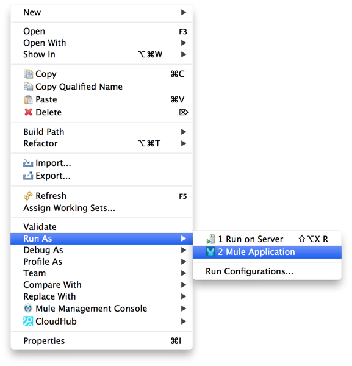

# TCP Connector

The TCP Connector allow sending or receiving messages over TCP connections. TCP is a layer over IP and used to implement many other reliable protocols such as HTTP and FTP. However, you may want to use the TCP transport directly if you require a specific protocol for reading the message payload that is not supported by one of these higher level protocols. This is often the case when communicating with legacy or native system applications that don't support web services.

[Prerequisites](#prerequisites)  
[Step 1: Create Demo Project](#step-1-create-demo-project)  
[Step 2: Add Global Element](#step-2-add-global-element)  
[Step 3: Create TCP Polling Flow](#step-3-create-tcp-polling-flow)  
[Step 4: Test TCP Polling Flow](#step-4-test-tcp-polling-flow)  
[Step 5: Create TCP Echo Flow](#step-5-create-tcp-echo-flow)  
[Step 6: Test TCP Echo Flow](#step-6-test-tcp-echo-flow)  
[XML Flow](#xml-flow)  
[Other Resources](#other-resources)  

### Prerequisites

In order to build and run this project, you'll need:

- [MuleStudio](http://www.mulesoft.org/download-mule-esb-community-edition) 

### Step 1: Create Demo Project

- Run Mule Studio and select the **File \> New \> Mule Project** menu item.  
- Type **Demo** in the Project Name field and click **Next**.  

Accept default values in the next screen of the project creation wizard and click **Finish**.

### Step 2: Add Global Element   

- Double click **src/main/app/demo.xml** to open it, select the **Global Elements** tab in the view.
- Click **Create** button and add the **TCP Polling** connector to the configuration.   

- Global Element Properties dialog will be automatically opened. You can specify the following properties for this global element:
    - **Name**: `TCP_Polling`    
    - **Timeout**:  `10000` 
    - **Polling Frequency**: `1000` 

- Switch to the **Protocol** tab, click **+** in the **Protocol** field, select **tcp:direct-protocol**.

- Click **Next** button, check the **Payload Only** field and click **Finish**.

- Click **OK**.

Current version of MuleStudio does not allow to add TCP connector via GUI, but we can do it by XML flow editing. Switch to the Configuration XML tab and insert the following strings: 

    <tcp:connector name="TCP" doc:name="TCP connector" clientSoTimeout="10000" 
    receiveBacklog="0" receiveBufferSize="0" sendBufferSize="0" serverSoTimeout="10000" 
    socketSoLinger="0" validateConnections="true">
        <tcp:direct-protocol payloadOnly="true"/>
    </tcp:connector>

### Step 3: Create TCP Polling Flow

In this example we will build a flow to pull quotes from **Quote Of The Day** ([QOTD](http://en.wikipedia.org/wiki/QOTD)) service via TCP.  

- In the Mule Studio flow editor, switch to the **Message Flow** tab.
- Drag **TCP** from the palette and drop it onto the canvas. A new flow will be created and TCP will be its Inbound Endpoint.    
- Double click the TCP Building block to show its properties, specify the following properties:
    - **Host**: `ota.iambic.com`  
    - **Port**: `17`  

- Switch to the **References** tab and select **TCP_Polling** from the **Connector Reference** dropdown list.

- Drag **Byte Array to String** transformer from the palette to the flow.
- Drag **Logger** component from the palette to the flow. Double click it to show its properties and type `#[payload]` to the **Message** field.

- Click **OK** and save the project.

### Step 4: Test TCP Polling Flow

- Right Click **flows/demo.mflow \> Run As/Mule Application**.

- Check the console to see when the application starts.  

You should see a log message on the console:  
 
    ++++++++++++++++++++++++++++++++++++++++++++++++++++++++++++    
    + Started app 'demo'                                       +
    ++++++++++++++++++++++++++++++++++++++++++++++++++++++++++++

At specific time intervals you should see a random quote in the log:

    INFO ...: A historian is a prophet in reverse | Friedrich Von Schlegel
    INFO ...: A child's spirit is like a child, you can never catch it by running after it; you must stand still, and, for love, it will soon itself come back | Arthur Miller
    INFO ...: To teach is to learn again. | Oliver Wendell Holmes

### Step 5: Create TCP Echo Flow

In this example we will build a simple echo server with a message transformer.  

- In the Mule Studio flow editor, drag **TCP** from the palette and drop it onto the canvas. A new flow will be created and TCP will be its Inbound Endpoint.    
- Double click the TCP Building block to show its properties, specify the following properties:
    - **Host**: `localhost`  
    - **Port**: `4444`  

- Switch to the **Configuration XML** tab, find **tcp:inbound-endpoint** and add `connector-ref="TCP"` to the element attributes.

- Drag **Byte Array to String** transformer from the palette to the flow.
- Drag **Set Payload** transformer from the palette to the flow. Double click it to show its properties and type `Hello #[payload]` to the **Value** field.

- Drag **String to Byte Array** transformer from the palette to the flow.

### Step 6: Test TCP Echo Flow

- Run the project.
- Run telnet using `telnet localhost 4444` and type something.  

You should see conversation like that:  
 
    Connected to localhost.
    Escape character is '^]'.
    test
    Hello test

### XML Flow 

The final XML flow should look like that:  

    <?xml version="1.0" encoding="UTF-8"?>

    <mule xmlns:tracking="http://www.mulesoft.org/schema/mule/ee/tracking" xmlns:tcp="http://www.mulesoft.org/schema/mule/tcp" xmlns="http://www.mulesoft.org/schema/mule/core" xmlns:doc="http://www.mulesoft.org/schema/mule/documentation" xmlns:spring="http://www.springframework.org/schema/beans" version="EE-3.4.0" xmlns:xsi="http://www.w3.org/2001/XMLSchema-instance" xsi:schemaLocation="http://www.springframework.org/schema/beans http://www.springframework.org/schema/beans/spring-beans-current.xsd
    http://www.mulesoft.org/schema/mule/core http://www.mulesoft.org/schema/mule/core/current/mule.xsd
    http://www.mulesoft.org/schema/mule/tcp http://www.mulesoft.org/schema/mule/tcp/current/mule-tcp.xsd
    http://www.mulesoft.org/schema/mule/ee/tracking http://www.mulesoft.org/schema/mule/ee/tracking/current/mule-tracking-ee.xsd">
	
    <tcp:polling-connector name="TCP_Polling" validateConnections="true" sendBufferSize="0" receiveBufferSize="0" receiveBacklog="0" clientSoTimeout="10000" serverSoTimeout="10000" socketSoLinger="0" doc:name="TCP Polling">
        <tcp:direct-protocol payloadOnly="true"/>
    </tcp:polling-connector>

    <tcp:connector name="TCP" doc:name="TCP connector" clientSoTimeout="10000" receiveBacklog="0" receiveBufferSize="0" sendBufferSize="0" serverSoTimeout="10000" socketSoLinger="0" validateConnections="true">
        <tcp:direct-protocol payloadOnly="true"/>
    </tcp:connector>
    
    <flow name="Polling" doc:name="Polling">
        <tcp:inbound-endpoint exchange-pattern="request-response" host="ota.iambic.com" port="17" responseTimeout="10000" doc:name="TCP" connector-ref="TCP_Polling"/>
        <byte-array-to-string-transformer doc:name="Byte Array to String"/>
        <logger message="#[payload]" level="INFO" doc:name="Logger"/>
    </flow>
    
    <flow name="Echo" doc:name="Echo">
        <tcp:inbound-endpoint exchange-pattern="request-response" host="localhost" port="4444" responseTimeout="10000" doc:name="TCP" connector-ref="TCP"/>
        <byte-array-to-string-transformer doc:name="Byte Array to String"/>
        <set-payload value="Hello #[payload]" doc:name="Set Payload"/>
        <string-to-byte-array-transformer doc:name="String to Byte Array"/>
    </flow>
    
</mule>

### Other Resources

For more information on:

- [TCP Transport Reference](http://www.mulesoft.org/documentation/display/current/TCP+Transport+Reference)  
- Mule platform and how to build Mule apps, please visit [http://www.mulesoft.org/documentation/display/current/Home](http://www.mulesoft.org/documentation/display/current/Home)

