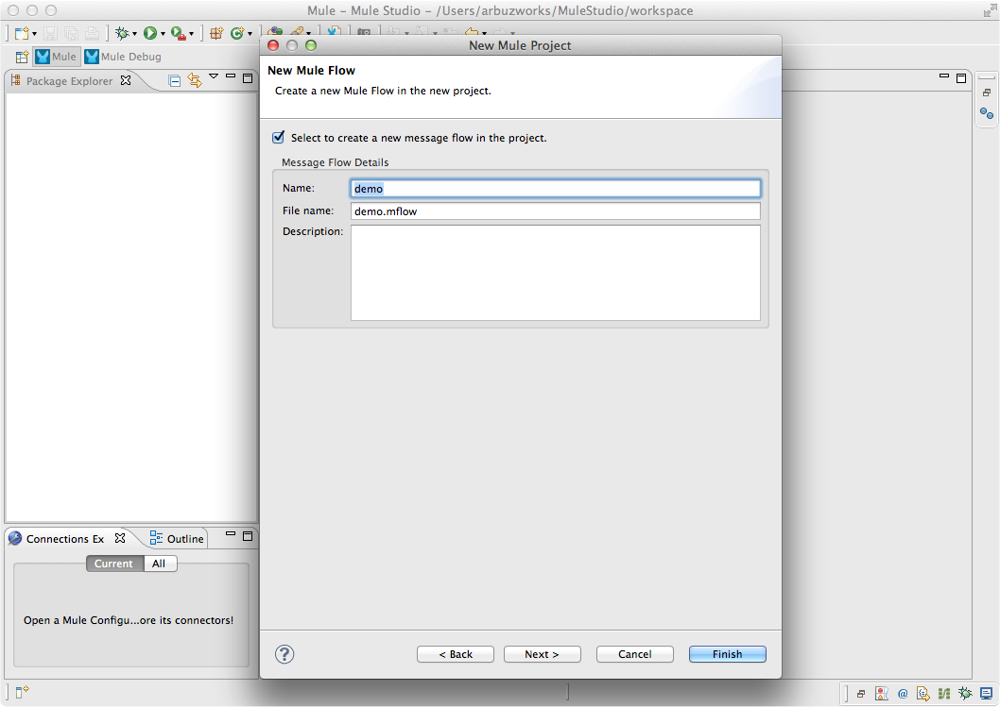
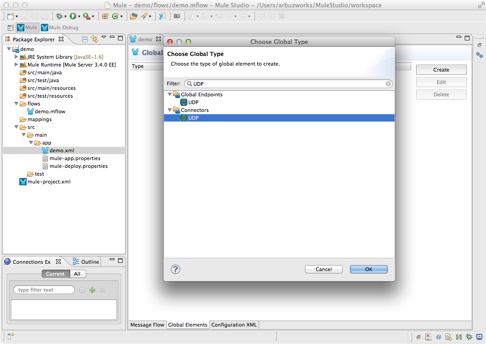

# UDP Connector

[Universal Datagram Protocol](http://en.wikipedia.org/wiki/User_Datagram_Protocol), or UDP, is a stateless protocol for sending or receiving large numbers of messages (datagrams) quickly. The UDP Connector in Mule allow sending messages to or receiving messages with Mule using UDP sockets.

[Prerequisites](#prerequisites)  
[Step 1: Create Demo Project](#step-1-create-demo-project)  
[Step 2: Add Global Element](#step-2-add-global-element)  
[Step 3: Create UDP Echo Flow](#step-3-create-udp-echo-flow)  
[Step 4: Test UDP Echo Flow](#step-4-test-udp-echo-flow)  
[XML Flow](#xml-flow)  
[Other Resources](#other-resources)  

### Prerequisites

In order to build and run this project, you'll need:

- [MuleStudio](http://www.mulesoft.org/download-mule-esb-community-edition) 

### Step 1: Create Demo Project

- Run Mule Studio and select the **File \> New \> Mule Project** menu item.  
- Type **Demo** in the Project Name field and click **Next**.  

Accept default values in the next screen of the project creation wizard and click **Finish**.

### Step 2: Add Global Element   

- Double click **src/main/app/demo.xml** to open it, select the **Global Elements** tab in the view.
- Click **Create** button and add the **UDP** connector to the configuration.   

- Global Element Properties dialog will be automatically opened. Accept default properties and click **OK**.

### Step 3: Create UDP Echo Flow

In this example we will build a flow with two UDP building blocks: the first one to receive a datagram and the second one to send the datagram.  

- In the Mule Studio flow editor, switch to the **Message Flow** tab.
- Drag **UDP** from the palette and drop it onto the canvas. A new flow will be created and UDP will be its Inbound Endpoint.    
- Double click the UDP building block to show its properties, specify the following properties:
    - **Exchange Patterns**: `one-way`  
    - **Host**: `localhost`  
    - **Port**: `4444`  

- Drag **UDP** from the palette and drop it onto the canvas. A new flow will be created and UDP will be its Inbound Endpoint.    
- Double click the UDP building block to show its properties, specify the following properties:
    - **Exchange Patterns**: `one-way`  
    - **Host**: `localhost`  
    - **Port**: `5555`  

- Save the flow.

### Step 4: Test UDP Echo Flow

- Right Click **flows/demo.mflow \> Run As/Mule Application**.

- Check the console to see when the application starts.  

You should see a log message on the console:  
 
    ++++++++++++++++++++++++++++++++++++++++++++++++++++++++++++    
    + Started app 'demo'                                       +
    ++++++++++++++++++++++++++++++++++++++++++++++++++++++++++++

- Open a terminal and run netcat utility to listen for an incoming connection on UDP port 5555:

    nc -ul 5555

- Open another terminal and run netcat utility to send data to outgoing connection on UDP port 4444:

    nc -u 127.0.0.1 4444

- Type a text in the second terminal.
- You should see the text in the first terminal.

### XML Flow 

The final XML flow should look like that:  

    <?xml version="1.0" encoding="UTF-8"?>

    <mule xmlns:tracking="http://www.mulesoft.org/schema/mule/ee/tracking" xmlns:udp="http://www.mulesoft.org/schema/mule/udp" xmlns="http://www.mulesoft.org/schema/mule/core" xmlns:doc="http://www.mulesoft.org/schema/mule/documentation" xmlns:spring="http://www.springframework.org/schema/beans" version="EE-3.4.0" xmlns:xsi="http://www.w3.org/2001/XMLSchema-instance" xsi:schemaLocation="http://www.springframework.org/schema/beans http://www.springframework.org/schema/beans/spring-beans-current.xsd
    http://www.mulesoft.org/schema/mule/core http://www.mulesoft.org/schema/mule/core/current/mule.xsd
    http://www.mulesoft.org/schema/mule/udp http://www.mulesoft.org/schema/mule/udp/current/mule-udp.xsd
    http://www.mulesoft.org/schema/mule/ee/tracking http://www.mulesoft.org/schema/mule/ee/tracking/current/mule-tracking-ee.xsd">
        <udp:connector name="UDP" validateConnections="true" doc:name="UDP"/>
        <flow name="Echo" doc:name="Echo">
            <udp:inbound-endpoint host="localhost" port="4444" responseTimeout="10000" doc:name="UDP"/>
            <udp:outbound-endpoint host="localhost" port="5555" responseTimeout="10000" doc:name="UDP"/>
        </flow>
    </mule>
        
    </mule>

### Other Resources

For more information on:

- [UDP Connector Reference](http://www.mulesoft.org/documentation/display/current/UDP+Transport+Reference)  
- Mule platform and how to build Mule apps, please visit [http://www.mulesoft.org/documentation/display/current/Home](http://www.mulesoft.org/documentation/display/current/Home)

urrent/Home](http://www.mulesoft.org/documentation/display/current/Home)

