# In Memory (VM) 

The In Memory (VM) connector can be used for intra-JVM communication between Mule Flows. This connector by default uses in-memory queues but can optionally be configured to use persistent queues.

[Prerequisites](#prerequisites)  
[Step 1: Create Demo Project](#step-1-create-demo-project)  
[Step 2: Configure application](#step-2-configure-application)    
[Step 3: Run project](#step-3-run-project)  
[Step 4: Test the project](#step-4-test-the-project)   
[Other Resources](#other-resources)   

### Prerequisites

In order to build and run this project you'll need:

*   [MuleStudio](http://www.mulesoft.org/download-mule-esb-community-edition).

### Step 1: Create Demo Project

*    Run Mule Studio and select **File \> New \> Mule Project** menu item.  
*    Type **demo** as a project name and click **Next**.  

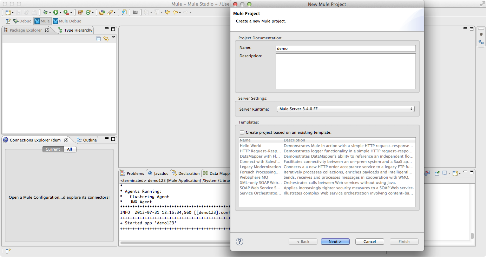

*    Then click **Next**.

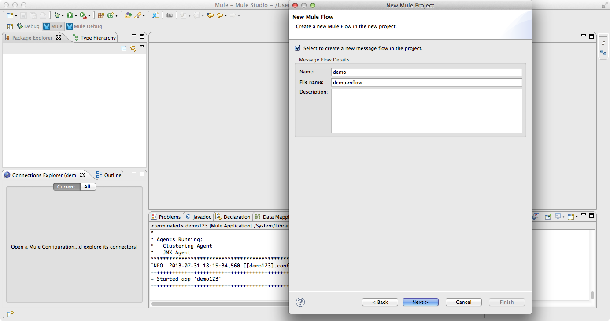

*    And finally click **Finish**.

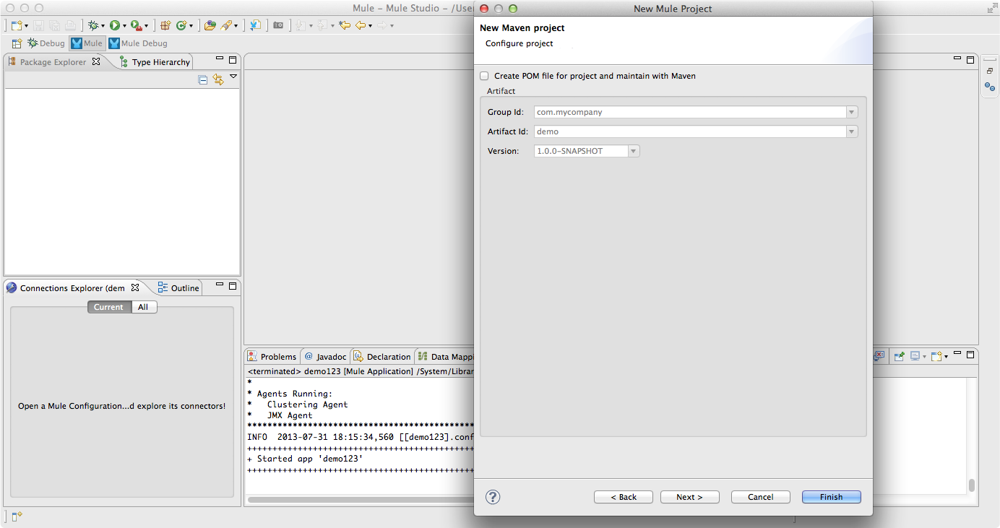

### Step 2: Configure application

The following example contains two flows. The first one reads XML file every 3 seconds (3000 ms) and places it in memory.
The second flow reads data from memory and outputs it to the file in plain text format.

##### Preparation of the input data.

*    First, lets create directory structure for our demo. Create a **tmp** folder in your home directory and then create folders: **input**, **output** and **xsl** within the **tmp** folder.
*    Second, we should prepare two files.

**addresses.xml** is the input file. For now, put this file to the **tmp** directory. Later we will move it to the **input** folder.  

```
<?xml version="1.0" encoding="UTF-8"?>
<addresses>
	<address>
		<country>USA</country>
		<city>New Orleans</city>
		<street>Oak Street</street>
		<dwelling>17</dwelling>
	</address>
	<address>
		<country>UK</country>
		<city>Manchester</city>
		<street>George Street</street>
		<dwelling>12B</dwelling>
	</address>
	<address>
		<country>Australia</country>
		<city>Perth</city>
		<street>Kangaroo Street</street>
		<dwelling>111</dwelling>
	</address>
</addresses>
```

**addresses.xsl** is a stylesheet for the xml file mentioned above. Put that file to the **xsl** folder.

```
<xsl:stylesheet xmlns:xsl="http://www.w3.org/1999/XSL/Transform" version="1.0">
<xsl:output method="text"/>
<xsl:template match="/">
    <xsl:apply-templates />
</xsl:template>
<xsl:template match="addresses">
    <xsl:apply-templates />
</xsl:template>
 <xsl:template match="country">
    Country: <xsl:apply-templates />
  </xsl:template>
    <xsl:template match="city">
    City: <xsl:apply-templates />
  </xsl:template>
  <xsl:template match="street">
    Street: <xsl:apply-templates />
  </xsl:template>
  <xsl:template match="dwelling">
    Dwelling: <xsl:apply-templates />
  </xsl:template>
</xsl:stylesheet>
```

##### Creating the *file_component*  flow.

*    Switch to the **Message Flow** tab. Then find **Flow** scope using filter and drag it to the message flow area.
*    Double click the flow's header and rename it to **file_component**.

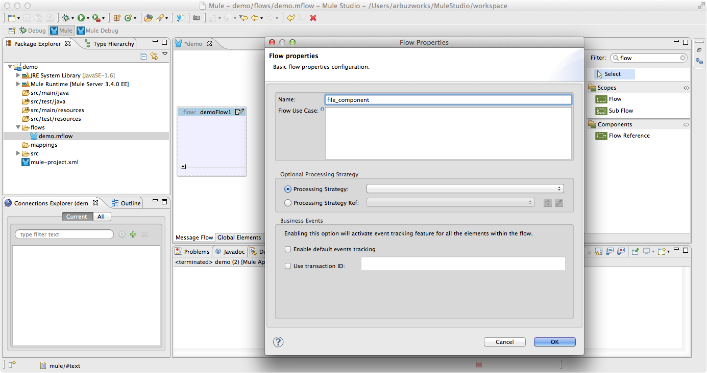

##### Adding and adjusting *File* endpoint. General tab.

*    Find the **File** endpoint using filter and drag it to the **file_component** flow.
*    Double click the **File** endpoint and adjust its general tab as it is shown on the following image. Point the path to the **input** folder within the **Path** field. 

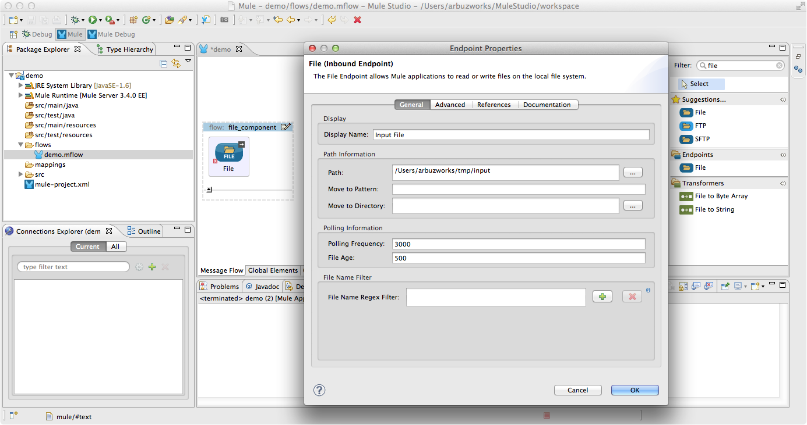

##### Adjusting *File* endpoint. Advanced tab.

*    Switch to the advanced tab and set the timeout to 10000 and the MIME type to text/xml. Then click **OK**.

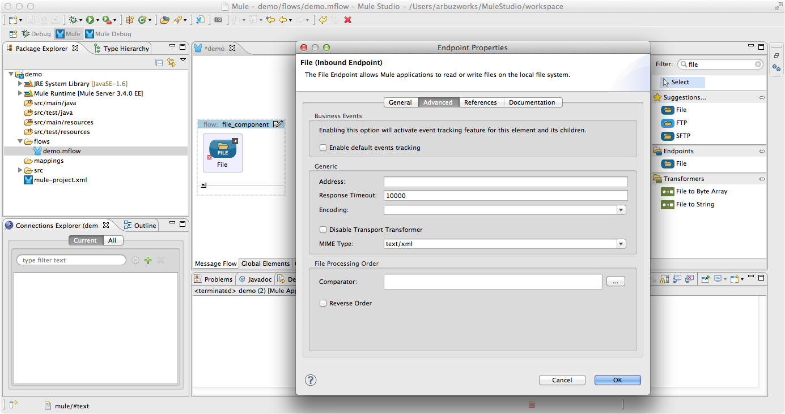

##### Putting and adjusting **XSLT** transformer.

*    Find the **XSLT** transformer using filter and drag it to the **file_component** flow.
*    Double click to open its properties, then point the path to the **xsl** file within the **XSL File** field. Click **OK**.

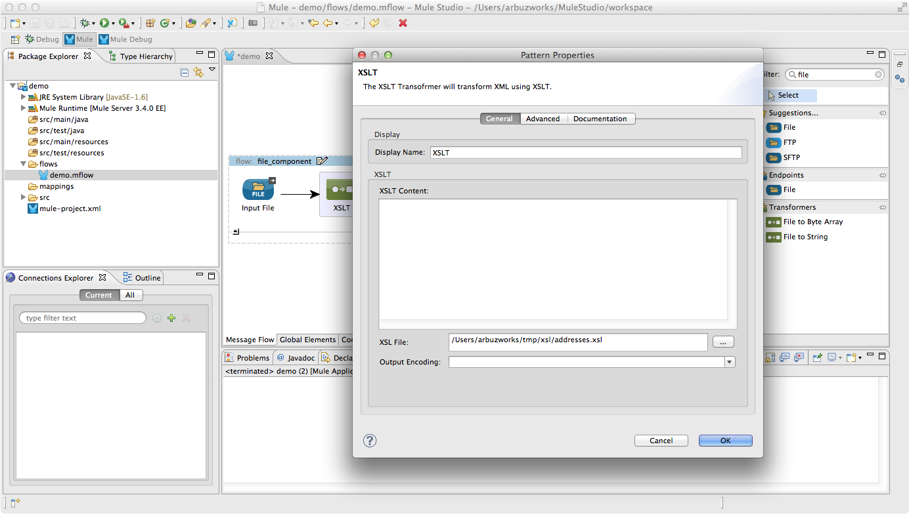

##### Putting and adjusting **VM** endpoint. General tab.

*    Find the **VM** endpoint using filter and drag it to the **file_component** flow.
*    Double click to open its properties and adjust it as it is shown on the following image.

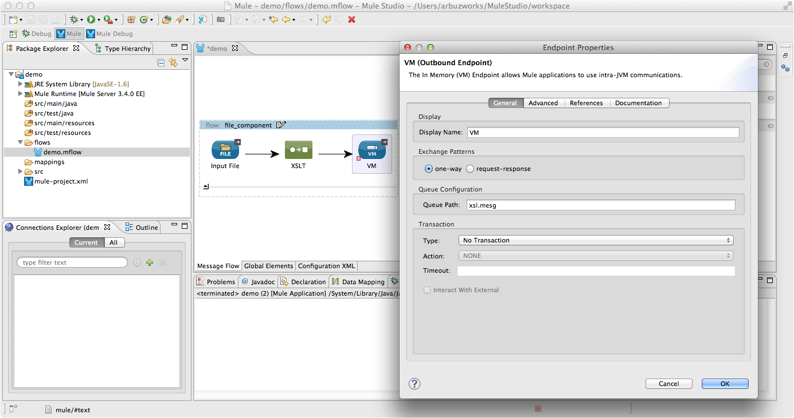

##### Adjusting **VM** endpoint. Advanced tab.

*    Switch to the advanced tab and set the timeout to 10000 and the MIME type to text/plain. Then click **OK**.

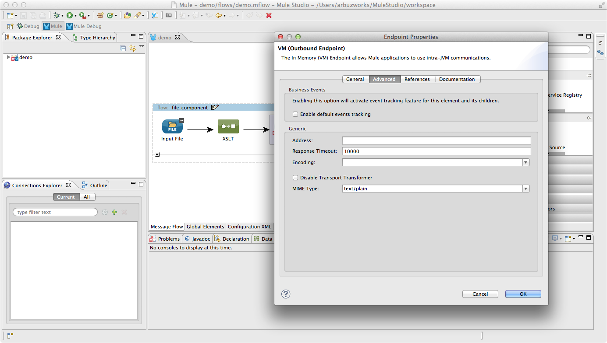

##### Creating the *vm_flow*  flow.

*    Find the **Flow** scope using filter and drag it to the message flow area.
*    Double click the flow's header and rename it to **vm_flow**.

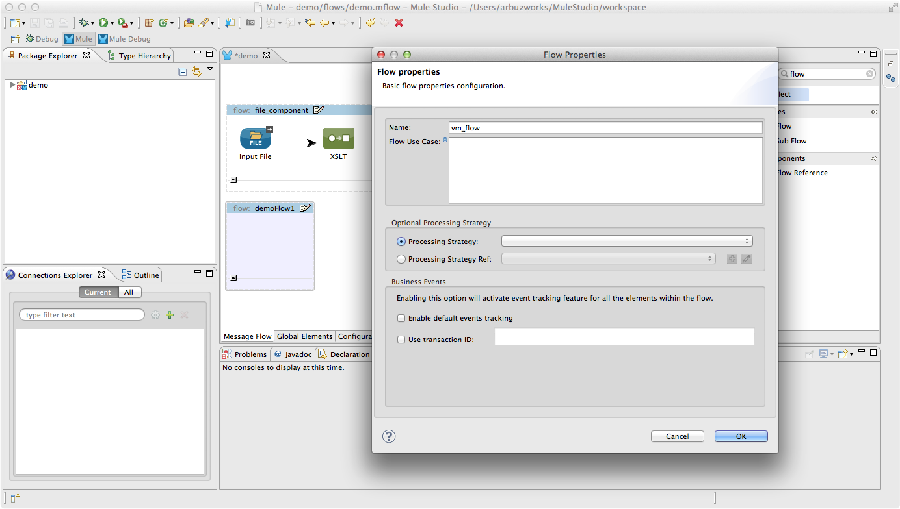

##### Putting and adjusting one more **VM** endpoint. General tab.

*    Find the **VM** endpoint using filter and drag it to the **vm_flow** flow.
*    Double click to open its properties and adjust it as it is shown on the following image.

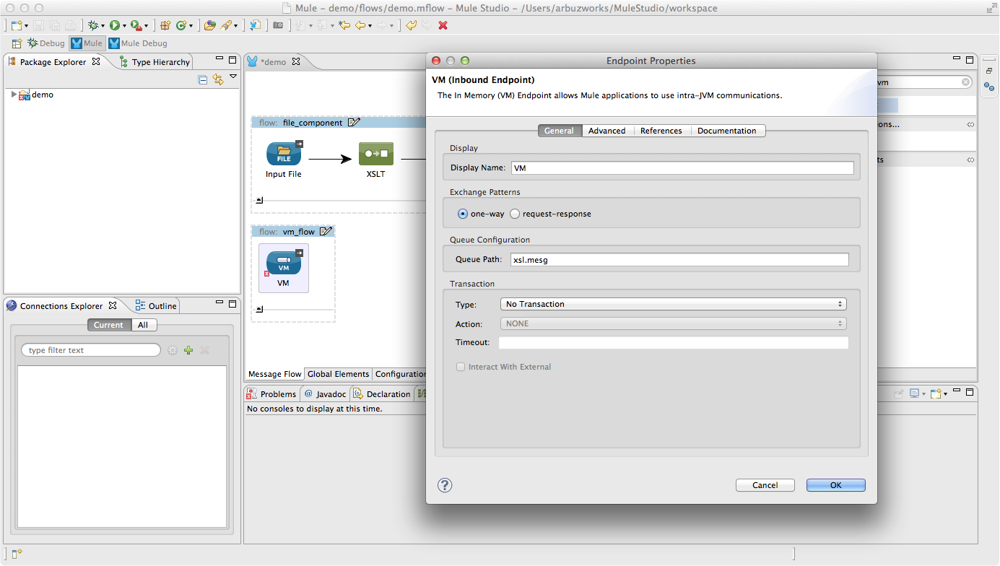

##### Adjusting **VM** endpoint. Advanced tab.

*    Switch to the advanced tab and set the timeout to 10000 and the MIME type to text/plain. Then click **OK**.

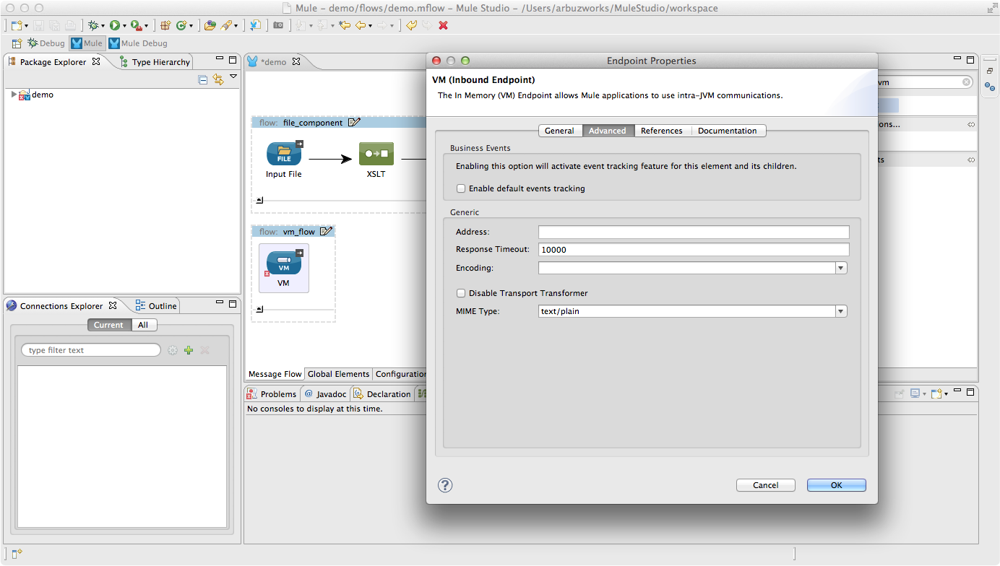

##### Putting and adjusting one more *File* endpoint.

*    Find the **File** endpoint using filter and drag it to the **vm_flow** flow.
*    Double click the **File** endpoint and adjust its general tab as it is shown on the following image. Point the path to the **output** folder within the **Path** field. Then put "**myfile#[function:datestamp].txt**" to the **Output Pattern** field.

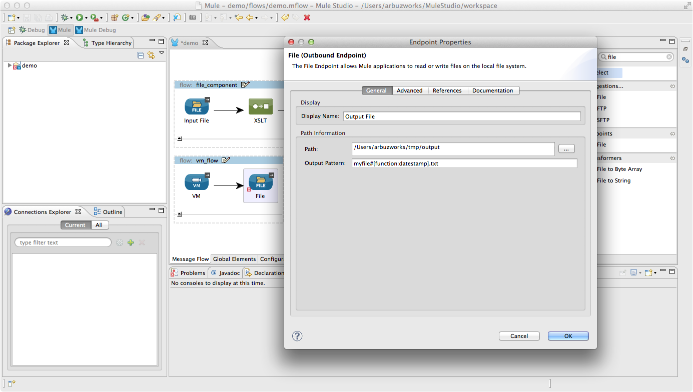

### Step 3: Run project

*    Right Click **src/main/app/demo.xml \> Run As/Mule Application**.

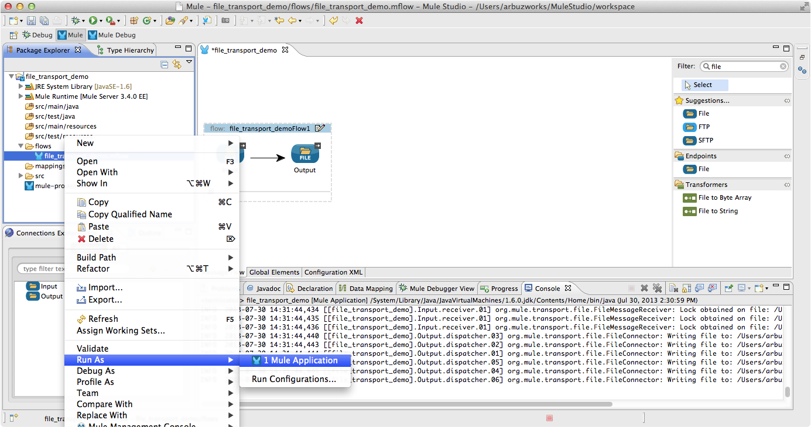 

*    Check the console to see when the application starts.  

You should see a log message on the console:  
 
    ++++++++++++++++++++++++++++++++++++++++++++++++++++++++++++    
    + Started app 'demo'            		                   +    
    ++++++++++++++++++++++++++++++++++++++++++++++++++++++++++++   

### Step 4: Test the project

*    In order to perform a test, open two windows, one pointing to the **input** folder and the second one pointing to the **output** folder respectively.
*    Copy/paste the **addresses.xml** file to the **input** folder.

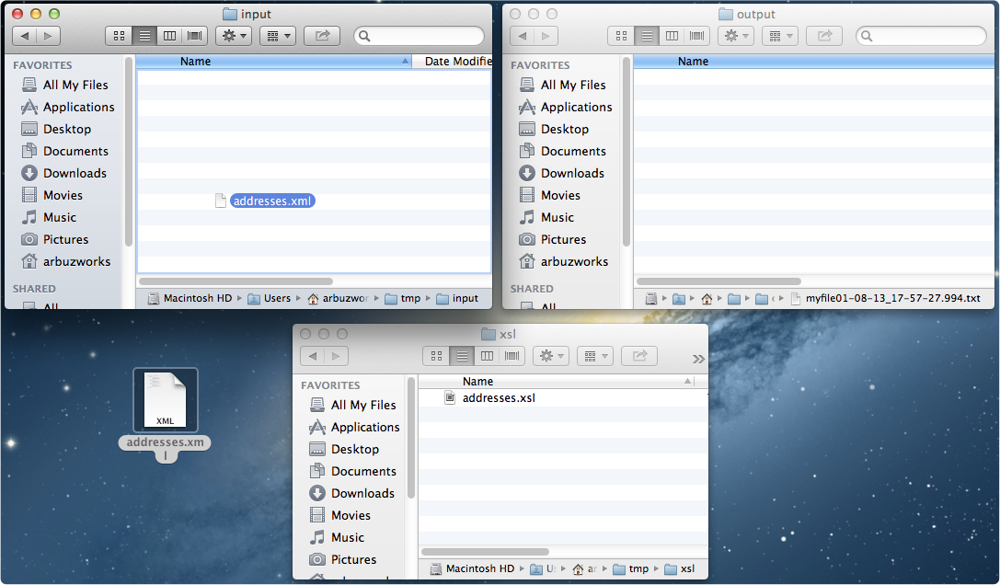

In 3 seconds the **txt** file will appear within the **output** folder.

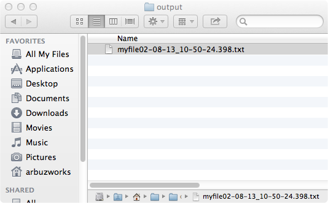

*    Open the created **txt** file to be sure that expected data is present there.

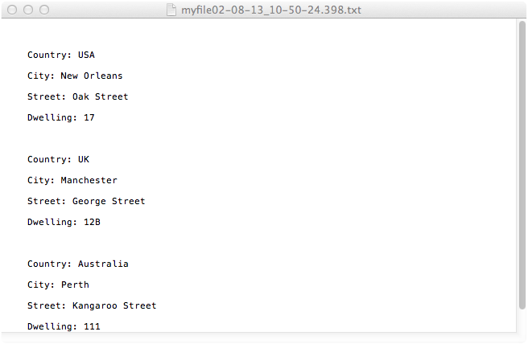

*    Stop Mule server.

### Other Resources

For more information on:

- Mule AnyPoint® connectors, please visit [http://www.mulesoft.org/connectors](http://www.mulesoft.org/connectors)
- Mule platform and how to build Mule apps, please visit [http://www.mulesoft.org/documentation/display/current/Home](http://www.mulesoft.org/documentation/display/current/Home)


