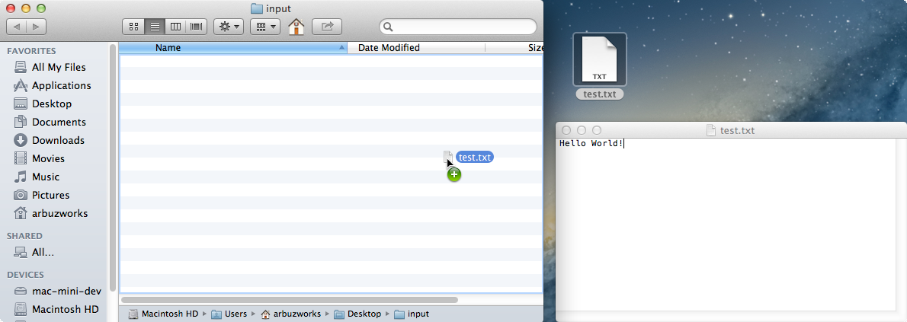
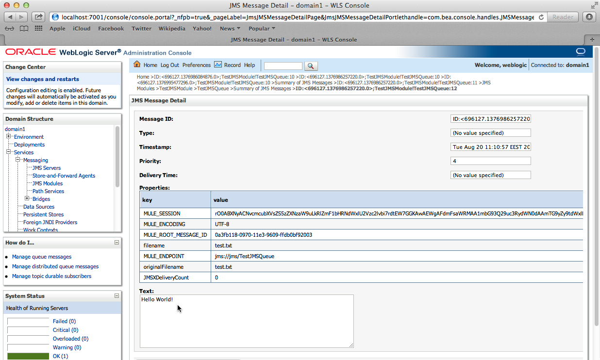

# WebLogic JMS Connector

JMS (Java Message Service) is a widely-used API for Message Oriented Middleware. It allows communication between different components of a distributed application to be loosely coupled, reliable and asynchronous.

JMS supports two models for messaging:

*   Queues - point-to-point;
*   Topics - publish and subscribe.

Mule's JMS connector allows you to easily send and receive messages to queues and topics for any message service which implements JMS specification.

[Prerequisites](#prerequisites)  
[Step 1: Weblogic environment setup](#step-1-weblogic-environment-setup)  
[Step 2: Create Demo Project](#step-2-create-demo-project)  
[Step 3: Configure application](#step-3-configure-application)  
[Step 4: Create WeblogicQueueTesting flow](#step-4-create-weblogicqueuetesting-flow)  
[Step 5: Run project](#step-5-run-project)  
[Step 6: Test Weblogic queue](#step-6-test-weblogic-queue)  
[Step 7: Create WeblogicTopicTesting flow](#step-7-create-weblogictopictesting-flow)  
[Step 8: Test Weblogic topic](#step-8-test-weblogic-topic)  
[Other Resources](#other-resources)  


### Prerequisites

In order to build and run this project you'll need:

*   [MuleStudio](http://www.mulesoft.org/download-mule-esb-community-edition).
*   Installed [Oracle Weblogic](http://www.oracle.com/technetwork/middleware/weblogic/downloads/wls-main-097127.html) server. 

### Step 1: Weblogic environment setup

*   First, log into Weblogic server, using login and password you have set during server installation (in our case they are: login - **weblogic**, password - **welcome1**). 
*   Follow this [guidance](https://blogs.oracle.com/soaproactive/entry/how_to_create_a_simple). Having done this, you should already have the queue configured with **TestJMSQueue** name. Then, in the same way you should setup topic, giving it **TestJMSTopic** name respectively. Finally, you have to create a subscriber within **Durable Subscribers** tab (It may be found by entering into your new topic and switching to the **Monitoring** tab).

*   Now you should generate **wlfullclient.jar**. Here is the related [guidance](http://docs.oracle.com/cd/E12840_01/wls/docs103/client/jarbuilder.html).

*   Create two folders, one for input files and one for output files (in our case they are **input** and **output** folders located on the desktop).
  
### Step 2: Create Demo Project

*    Run Mule Studio and select **File \> New \> Mule Project** menu item.  
*    Type **demo** as a project name and click **Next**.  


*    Then click **Next**.


*    And finally click **Finish**.


### Step 3: Configure application  

To be able to implement Weblogic JMS connector we need to add **wlfullclient.jar** jar file to our build path. Right-click your project, select **Build Path** and choose **Add External Archives**. Choose the **wlfullclient.jar** file from the **/lib** directory of the demo project. 


##### Configuration of the File connector

Open **flows/demo.mflow** file. Select **Global Elements** tab, click **Create** button and using the filter find and select the **File** connector. Click **OK**. You will see a window for the **File** connector configuration, click **OK**.


##### Configuration of the WebLogic JMS Connector

Click **Create** button and using the filter find and select the **Web logic JMS** connector. Then click **OK**. You will see a window for the **Web logic JMS** connector. Enter user name and password you have created during Weblogic installation into related fields.


Switch to the **Advanced** tab and adjust it as it is shown on the following image.


### Step 4: Create WeblogicQueueTesting flow

*    Switch to the **Message Flow** tab in the flow editor.
*    Add a new flow by dragging it from the Palette.
*    Double click the new flow to open its properties and rename it to **WeblogicQueueTesting**. Click **OK**.


*    Find the **File** endpoint in the palette using the filter and drag it to the **WeblogicQueueTesting** flow.
*    Double click the **File** endpoint and adjust its general tab as it is shown on the following image.


*    Find the **File to String** transformer in the palette using the filter and drag it to the **WeblogicQueueTesting** flow. It does not need any additional settings.


*    Find the **JMS** endpoint in the palette using the filter and drag it to the **WeblogicQueueTesting** flow.
*    Double click the **JMS** endpoint and adjust its general tab as it is shown on the following image.
 


*    Switch to the **References** tab and in the **Connector Reference** dropdown select the **Web_logic_JMS** connector which we configured earlier on Step 3.


*    Save the flow.

### Step 5: Run project

*    Right Click **src/main/app/jdbc_demo.xml \> Run As/Mule Application**.

 

*    Check the console to see when the application starts.  

You should see a log message on the console:  
 
    ++++++++++++++++++++++++++++++++++++++++++++++++++++++++++++    
    + Started app 'demo'                                       +    
    ++++++++++++++++++++++++++++++++++++++++++++++++++++++++++++   

### Step 6: Test Weblogic queue

*    Create a text file and fill it in with a certain phrase (in our case it is **test.txt** file with **Hello World!** phrase in it).
*    When the application is started, open **input** folder and copy/paste your text file there.

 

*    Open the **Administration console** page of your server and navigate to your queue, then switch to the **Monitoring** tab and select **TestJMSModule!TestJMSQueue** within the **Destinations** table and click **Show Messages**. Then you should see one record within the **JMS Messages** table; it will have an id like ```ID:<696127.1376986257220.0>```.

 

*    Click the id and you will see a message page. Within **Text** area at the bottom of the page you should see the same phrase you have put in the text file.

 

*    Stop Mule server. 

### Step 7: Create WeblogicTopicTesting flow

*    Switch to the **Message Flow** tab in the flow editor.
*    Add a new flow by dragging it from the Palette.
*    Double click the new flow to open its properties and rename it to **WeblogicTopicTesting**. Click **OK**.

 

*    Find the **JMS** endpoint in the palette using the filter and drag it to the **WeblogicTopicTesting** flow.
*    Double click the **JMS** endpoint and adjust its general tab as it is shown on the following image.


*    Switch to the **Advanced** tab and adjust its general tab as it is shown on the following image.


*    Switch to the **References** tab and in the **Connector Reference** dropdown select the **Web_logic_JMS** connector which we configured earlier on Step 3.


*    Find the **String to Byte Array** transformer in the palette using the filter and drag it to the **WeblogicTopicTesting** flow. It does not need any additional settings.


*    Find the **File** endpoint in the palette using the filter and drag it to the **WeblogicTopicTesting** flow.
*    Double click the **File** endpoint and adjust its general tab as it is shown on the following image.


### Step 8: Test Weblogic topic

*    Run project again.

*    Open **Administration console** page of your server and navigate to your topic, then switch to the **Monitoring** tab and switch again to the **Durable Subscribers** tab. Select the record with **mule_test** id within the **Durable Subscribers** table.


*    Click **Show Messages** and then click **New**. You should see the window with **Produce JMS Message** in the header. Create a new message by putting some text into the **Body** area at the bottom of the page (In our case we put **Don't worry, be happy!** phrase).


*    Open the **output** folder and you will see the **weblogic_test.txt** file. Open it and find that it contains exactly the same phrase you have put into the topic.


### Other Resources

For more information on:

- Mule AnyPoint® connectors, please visit [http://www.mulesoft.org/connectors](http://www.mulesoft.org/connectors)
- Mule platform and how to build Mule apps, please visit [http://www.mulesoft.org/documentation/display/current/Home](http://www.mulesoft.org/documentation/display/current/Home)