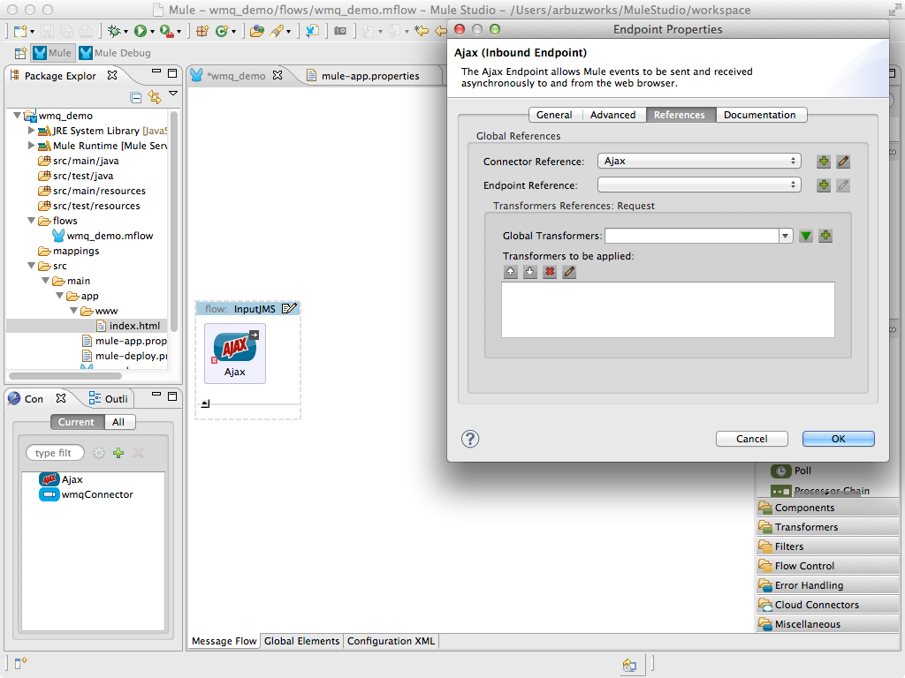

# WebSphere MQ Connector

IBM WebSphere MQ allows independent and potentially non-concurrent applications on a distributed system to communicate with each other. This example demonstrates how to use the Websphere MQ Connector in order to send and receive transactional messages to WebSphere MQ. This example is available in Mule Enterprise Edition.

### Contents

[Prerequisites](#prerequisites)  
[Step 1: Create Demo Project](#step-1-create-demo-project)  
[Step 2: Configure WMQ connector](#step-2-configure-wmq-connector)  
[Step 3: Configure AJAX connector](#step-3-configure-ajax-connector)  
[Step 4: Create InputJMS flow](#step-4-create-inputjms-flow)  
[Step 5: Create JMSProcessor flow](#step-5-create-jmsprocessor-flow)  
[Step 6: Create OutputJMS flow](#step-6-create-outputjms-flow)  
[Step 7: Run project](#step-7-run-project)  
[Step 8: Test application](#step-8-test-application)  
[Other Resources](#other-resources)  


### Prerequisites

Before you run the example, ensure that your system meets the following conditions:

* Mule Enterprise 3.1 or later version is installed
* WebSphere MQ 6 or 7 is installed. Make sure your WebSphere MQ installation has queues named "**in**" and "**out**".
* WebSphere MQ client JARs are available to you. Add the following JARSs to MuleStudio class path. Paste them to **/path/to/MuleStudio/plugins/org.mule.tooling.server.{$mule_server_version}/mule/user**.

```ini
com.ibm.dhbcore.jar
com.ibm.mq.jar
com.ibm.mqetclient.jar
com.ibm.mqjms.jar
com.ibm.mq.jmqi.jar (WebSphere MQ version 7 only)
```

### Step 1: Create Demo Project

* Run Mule Studio and select **File \> New \> Mule Project** menu item.  
* Type **wmq_demo** as a project name and click **Next**.  


* Then click **Finish**.


### Step 2: Configure WMQ connector

We need to provide values for WebSphere MQ parameters. Open **src/main/app/flows/mule-app.properties** file and add the following lines: 

```ini
wmq.host=localhost
wmq.port=1414
wmq.queue.manager=QUEUE_MANAGER
wmq.username=username
wmq.password=password  
```


Open **flows/wmq_demo.mflow** file. For configuration of the WMQ Connector select the **Global Elements** tab, click **Create** button and using the filter find and select  **WMQ** in the list of connectors. Click **OK**. You will see a window for the WebSphere MQ Connector configuration, adjust the fields as displayed on the following image.


### Step 3: Configure AJAX connector

For configuration of the AJAX Connector select the **Global Elements** tab, click **Create** button and using the filter find and select **AJAX** in the list of connectors. Click **OK**. You will see a window for the AJAX Connector configuration, adjust the fields as displayed on the following image.


This starts the AJAX server which is ready to start publishing and subscribing.

Create a new **src/main/app/www/index.html** file and add the following HTML code. 

```html
<!DOCTYPE>
<head>
    <script type="text/javascript" src="mule-resource/js/mule.js"></script>
    <script type="text/javascript">
	
    	function init(){
    		mule.subscribe("/services/dequeue", function(data){
    	    	document.getElementById('messages').value += data.data + '\n';
    	    });
    	}    
    
        function publishToMule() {                       
            var message = document.getElementById('message').value;      
            mule.publish("/services/enqueue", message);
        }      
    </script>
</head>
 
<body onLoad="init()">
	<h3>WebSphere example</h3>
	<table>
		<tr>
			<td colspan="2">
				<label>Messages:</label><br/>
				<textarea id="messages" style="width:100%; height:150px;" disabled="disabled"></textarea>
			</td>
		</tr>
		<tr>
			<td>
				<label>Message:</label> <input id="message" type="text"/>				
			</td>
			<td>
				<input id="sendButton" class="button" type="submit" name="Send" value="Send" onclick="publishToMule();"/>	
			</td>
		</tr>
	</table>
 </body>
</html>
```

The browser will send messages to Mule (using JavaScript Mule client) when a button is pushed. Also it will read all messages from Mule server and write them to the **Messages** textarea.

### Step 4: Create InputJMS flow

In the **InputJMS** flow there is **AJAX Inbound Endpoint**, which listens to the messages on the **/services/enqueue** configured channel. The flow adds the incoming messages to the "**in**" queue.

* Switch to the **Message Flow** tab in the flow editor.
* Add a new flow by dragging it from the Palette.
* Double click the new flow to open its properties and rename it to **InputJMS**. Click **OK**.


* Drag **AJAX Endpoint** to the flow. Double click it to show its properties and set the **General \> Generic \> Channel** field as **/services/enqueue**.


* Switch to the **References** tab and in the **Connector Reference** dropdown select  **Ajax** which we configured earlier on Step 3 and click **OK**.



* Drag **Message Properties** to the flow. Double click it to show its properties and select **invocation** in the **General \> Generic \> Scope** dropdown. In **Delete messages properties** panel click "**+**" button and add the **MULE_REPLYTO** key.


* Drag **WMQ Edpoint** to the flow. Double click it to show its properties and set the **General \> Settings \> Queue Name** field as **in** and **General \> Transaction \> Transaction Type** as **No Transaction**.


* Switch to the **References** tab and in the **Connector Reference** dropdown select  **wmqConnector** which we configured earlier on Step 2 and click **OK**.


* Save the flow.

### Step 5: Create JMSProcessor flow

The **JMSProcessor** flow reads messages from the "**in**" queue. The flow's test component waits for 5 seconds, then adds the message to the "**out**" queue.

* Add a new flow.
* Double click the new flow to open its properties and rename it to **JMSProcessor**. Click **OK**.


* Drag **WMQ Edpoint** to the flow. Double click it to show its properties and set the **General \> Settings \> Queue Name** field as **in** and **General \> Transaction \> Transaction Type** as **WMQ Transaction** and **General \> Transaction \> Action** as **ALWAYS_BEGIN**.


* Switch to the **References** tab and in the **Connector Reference** dropdown select  **wmqConnector** which we configured earlier on Step 2 and click **OK**.

* Select the **Configuration XML** tab of the **flows/wmq_demo.mflow** file and add  **test-component** to the JMSProcessor flow:

```xml
<flow name="JMSProcessor" doc:name="JMSProcessor">
    <wmq:inbound-endpoint queue="in" connector-ref="wmqConnector" doc:name="WMQ">
        <wmq:transaction action="ALWAYS_BEGIN"></wmq:transaction> 
    </wmq:inbound-endpoint> 
    <test:component logMessageDetails="true" waitTime="5000"></test:component> 
</flow>
```

* Drag **WMQ Edpoint** to the flow. Double click it to show its properties and set the **General \> Settings \> Queue Name** field as **out** and **General \> Transaction \> Transaction Type** as **WMQ Transaction** and **General \> Transaction \> Action** as **ALWAYS_JOIN**.


* Switch to the **References** tab and in the **Connector Reference** dropdown select  **wmqConnector** which we configured earlier on Step 2 and click **OK**.

* Save the flow.

### Step 6: Create OutputJMS flow

The **OutputJMS** flow reads messages from the "**out**" queue, then publishes them via the AJAX outbound endpoint.

* Add a new flow.
* Double click the new flow to open its properties and rename it to **OutputJMS**. Click **OK**.


* Drag **WMQ Edpoint** to the flow. Double click it to show its properties and set the **General \> Settings \> Queue Name** field as **out** and **General \> Transaction \> Transaction Type** as **No Transaction**.

* Switch to the **References** tab and in the **Connector Reference** dropdown select  **wmqConnector** which we configured earlier on Step 2 and click **OK**.

* Drag **AJAX Endpoint** to the flow. Double click it to show its properties and set the **General \> Generic \> Channel** field as **/services/dequeue**.

* Switch to the **References** tab and in the **Connector Reference** dropdown select  **Ajax** which we configured earlier on Step 3 and click **OK**.

* Save the flow.

### Step 7: Run project

* Right Click **src/main/app/wmq_demo.xml \> Run As/Mule Application**.

 

* Check the console to see when the application starts.  

You should see a log message on the console:  
 
    ++++++++++++++++++++++++++++++++++++++++++++++++++++++++++++    
    + Started app 'wmq_demo'                             +    
    ++++++++++++++++++++++++++++++++++++++++++++++++++++++++++++  

### Step 8: Test application

* Run the project.
* Open your browser and point it to [http://localhost:8081/wmq](http://localhost:8081/wmq).
* You should see empty **Messages** textarea and **Message** text field.
* Type several messages in the text field, then push **Send** button to submit them to Mule via AJAX/WMQ. After 5 seconds of intentional delay, Mule confirms receipt of the messages.


* Stop Mule server.

### Other Resources

For more information on:

- Mule AnyPoint® connectors, please visit [http://www.mulesoft.org/connectors](http://www.mulesoft.org/connectors)
- Mule platform and how to build Mule applications, please visit [http://www.mulesoft.org/documentation/display/current/Home](http://www.mulesoft.org/documentation/display/current/Home)